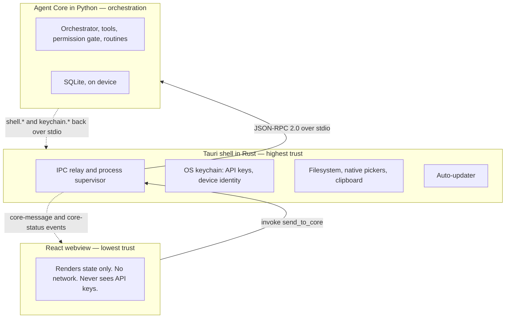

# Addison

Addison is a local-first desktop chat agent — approachable by default, powerful on
request. It is built for people who are not developers: it asks in plain language
before it does anything on your computer, and everything it does can be undone.
Technical users opt into a Developer profile that adds visibility without changing
any of the safety rules.

Local-first means what it says. Your conversations live in a SQLite database on
your own machine. You bring your own model key (BYOK); it is stored in the operating
system keychain and never travels to the part of the app that draws the screen.

## Architecture at a glance

Addison is three processes at three trust levels. They talk over JSON-RPC 2.0 —
the webview to the Rust shell through a single Tauri command, the shell to the
Python core over stdio.



- **Tauri shell (Rust)** — highest trust. Owns the OS keychain, the filesystem and
  native pickers, and the updater. It spawns and supervises the Agent Core and
  relays IPC frames. It never runs model instructions and never interprets a frame's
  meaning.
- **Agent Core (Python)** — the orchestration loop, tool registry, permission gate,
  routine engine, and SQLite store. It has no OS permissions of its own: every
  filesystem or keychain effect is a request back to the shell.
- **React webview** — lowest trust. Renders state and collects clicks. It never
  reaches the network, never talks to the core directly, and never sees a key.

More detail: [docs/architecture.md](docs/architecture.md).

## Safety invariants

These are hard constraints, enforced in code rather than by convention:

1. **No arbitrary code or shell execution, ever.** Tools are individual typed
   functions, not a "run command". Routines are declarative plans — data, with no
   code, eval, or shell field anywhere in the structure.
2. **Every mutating tool has a real undo.** Any tool whose risk tier is not LOW must
   implement a genuine `undo()`; the tool registry raises at registration time if it
   does not. A tool that cannot be undone must stay LOW and read-only.
3. **API keys never reach the webview.** They live in the OS keychain, are read by
   the shell or core only at the moment of use, are never persisted in core memory
   beyond one request, and are never written to SQLite.
4. **The Setup Assistant relay's keys never exist in this repository.** They are
   server-side; the device only signs requests with a keypair whose private half
   never leaves the keychain.
5. **A routine never exceeds live-granted permissions.** The routine engine uses the
   exact same registry, permission gate, and undo manager instances as the live
   loop — no privilege escalation through automation.
6. **No scheduling or autonomous triggering.** Nothing runs unless the user starts it.
7. **Guaranteed rollback.** Neither the user nor the model can leave Addison in a
   state you cannot get out of. Addison saves a **restore point** automatically
   before any risky change — switching profiles, connecting or removing a service,
   deleting a note, a widget, or a routine — and you can save one yourself at any
   time. One action in Settings → **Restore points** puts your settings back to the
   last setup that actually worked. Your chats are never touched, and your saved
   keys never move: they stay in the OS keychain, so a rollback can't expose or
   clobber one. Restore points are stored twice, in the database and as plain files
   beside it, so the restore still works when the database itself is damaged.

The list above is the v1 model. The 2026-07 scope amendment adds an opt-in
**Developer** surface where real commands can run behind a per-invocation
confirmation, so invariant 1 holds for the default **Simple** profile rather than
universally; invariants 2–7 hold in every mode, without exception. See
[CLAUDE.md](CLAUDE.md) for the current, authoritative statement.

## Feature highlights

- Chat with tool use — web search, reading a picked file, the clipboard, a
  calculator, saving a new file, drafting a message, opening a link.
- A per-message model picker: cloud models the configured key can access, plus local
  models run through Ollama, chosen explicitly per message with an answer-style
  ("effort") control where the model supports it.
- Conversation history — start, list, and reopen past conversations, each
  auto-titled from its first message.
- Undo and conversational rewind — reverse the last mutating action, or rewind the
  thread to an earlier message and edit-and-resend.
- Routines — save a sequence of steps Addison just did as a declarative plan you can
  re-run, with per-run values generalized into variables.
- Simple and Developer profiles — a surface choice that reshapes onboarding and
  visibility, never the security model.
- Bring keys from multiple providers — Anthropic, OpenAI, Google, or your own
  OpenAI-compatible server — and pick any of their models from one picker.
- A widget rail of small, declarative cards — routine run-buttons, a token
  meter, connection status — proposed by Addison in chat and pinned by you.
- A redesigned three-column interface ("Fern"): conversation sidebar, a
  serif correspondence-style chat with Markdown and Mermaid rendering, and the
  widget rail — warm and calm, light and dark themes, in-window settings.

## Quickstart

```bash
# Agent Core (from agent_core/)
python3 -m venv .venv && source .venv/bin/activate
pip install -e ".[dev]"
pytest ../tests/ -q          # safety-invariant tests must pass

# Shell (from shell/)
npm install
npm run tauri dev
```

The core can also be driven without the desktop shell for development:
`python3 -m agent_core.main --cli` (needs `ANTHROPIC_API_KEY` in the environment).

## Documentation map

- [docs/architecture.md](docs/architecture.md) — trust boundaries and the agent
  core's internal components.
- [docs/flows.md](docs/flows.md) — sequence diagrams for the main runtime flows.
- [docs/data-model.md](docs/data-model.md) — the SQLite schema, table by table.
- [docs/classes.md](docs/classes.md) — class diagrams of the core, providers, and
  routines.
- [docs/TESTING-CHECKLIST.md](docs/TESTING-CHECKLIST.md) and
  [docs/VERIFICATION.md](docs/VERIFICATION.md) — manual test and verification notes.

## License

Not yet chosen.
