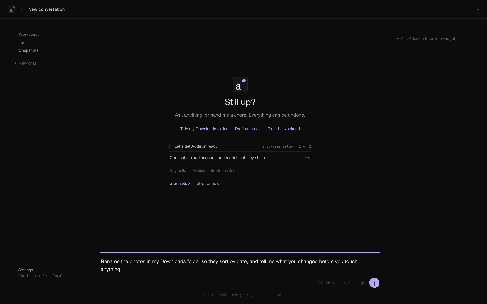
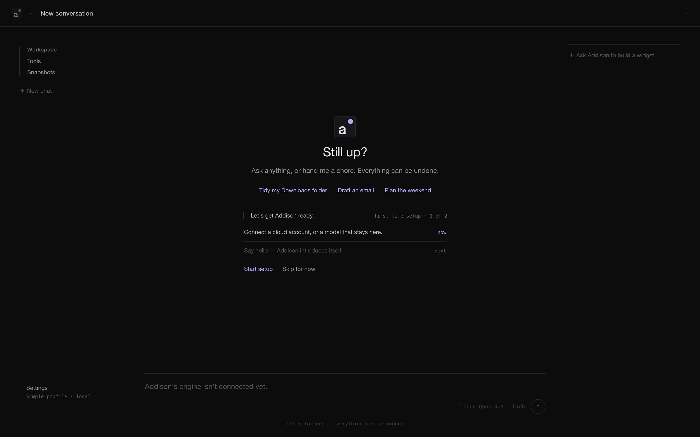
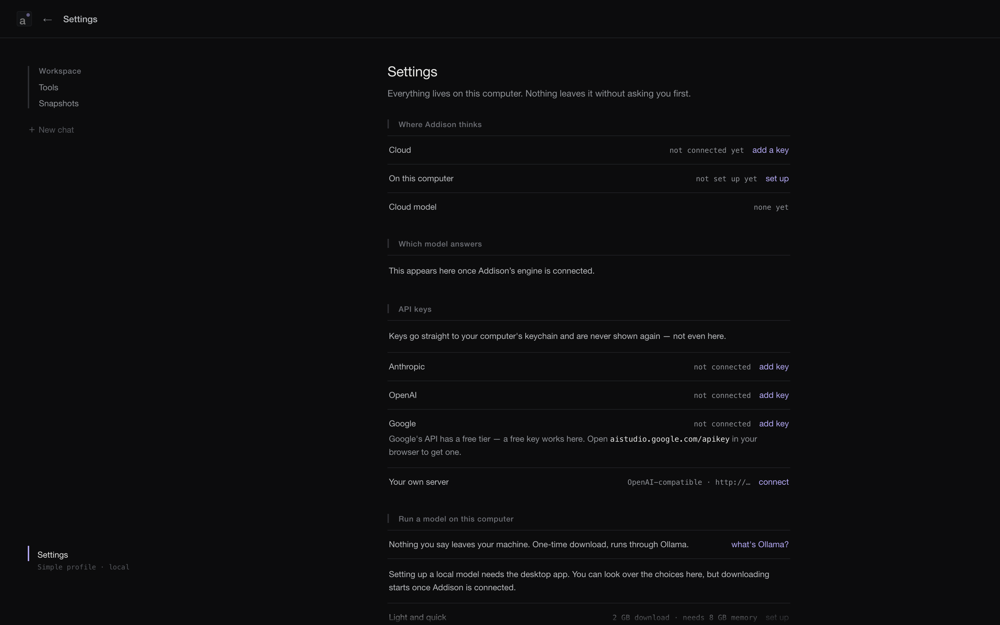
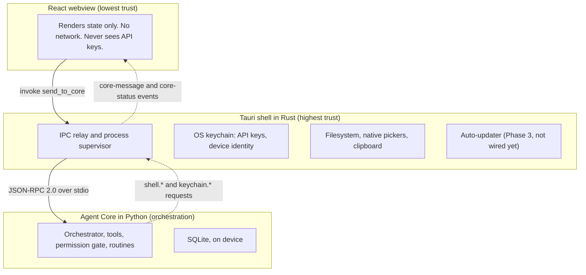

# Addison

**A private desktop assistant that runs entirely on your own computer. It asks in
plain language before it touches anything, and it can undo what it did.**

[](https://github.com/N041M/Addison/actions/workflows/ci.yml)




Most AI assistants live in someone else's cloud. Addison lives on your desk. Your
conversations stay in a SQLite file on your own disk, and you bring your own model
key, which goes straight into the operating system keychain where the app window
can never see it.

Addison is built first for people who don't write code. Everything it wants to do
on your machine is explained in plain language before it happens, and there is
always a way back afterward. If you do write code, an opt-in Developer profile
turns Addison into a capable coding assistant that can read and edit files in
folders you have trusted, and run commands you confirm one at a time. Switching
profiles changes what Addison can reach and how often it asks. The safety
guarantees below hold everywhere, on every profile.

## Features

**Chat with real tools.** Web search, reading a web page and answering from it,
reading a file you picked, the clipboard, a calculator, saving a new file,
drafting a message, opening a link, and saving a restore point whenever you ask.

**Any model, one picker.** Connect keys from Anthropic, OpenAI, Google, or your
own OpenAI-compatible server, and run local models through Ollama. All of them
appear in a single picker, chooseable per message, with an answer-style control
where the model supports one.

**Useful without a paid key.** Ask for a local or free model server in plain
language and Addison offers to add it. Ask it to run more cheaply and it shows
you the change before applying it. Both save a restore point first, so either is
a single action to undo.

**Routing you can explain.** A simple prefer-quality or prefer-free toggle by
default, and a full strategy picker on the Developer profile. If a model is busy,
Addison falls back to the next one and tells you it did. If a free model
answered, it says so.

**Undo and rewind.** Reverse the last action that changed something, or rewind
the thread to an earlier message, edit it, and send again.

**Restore points.** Addison saves one automatically before anything risky and
whenever you ask. One action in Settings puts your configuration back to the last
setup that actually worked.

**Routines.** Save a sequence of steps Addison just did as a plan you can run
again, with the values that change per run turned into variables.

**Skills.** Short notes in your own words about how you want Addison to work,
read before each reply. They can steer what Addison does. They can never widen
what it is allowed to do.

**A widget rail.** Buttons that run a routine, a token meter, connection status.
Addison proposes widgets in chat and you decide whether to pin them.

**Conversation history.** Start, list, and reopen past conversations, each titled
automatically from its first message.

**A coding harness (Developer profile).** Typed file tools that work inside
folders you have trusted and nowhere else. A path outside those folders is
refused before the tool even runs. Commands always ask.

**Outside tool servers (Developer profile).** Save the address of an MCP server,
press Check now, and its tools appear in their own section headed by the server
they came from. Addison asks before each use and says where the tool came from.
Anything a server sends back has the passwords and keys Addison recognises taken
out before a model sees it, and anything Addison won't pass along, such as
pictures or files, is named rather than dropped in silence.

**Authored automations (Developer profile).** Addison can write down an
automation for the operating system to run on a schedule. Arming one requires
retyping a one-time code that Addison shows you, so nothing Addison reads on a
web page can talk it into arming anything. The OS runs the job. Addison never
fires it.

**A calm, distinctive interface.** Three columns: conversations on the left, the
chat in the middle with Markdown and Mermaid rendering, widgets on the right. A
quiet near-black surface with one violet accent, system fonts, and a light theme
alongside the dark one. Settings are pages inside the window instead of pop-ups.

## Planned

**Signed builds with auto-update.** Packaged, notarised installers that keep
themselves current, plus the ability to step back to a previous app version if an
update disagrees with you.

**A Developer review surface.** A file tree over your trusted folders, a diff of
every edit Addison has made that is still on disk, and per-file revert. Already
built, in final cross-platform testing now.

**Smarter automatic routing.** Addison picking the right routing strategy per
task on its own, instead of you choosing one.

**Shareable routines.** Export a routine you built and hand it to someone else,
with screening for untrusted content built in from the start.

## A look around

The dark direction is the designed reference and light is derived from it. The
theme follows your system by default.

| Dark | Light |
|---|---|
|  |  |

Settings speak plain language and are honest about what is not set up yet. Keys
go straight to the keychain, and the window never sees them again.



## How it is put together

Three processes at three levels of trust, talking over JSON-RPC 2.0. The webview
reaches the Rust shell through a single Tauri command, and the shell reaches the
Python core over stdio.


```mermaid
flowchart TB
    subgraph webview["React webview (lowest trust)"]
        UI["Renders state only. No network. Never sees API keys."]
    end
    subgraph shell["Tauri shell in Rust (highest trust)"]
        Relay["IPC relay and process supervisor"]
        KC["OS keychain: API keys, device identity"]
        FS["Filesystem, native pickers, clipboard"]
        UP["Auto-updater (Phase 3, not wired yet)"]
    end
    subgraph core["Agent Core in Python (orchestration)"]
        Orch["Orchestrator, tools, permission gate, routines"]
        DB["SQLite, on device"]
    end

    UI -->|"invoke send_to_core"| Relay
    Relay -->|"JSON-RPC 2.0 over stdio"| Orch
    Orch -.->|"shell.* and keychain.* requests"| Relay
    Relay -.->|"core-message and core-status events"| UI
```

**Tauri shell (Rust).** The most trusted of the three. It owns the keychain, the
filesystem, the native file pickers and the updater. It starts the Agent Core,
keeps it running, and passes messages along. It never runs model instructions
and never interprets what a message means.

**Agent Core (Python).** The orchestration loop, the tool registry, the
permission gate, the routine engine and the SQLite store. It has no operating
system permissions of its own. Anything that touches the filesystem or the
keychain goes back to the shell as a request.

**React webview.** The least trusted of the three. It draws whatever state it is
given and collects your clicks. It never reaches the network, never talks to the
core directly, and never sees a key.

There is more detail in [docs/architecture.md](docs/architecture.md).

## What it guarantees

Four things hold on every profile, in every mode. No setting anywhere turns them
off, and they are enforced in code rather than by convention.

**Your keys stay out of the window.** They live in the operating system
keychain. The shell or the core reads one at the moment it is used, holds it for
that request only, and never writes it to the database or hands it to the part
of the app you can see. The Setup Assistant relay's own keys are not in this
repository at all. They sit on a server, and your device only signs requests
with a keypair whose private half stays in the keychain.

**Addison never starts work on its own.** Nothing runs on a schedule or after a
delay it picked. Every action starts from something you did.

If you ask it to, Addison can write down an automation describing what to run
and when, and in the Developer profile you can switch it on. Doing that takes
more than a click. Addison shows you exactly what will run, where it will be
saved, and that it will run on its own schedule even when Addison is closed, and
then shows a short code you type back to confirm. The code is different every
time and Addison itself cannot supply it, so nothing it reads on a web page can
talk you through arming something. The operating system is what runs the job,
never Addison, and switching one on deliberately does not cause a first run.

**You can always get back.** Neither you nor the model can leave Addison in a
state you can't get out of. It saves a restore point by itself before anything
risky, like switching profiles, connecting or removing a service, or deleting a
note, a widget or a routine. You can also save one whenever you want. One action
in Settings under Restore points puts your settings back to the last setup that
actually worked. Your chats are left alone and your keys never move, so a
rollback can't expose one or overwrite one. Restore points are written twice,
once into the database and once as plain files next to it, so the restore still
works if the database itself is broken.

**Lowering a safeguard still leaves a way back.** Turning a guard off is only
possible on the Custom profile, behind an extra confirmation. Doing it first
saves a restore point that can't be deleted, and records which build of Addison
you were on at the time.

Two more hold wherever they can be enforced:

- Every tool that changes something has a real undo. Any tool above the lowest
  risk tier has to implement one, and the registry refuses to register it
  otherwise. A tool that genuinely can't be undone stays read only. The
  Developer command tool is one exception, and a tool from an outside tool
  server is the other, which is why both are treated as things that cannot be
  taken back: a card before each one, unless you have chosen on the Custom
  profile to be asked less often.
- A routine can't do more than you allowed while you were sitting there. The
  routine engine uses the same registry, permission gate and undo manager as a
  live conversation, so saving something as a routine will never get around a
  question you would otherwise be asked.

Profiles change the surface and the tools, never the four guarantees. Simple is
the default and has no shell at all, so its tools are individual typed functions
and its routines are plain data with nowhere to put code. Developer adds real
command execution behind a card that shows you the exact command every time,
plus file tools that only work inside folders you have trusted. Custom sits
behind an extra confirmation and lets you choose how often Addison asks you.
[CLAUDE.md](CLAUDE.md) is the authoritative version of all of this.

## Running it

```bash
# Agent Core (from agent_core/)
python3 -m venv .venv && source .venv/bin/activate
pip install -e ".[dev]"
pytest ../tests/ -q          # safety-invariant tests must pass

# Shell (from shell/)
npm install
npm run tauri dev

# Every gate, exactly as CI runs them (from the repo root)
./scripts/gates.sh
```

You can also drive the core without the desktop shell, which is useful while
developing: `python3 -m agent_core.main --cli`. That path needs
`ANTHROPIC_API_KEY` in the environment.

A note on aggregating routers: the custom server option will accept one, such as
LiteLLM, if you point it at one. That is your call to make. Nothing of the sort
is bundled or recommended inside the app.

## Status

[ROADMAP.md](ROADMAP.md) has what is built, what is next and what is
deliberately left out.

## Where the documentation is

[docs/README.md](docs/README.md) maps every document to the topic it owns. The
short version follows.

Start with [CLAUDE.md](CLAUDE.md). It is the short version of how this
repository works. There is no precedence chain here: every topic has exactly one
owner, named in [docs/README.md](docs/README.md), and a second mention anywhere
is meant to be a link rather than a copy. Where two documents disagree, the
owner is right, regardless of which one is newer or shorter.

How the system is built:

- [docs/architecture.md](docs/architecture.md), trust boundaries and the parts
  of the agent core.
- [docs/flows.md](docs/flows.md), sequence diagrams for the main runtime flows.
- [docs/data-model.md](docs/data-model.md), the SQLite schema table by table.
- [docs/classes.md](docs/classes.md), class diagrams for the core, the providers
  and routines.

Why it is built that way. None of these overrules another, and each owns its own
topic:

- [docs/addison-design-doc.md](docs/addison-design-doc.md), the product and UX
  reasoning, including the two non-technical people it is designed around.
- [docs/addison-engineering-spec.md](docs/addison-engineering-spec.md), the
  original build brief.
- [docs/SAFETY.md](docs/SAFETY.md), the safety model in full: the four floors,
  the two policy modes, the Custom guards and the snapshot subsystem. Anything
  about safety is decided here.
- [docs/addison-scope-amendment-2026-07.md](docs/addison-scope-amendment-2026-07.md),
  the July 2026 scope change that introduced the butler idea, the three
  profiles, guaranteed rollback, MCP as a client, routing strategies and free
  models. It was folded into the documents above and retired on 2026-07-27, and
  is kept for the story behind those decisions rather than to settle questions
  about them.
- [docs/phase-3-review-surface-plan.md](docs/phase-3-review-surface-plan.md),
  the plan for the Developer review surface.

How it looks:

- [docs/design-brief-dark/](docs/design-brief-dark/) is the UI direction in
  force. `IMPLEMENTATION.md` records how the prototype maps onto the app.
- [docs/design-brief-fern/](docs/design-brief-fern/) is the previous direction,
  kept only as history. Don't build from it.

How it is checked:

- [docs/TESTING-CHECKLIST.md](docs/TESTING-CHECKLIST.md) and
  [docs/VERIFICATION.md](docs/VERIFICATION.md), the manual test and verification
  notes.
- [docs/HANDOFF.md](docs/HANDOFF.md), the current state of play, and the
  standard changes are held to here. That standard is stricter than "the tests
  pass".

## License

The Addison Non-Commercial License v1.0. Free to use, study, modify and share
for personal, educational, research and other non-commercial purposes.
Commercial use needs a separate license from the maintainer, who you can contact
through GitHub. The full terms are in [LICENSE.md](LICENSE.md).
