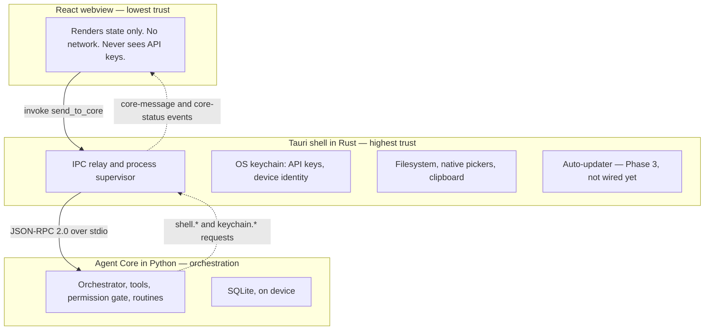

# Addison

[](https://github.com/N041M/Addison/actions/workflows/ci.yml)

Addison is a desktop assistant that runs on your own computer. It is built for
people who don't write code. It asks in plain language before it does anything on
your machine, and you can undo what it did.

Your conversations are kept in a SQLite file on your own disk. You bring your own
model key. The key is stored in the operating system keychain, and it never reaches
the part of the app that draws the window.

If you do write code, there is a Developer profile. It lets Addison read and edit
files in folders you have trusted, and run commands that you confirm one at a time.
Switching profile changes what Addison can reach and how often it asks you. It does
not switch off any of the guarantees below.

## How it is put together

Three processes at three levels of trust. They talk to each other over JSON-RPC 2.0.
The webview reaches the Rust shell through a single Tauri command, and the shell
reaches the Python core over stdio.


```mermaid
flowchart TB
    subgraph webview["React webview — lowest trust"]
        UI["Renders state only. No network. Never sees API keys."]
    end
    subgraph shell["Tauri shell in Rust — highest trust"]
        Relay["IPC relay and process supervisor"]
        KC["OS keychain: API keys, device identity"]
        FS["Filesystem, native pickers, clipboard"]
        UP["Auto-updater — Phase 3, not wired yet"]
    end
    subgraph core["Agent Core in Python — orchestration"]
        Orch["Orchestrator, tools, permission gate, routines"]
        DB["SQLite, on device"]
    end

    UI -->|"invoke send_to_core"| Relay
    Relay -->|"JSON-RPC 2.0 over stdio"| Orch
    Orch -.->|"shell.* and keychain.* requests"| Relay
    Relay -.->|"core-message and core-status events"| UI
```

**Tauri shell (Rust).** The highest trust of the three. It owns the keychain, the
filesystem, the native file pickers and the updater. It starts the Agent Core, keeps
it running, and passes messages along. It never runs model instructions and never
interprets what a message means.

**Agent Core (Python).** The orchestration loop, the tool registry, the permission
gate, the routine engine and the SQLite store. It has no operating system
permissions of its own. Anything that touches the filesystem or the keychain goes
back to the shell as a request.

**React webview.** The lowest trust of the three. It draws whatever state it is
given and collects your clicks. It never reaches the network, never talks to the
core directly, and never sees a key.

There is more detail in [docs/architecture.md](docs/architecture.md).

## What it guarantees

Four things hold on every profile, in every mode. No setting anywhere turns them
off, and they are enforced in code rather than by convention.

**Your keys stay out of the window.** They live in the operating system keychain.
The shell or the core reads one at the moment it is used, holds it for that request
only, and never writes it to the database or hands it to the part of the app you can
see. The Setup Assistant relay's own keys are not in this repository at all. They
sit on a server, and your device only signs requests with a keypair whose private
half stays in the keychain.

**Addison never starts work on its own.** Nothing runs on a schedule or after a
delay it picked. Every action starts from something you did. The design does allow
Addison to write automation that your operating system runs later, such as a cron
entry or a watcher script, with the operating system running it and Addison only
having written it, and with a keyword you type yourself needed to arm it. That part
is specified but not built. Addison cannot write automation today.

**You can always get back.** Neither you nor the model can leave Addison in a state
you can't get out of. It saves a restore point by itself before anything risky, like
switching profiles, connecting or removing a service, or deleting a note, a widget
or a routine. You can also save one whenever you want. One action in Settings under
Restore points puts your settings back to the last setup that actually worked. Your
chats are left alone and your keys never move, so a rollback can't expose one or
overwrite one. Restore points are written twice, once into the database and once as
plain files next to it, so the restore still works if the database itself is broken.

**Lowering a safeguard still leaves a way back.** Turning a guard off is only
possible on the Custom profile, behind an extra confirmation. Doing it first saves a
restore point that can't be deleted, and records which build of Addison you were on
at the time.

Two more hold wherever they can be enforced:

- Every tool that changes something has a real undo. Any tool above the lowest risk
  tier has to implement one, and the registry refuses to register it otherwise. A
  tool that genuinely can't be undone stays read only. The Developer command tool is
  the exception, which is why it asks you every single time.
- A routine can't do more than you allowed while you were sitting there. The routine
  engine uses the same registry, permission gate and undo manager as a live
  conversation, so saving something as a routine is not a way around a question you
  would otherwise be asked.

Profiles change the surface and the tools, not the four guarantees. Simple is the
default and has no shell at all, so its tools are individual typed functions and its
routines are plain data with nowhere to put code. Developer adds real command
execution behind a card that shows you the exact command every time, plus file tools
that only work inside folders you have trusted. Custom sits behind an extra
confirmation and lets you choose how often Addison asks you. [CLAUDE.md](CLAUDE.md)
is the authoritative version of all of this.

## What it does

- Chat with tools. Web search, reading a web page and answering from it, reading a
  file you picked, the clipboard, a calculator, saving a new file, drafting a
  message, opening a link, and saving a restore point when you ask for one.
- Pick the model per message. Cloud models your key can reach, plus local models
  through Ollama. Where the model supports it there is an answer style ("effort")
  control next to the picker.
- Conversation history. Start, list and reopen past conversations. Each one is
  titled automatically from its first message.
- Undo, and rewind. Reverse the last action that changed something, or rewind the
  thread back to an earlier message and edit it before sending again.
- Routines. Save a sequence of steps Addison just did as a plan you can run again,
  with the values that change per run turned into variables.
- Three profiles. Simple is the default and asks before anything risky. Developer
  adds command execution behind a confirmation card. Custom sits behind an extra
  confirmation and lets you choose how often Addison asks. Lowering a safeguard
  saves a permanent restore point first.
- A coding harness on the Developer profile. Typed tools that read and write files
  inside folders you trusted and nowhere else. A path outside those folders is
  refused before the tool runs at all. Trusting a folder stops the questions for
  those file tools only. Commands always ask.
- Routing you can explain. Prefer quality or prefer free on Simple, and a full
  strategy picker on Developer. If a model is busy Addison falls back to the next
  one and tells you it did. If a free model answered, it says so.
- Skills. Short notes in your own words about how you want Addison to work, which it
  reads before each reply. They can steer what it does. They can never widen what it
  is allowed to do.
- Ask for a local or free model server in plain language and Addison offers to add
  it. Ask it to run more cheaply and it shows you the change before it applies it.
  Both save a restore point first, so either one is a single action to undo.
- Keys from more than one provider. Anthropic, OpenAI, Google, or your own
  OpenAI-compatible server, with all their models in one picker. The custom server
  option will also accept an aggregating router such as LiteLLM if you point it at
  one. That is your call. Nothing of the sort is bundled or recommended in the app.
- A rail of small widgets. Buttons that run a routine, a token meter, connection
  status. Addison proposes them in chat and you decide whether to pin them.
- A three column window. Conversations on the left, the chat in the middle with
  Markdown and Mermaid, widgets on the right. It is a quiet near black surface with
  one violet accent, system fonts, a light theme as well as a dark one, and settings
  that are pages inside the window instead of pop-ups.

## Running it

```bash
# Agent Core (from agent_core/)
python3 -m venv .venv && source .venv/bin/activate
pip install -e ".[dev]"
pytest ../tests/ -q          # safety-invariant tests must pass

# Shell (from shell/)
npm install
npm run tauri dev
```

You can also drive the core without the desktop shell, which is useful while
developing: `python3 -m agent_core.main --cli`. That path needs `ANTHROPIC_API_KEY`
in the environment.

## Status

[ROADMAP.md](ROADMAP.md) has what is built, what is next and what is deliberately
left out.

## Where the documentation is

Start with [CLAUDE.md](CLAUDE.md). It is the short version of how this repository
works, and it wins wherever it and another document disagree.

How the system is built:

- [docs/architecture.md](docs/architecture.md), trust boundaries and the parts of
  the agent core.
- [docs/flows.md](docs/flows.md), sequence diagrams for the main runtime flows.
- [docs/data-model.md](docs/data-model.md), the SQLite schema table by table.
- [docs/classes.md](docs/classes.md), class diagrams for the core, the providers and
  routines.

Why it is built that way. These are layered, and a later one wins over an earlier
one where they disagree:

- [docs/addison-design-doc.md](docs/addison-design-doc.md), the product and UX
  reasoning, including the two non-technical people it is designed around.
- [docs/addison-engineering-spec.md](docs/addison-engineering-spec.md), the original
  build brief.
- [docs/addison-scope-amendment-2026-07.md](docs/addison-scope-amendment-2026-07.md),
  the July 2026 scope change: the butler idea, the three profiles, guaranteed
  rollback, MCP as a client, routing strategies and free models. It overrides both
  documents above it where they differ.
- [docs/phase-3-review-surface-plan.md](docs/phase-3-review-surface-plan.md), an
  approved plan for a Developer review surface that hasn't been started.

How it looks:

- [docs/design-brief-dark/](docs/design-brief-dark/) is the UI direction in force.
  `IMPLEMENTATION.md` records how the prototype maps onto the app.
- [docs/design-brief-fern/](docs/design-brief-fern/) is the previous direction, kept
  only as history. Don't build from it.

How it is checked:

- [docs/TESTING-CHECKLIST.md](docs/TESTING-CHECKLIST.md) and
  [docs/VERIFICATION.md](docs/VERIFICATION.md), the manual test and verification
  notes.
- [docs/HANDOFF.md](docs/HANDOFF.md), the current state of play, and the standard
  changes are held to here. That standard is stricter than "the tests pass".

## License

The Addison Non-Commercial License v1.0. Free to use, study, modify and share for
personal, educational, research and other non-commercial purposes. Commercial use
needs a separate license from the maintainer, who you can contact through GitHub.
The full terms are in [LICENSE.md](LICENSE.md).
