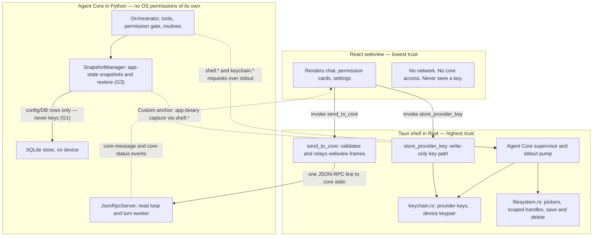
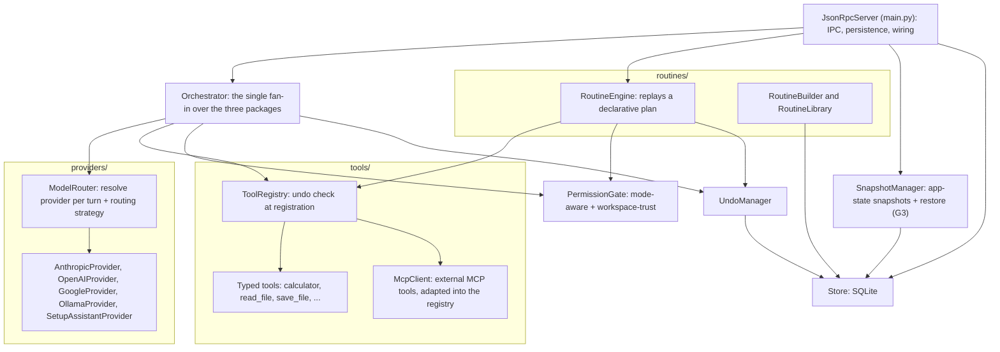

# Architecture

> **Amended 2026-07-20** — see [Scope Amendment](addison-scope-amendment-2026-07.md).
> Adds the snapshot/restore subsystem (global floor **G3**, guaranteed rollback), a
> third **Custom** profile, a **workspace-trust** boundary for the coding-agent
> harness, an **MCP client** surface over the existing registry + gate, and named
> **routing strategies**. The three-process trust model below is unchanged.

Addison is one desktop application made of three processes held at three trust
levels, so the security model is enforced by the process boundary rather than by
convention. This document covers the trust boundaries between the processes and the
internal shape of the Agent Core. For the runtime flows across these boundaries, see
[flows.md](flows.md); for the persisted state, see [data-model.md](data-model.md).

Back to the [README](../README.md).

## Trust boundaries

What each process may and may not do:

- **React webview (lowest trust).** It renders state and turns clicks into typed IPC
  calls. It reaches the shell through exactly three Tauri commands — `send_to_core`
  for everything conversational, and the write/delete-only pair
  `store_provider_key` / `delete_provider_key` for saving or removing a key the
  user typed. It has no network access, cannot talk to the core directly, and
  can never read a key back. The shell rejects any relayed frame whose method is in
  the `shell.*` or `keychain.*` namespace, so the lowest-trust process can never
  drive the OS-level side.
- **Tauri shell (highest trust).** It is a relay and a supervisor, not a
  decision-maker. It spawns the Agent Core as a child process, pumps its stdout, and
  answers the core's `shell.*` and `keychain.*` requests in-process. `keychain.rs` is
  the only place a key value is handled in the shell, and it is strictly asymmetric:
  the webview may write a key, but only the core can read one back over stdio, and
  the device private key never leaves the module except as an in-memory signing key.
  `filesystem.rs` gives the core only opaque handles and paths the shell itself
  minted this session, so the core structurally cannot wander outside the user's live
  selection.
- **Agent Core (orchestration, no OS permissions).** It runs the conversation loop,
  the typed tools, the permission gate, the routine engine, the snapshot manager, and
  the SQLite store. Every filesystem, clipboard, external-app, or keychain effect
  leaves the core as a Core-to-Shell request; the core never makes a raw syscall.

### Snapshot and restore (G3 — guaranteed rollback)

The scope amendment adds a fourth global floor, **G3**: neither the user nor the
model can drive Addison into an unrecoverable configuration — at all times there is a
one-action restore to a **last verified-working** state, and the restore path is
itself unbreakable. It is realised by the **SnapshotManager**, which takes
point-in-time copies of Addison's *mutable state* — settings, active profile/mode,
routing choice and guard toggles, provider configuration metadata, and the
declarative skills/widgets/routines rows. A snapshot is taken **automatically** before
any risky or sweeping change (a guard toggle, a provider/endpoint change, a bulk
"make it cheaper" reconfiguration, a mode switch) and can also be taken **on command**
from Settings or by asking Addison. Restore always targets the last state that
actually completed a turn, not merely the state before the last edit.

Two boundaries keep this consistent with the trust model:

- **Keys are excluded (G1 holds).** A snapshot never contains key material; restoring
  config leaves the OS keychain untouched, so a rollback can never move, expose, or
  clobber a key. A restored provider config re-binds to whatever keys are in the
  keychain by provider id.
- **Deletable, except the anchor.** Ordinary snapshots are housekeeping and the user
  may clear them. The moment a safety guard is **turned off in Custom mode** and saved,
  an **undeletable anchor** of the last verified-working state is minted — neither user
  nor model can remove it. Unlike an ordinary snapshot (state only), the anchor **also
  captures the app binary** via the shell, giving a complete known-good build + config
  to fall back to (keys still excluded).

## Agent Core components

Inside the core, `orchestrator.py` is the single fan-in. The three sibling packages —
`tools/`, `providers/`, and `routines/` — must not import from one another; only the
orchestrator (and the outer `JsonRpcServer` that wires everything) knows about all
three. That boundary is what lets the routine engine replay tool calls through the
exact same registry and gate as the live loop.

The shared instances are the point of the diagram: the `Orchestrator` and the
`RoutineEngine` are handed the **same** `ToolRegistry`, `PermissionGate`, and
`UndoManager` objects, so a routine can never out-permission the live conversation.

Component by component:

- **Orchestrator** — the turn loop. It resolves a provider per turn through the
  `ModelRouter` (there is no single active provider), sends the conversation, and for
  each requested tool call consults the permission gate, executes the tool through
  the registry, records an undo snapshot, and feeds the result back to the model
  until the model returns plain text. The same loop is reused, constrained, by the
  routine engine, which is why the gate and registry live here and not inside any
  provider.
- **ToolRegistry** — holds the typed tools and enforces the central invariant at
  registration: a tool whose risk tier is not LOW must implement a real `undo()`, or
  registration raises. This single check is the mechanical backbone of the safety
  model. Mode-scoped safety (owner decision 2026-07-19, `policy.py`): a `dev_only`
  tool (only `run_command` today) is exempt from that check and lives in the ONE
  shared registry, but is filtered out of the SAFE view — `visible_tools(mode)`
  returns it only in OPEN mode, so the Simple profile can neither see nor run it,
  while routines still share the same registry instance (no second registry).
- **PermissionGate** — consulted before every tool execution, not just the first, so
  a revoked grant takes effect immediately. It is mode-aware (`authorize`): in SAFE
  mode it prompts for every not-yet-granted tool exactly as before; in OPEN mode it
  auto-allows non-destructive calls (recording them in the activity log) and prompts
  **per invocation** for destructive ones — no prior grant is consulted and none is
  recorded, so approving one destructive command never authorizes a later one, and
  the card names the exact command text each time (`detail`, truncated ~120 chars).
  The gate still runs on every call in both modes. Destructiveness is per-call
  (`run_command` classifies its own command via a read-only allowlist; any other
  tool is destructive iff its tier is HIGH). Non-dev tools keep the coarse
  session-grant model it tracks; the consent prompt itself is an IPC round-trip to
  the webview. The amendment extends the gate along two axes without changing its
  "runs and logs on every call" guarantee. **Workspace-trust** (Phase-2): when the
  user grants a project directory, OPEN mode stops *prompting* for destructive calls
  *inside* that scope (the gate still runs and logs); calls outside the workspace
  still raise the per-invocation card exactly as today. **Custom mode** (the third
  profile) makes the gate's *prompting* guards — the destructive card, the auto-grant
  scope, the workspace boundary, the keyword-gate strictness — user-tunable deep in
  Settings; the four global floors (G1, G2, G3, undeletable-anchor) are never in that
  panel. A powerful or *armed* action additionally requires a **user-typed keyword
  prefix** on the message; because it is user-typed, observed content can never supply
  it, so the keyword gate doubles as a prompt-injection barrier.
- **UndoManager** — records an action snapshot per mutating tool call and reverses
  the most recent ones on request, and separately truncates message history for a
  conversational rewind. The two mechanisms are independent.
- **ModelRouter** — resolves which provider handles a request from an explicit role
  (PRIMARY, LOCAL, SETUP_ASSISTANT) and an optional model name. Multiple roles and
  several models per role can be configured and reachable at once. The amendment adds a
  bounded **routing strategy** layer over this substrate (Phase-2): four named
  strategies — **quality-first** (default; strongest capable model, degrade down on
  unavailability/rate-limit/budget), **cost-first**, **local-only** (never leaves the
  machine), and **balanced** — plus a Developer-only **custom** builder. The companion
  surface exposes only a single "prefer quality / prefer free" toggle. Routing is
  strong-first by default, degrades gracefully with a plain-language note and a light
  per-provider cooldown instead of hammering a failing endpoint, and shows an
  "answered with a free model" disclaimer whenever a free model responds.
- **Providers** — one adapter per backend. `AnthropicProvider`, `OpenAIProvider`, and
  `GoogleProvider` are cloud providers (multi-provider, owner decision 2026-07-18);
  `OpenAIProvider` also backs an OpenAI-compatible **custom server** via a `base_url`
  override and an optional key. `OllamaProvider` runs local models, and
  `SetupAssistantProvider` fills the onboarding relay role. Each connected cloud
  provider contributes models to one picker union; a by-name pick resolves to that
  provider's instance in the router. The orchestrator never branches on the concrete
  provider; it reads capabilities instead.
- **Provider connections** — keys are stored per provider id (`anthropic | openai |
  google | custom`) in the OS keychain; `provider.connect` validates a saved key with
  one tiny request, then registers the provider's models. Non-secret connection
  metadata (connected, added date, custom base URL) lives in `provider_config`;
  `provider.list`/`connect`/`disconnect` responses never carry key material.
- **RoutineBuilder / RoutineLibrary / RoutineEngine** — build a declarative plan from
  a recent conversation, store and list saved routines, and replay a plan's steps
  through the shared gate and registry. Mode-scoped safety (`policy.py`): a plan step
  may carry an OPEN-mode-only `command` (run through the `run_command` dev-only tool,
  same gate + registry, so a destructive command still prompts). A routine's
  `created_in_mode` column records the mode it was saved under; routines created in
  OPEN mode are hidden from `routine.list` and refused by `routine.run` in SAFE mode,
  and return untouched in OPEN. Command routines can only be saved in OPEN mode.
- **Widgets and usage** — server/orchestrator machinery, not registry tools. After
  each provider call the orchestrator's `on_usage` hook records a `usage_log` row
  (tokens + latency) at that single choke point; `stats.get` derives the token meter
  and per-provider latency from it. Widgets themselves are **declarative specs**
  (`agent_core/widgets.py`), validated at save *and* at render, never eval'd. The
  amendment makes widgets **buildable in every mode** and gates the *capability* a
  widget may use rather than whether one can be built (Phase-2). SAFE draws from a
  **non-destructive vocabulary** — the existing launchers (routine / stat / command)
  plus interactive display kinds (to-do/checklist, note, counter, timer) rendered by
  trusted Addison components over safe backing storage, with no arbitrary code, so
  SAFE-1 and the webview CSP still hold. Higher tiers (Developer / Custom) add
  code-backed / system-capable widgets governed by workspace-trust, per-tool `undo()`,
  the snapshot floor, and the keyword gate. A widget can never exceed its mode's
  capability tier; `created_in_mode` continues to hide higher-tier widgets under the
  Simple profile. They are proposed like routines (draft held in the core, saved only
  on an explicit confirm) and stored in the `widgets` table.
- **McpClient** — Addison as an MCP **client**, not a server or gateway (Phase-2). It
  connects to external MCP servers and surfaces their tools through the **existing
  ToolRegistry and PermissionGate** — never a side channel, so MCP tools are gated,
  logged, and undo-aware like any native tool. It is mode-scoped: OPEN runs them under
  workspace-trust, while SAFE admits only read-only or genuinely undo-able tools (a
  mutating MCP tool with no `undo()` cannot be LOW-risk, so invariant 2 keeps it out of
  the SAFE view automatically). Connecting an MCP server is reversible, snapshotted
  provider-style config, addable by prompting, sharing the add-an-endpoint plumbing.
- **SnapshotManager** — the G3 machinery described above: it captures app-state
  snapshots (config/DB rows, keys excluded) automatically before risky changes and on
  command, marks a configuration verified-working after a turn completes against it,
  and restores to the last verified-working state. It mints the undeletable Custom-mode
  anchor (which additionally captures the app binary via the shell). It is wired
  directly under the `JsonRpcServer` alongside the routine engine, and reads/writes its
  own snapshot rows through the Store.
- **Store** — the SQLite access layer. It reads and writes the transcript, action
  snapshots, routines, usage, widgets, settings, and app-state snapshots; it holds no
  secrets, since keys live only in the keychain.
