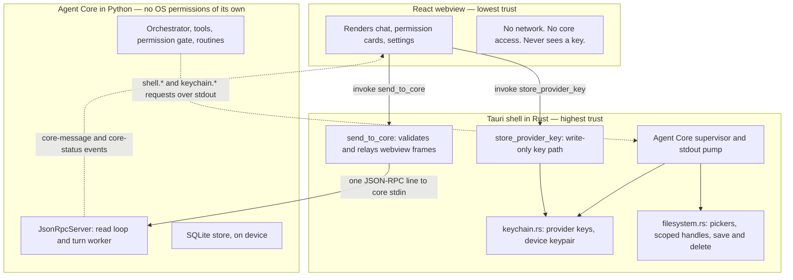
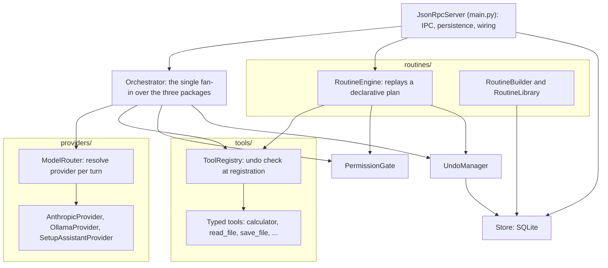

# Architecture

Addison is one desktop application made of three processes held at three trust
levels, so the security model is enforced by the process boundary rather than by
convention. This document covers the trust boundaries between the processes and the
internal shape of the Agent Core. For the runtime flows across these boundaries, see
[flows.md](flows.md); for the persisted state, see [data-model.md](data-model.md).

Back to the [README](../README.md).

## Trust boundaries

What each process may and may not do:

- **React webview (lowest trust).** It renders state and turns clicks into typed IPC
  calls. It reaches the shell through exactly two Tauri commands — `send_to_core` for
  everything conversational, and a write-only `store_provider_key` for saving a key
  the user typed. It has no network access, cannot talk to the core directly, and
  can never read a key back. The shell rejects any relayed frame whose method is in
  the `shell.*` or `keychain.*` namespace, so the lowest-trust process can never
  drive the OS-level side.
- **Tauri shell (highest trust).** It is a relay and a supervisor, not a
  decision-maker. It spawns the Agent Core as a child process, pumps its stdout, and
  answers the core's `shell.*` and `keychain.*` requests in-process. `keychain.rs` is
  the only place a key value is handled in the shell, and it is strictly asymmetric:
  the webview may write a key, but only the core can read one back over stdio, and
  the device private key never leaves the module except as an in-memory signing key.
  `filesystem.rs` gives the core only opaque handles and paths the shell itself
  minted this session, so the core structurally cannot wander outside the user's live
  selection.
- **Agent Core (orchestration, no OS permissions).** It runs the conversation loop,
  the typed tools, the permission gate, the routine engine, and the SQLite store.
  Every filesystem, clipboard, external-app, or keychain effect leaves the core as a
  Core-to-Shell request; the core never makes a raw syscall.

## Agent Core components

Inside the core, `orchestrator.py` is the single fan-in. The three sibling packages —
`tools/`, `providers/`, and `routines/` — must not import from one another; only the
orchestrator (and the outer `JsonRpcServer` that wires everything) knows about all
three. That boundary is what lets the routine engine replay tool calls through the
exact same registry and gate as the live loop.

The shared instances are the point of the diagram: the `Orchestrator` and the
`RoutineEngine` are handed the **same** `ToolRegistry`, `PermissionGate`, and
`UndoManager` objects, so a routine can never out-permission the live conversation.

Component by component:

- **Orchestrator** — the turn loop. It resolves a provider per turn through the
  `ModelRouter` (there is no single active provider), sends the conversation, and for
  each requested tool call consults the permission gate, executes the tool through
  the registry, records an undo snapshot, and feeds the result back to the model
  until the model returns plain text. The same loop is reused, constrained, by the
  routine engine, which is why the gate and registry live here and not inside any
  provider.
- **ToolRegistry** — holds the typed tools and enforces the central invariant at
  registration: a tool whose risk tier is not LOW must implement a real `undo()`, or
  registration raises. This single check is the mechanical backbone of the safety
  model.
- **PermissionGate** — consulted before every tool execution, not just the first, so
  a revoked grant takes effect immediately. It tracks coarse grant and denial state;
  the consent prompt itself is an IPC round-trip to the webview.
- **UndoManager** — records an action snapshot per mutating tool call and reverses
  the most recent ones on request, and separately truncates message history for a
  conversational rewind. The two mechanisms are independent.
- **ModelRouter** — resolves which provider handles a request from an explicit role
  (PRIMARY, LOCAL, SETUP_ASSISTANT) and an optional model name. Multiple roles and
  several models per role can be configured and reachable at once; the choice is
  always explicit in v1.
- **Providers** — one adapter per backend. `AnthropicProvider` is the cloud primary,
  `OllamaProvider` runs local models, and `SetupAssistantProvider` fills the
  onboarding relay role. The orchestrator never branches on the concrete provider; it
  reads capabilities instead.
- **RoutineBuilder / RoutineLibrary / RoutineEngine** — build a declarative plan from
  a recent conversation, store and list saved routines, and replay a plan's steps
  through the shared gate and registry.
- **Store** — the SQLite access layer. It reads and writes the transcript, action
  snapshots, routines, and settings; it holds no secrets, since keys live only in the
  keychain.
