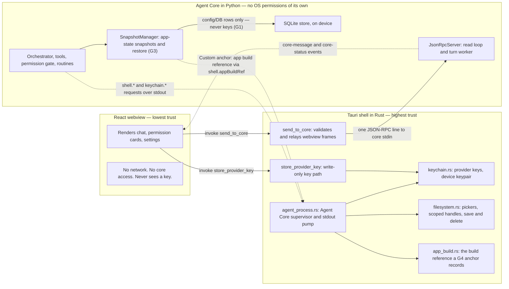
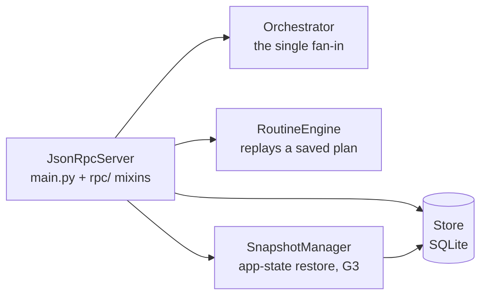
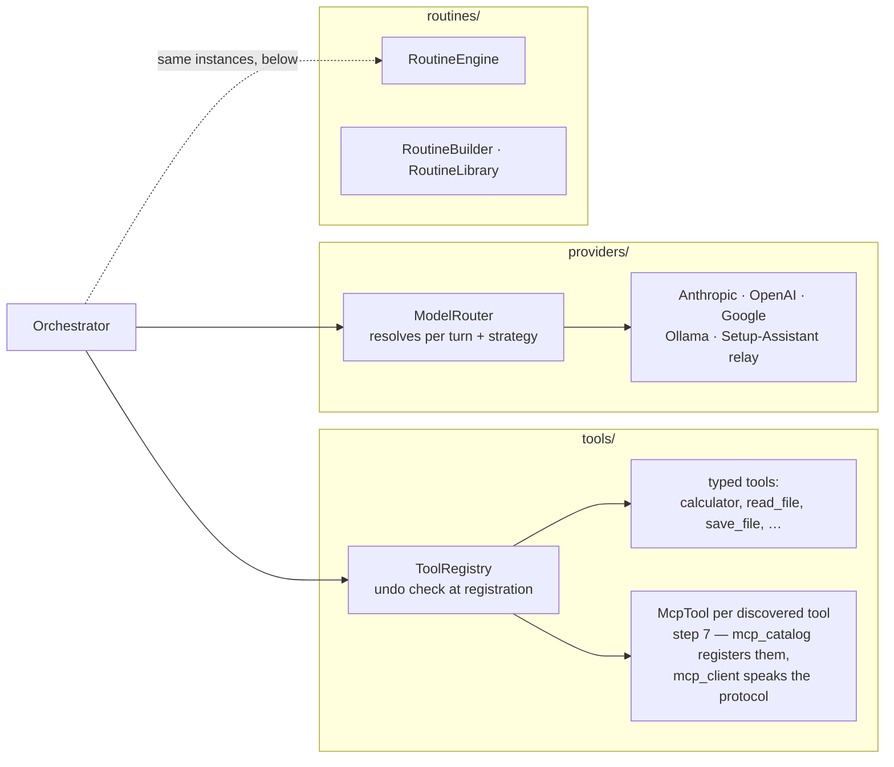
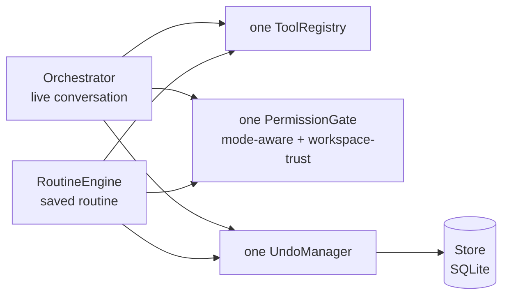

# Architecture

> **Amended 2026-07-20** by the scope amendment, which was folded into the
> authoritative docs and **retired 2026-07-27**. Floors, modes and guards are
> owned by [`SAFETY.md`](SAFETY.md); status by [`../ROADMAP.md`](../ROADMAP.md).
> Do not consult the amendment to settle a question — it is a historical record.
> Adds the snapshot/restore subsystem (global floor **G3**, guaranteed rollback), a
> third **Custom** profile, a **workspace-trust** boundary for the coding-agent
> harness, an **MCP client** surface over the existing registry + gate, and named
> **routing strategies**. The three-process trust model below is unchanged.

Addison is one desktop application made of three processes held at three trust
levels, so the security model is enforced by the process boundary rather than by
convention. This document covers the trust boundaries between the processes and the
internal shape of the Agent Core. For the runtime flows across these boundaries, see
[flows.md](flows.md); for the persisted state, see [data-model.md](data-model.md).

Back to the [README](../README.md).

## Trust boundaries

```mermaid
%% LR, deliberately: the core->shell callback edges make a rank cycle that, in a
%% TB layout, scrambles the bands and routes edges through the shell subgraph's
%% title text. Left-to-right, every edge lands in open space.
flowchart LR
    subgraph webview["React webview — lowest trust"]
        direction TB
        UIrender["Renders chat, permission cards, settings"]
        UInote["No network. No core access. Never sees a key."]
    end

    subgraph shell["Tauri shell in Rust — highest trust"]
        direction TB
        SendCmd["send_to_core: validates and relays webview frames"]
        StoreKeyCmd["store_provider_key: write-only key path"]
        Supervisor["agent_process.rs: Agent Core supervisor and stdout pump"]
        Keychain["keychain.rs: provider keys, device keypair"]
        Filesystem["filesystem.rs: pickers, scoped handles, save and delete"]
        AppBuild["app_build.rs: the build reference a G4 anchor records"]
    end

    subgraph core["Agent Core in Python — no OS permissions of its own"]
        direction TB
        Server["JsonRpcServer: read loop and turn worker"]
        Engine["Orchestrator, tools, permission gate, routines"]
        Snapshots["SnapshotManager: app-state snapshots and restore (G3)"]
        Store["SQLite store, on device"]
    end

    UIrender -->|"invoke send_to_core"| SendCmd
    UIrender -->|"invoke store_provider_key"| StoreKeyCmd
    SendCmd -->|"one JSON-RPC line to core stdin"| Server
    Server -.->|"core-message and core-status events"| UIrender
    Engine -.->|"shell.* and keychain.* requests over stdout"| Supervisor
    Engine --> Snapshots
    Snapshots -->|"config/DB rows only — never keys (G1)"| Store
    Snapshots -.->|"Custom anchor: app build reference via shell.appBuildRef"| Supervisor
    Supervisor --> Keychain
    Supervisor --> Filesystem
    Supervisor --> AppBuild
    StoreKeyCmd --> Keychain
```

`shell/src-tauri/src/main.rs` registers exactly those three webview commands and
spawns the core. Beside it sit six working modules — `agent_process`, `app_build`,
`exec` (the step-5.5 seatbelt: the sandboxed executor every approved `run_command`
runs through), `filesystem`, `ipc` and `keychain`. There is a seventh, `updater.rs`,
but it is a **nine-line comment stub with no code**: `tauri-plugin-updater` is not
wired up, and auto-update is a **Phase-3** item (see G4 below, where this matters).

What each process may and may not do:

- **React webview (lowest trust).** It renders state and turns clicks into typed IPC
  calls. It reaches the shell through exactly three Tauri commands — `send_to_core`
  for everything conversational, and the write/delete-only pair
  `store_provider_key` / `delete_provider_key` for saving or removing a key the
  user typed. It has no network access, cannot talk to the core directly, and
  can never read a key back. The shell rejects any relayed frame whose method is in
  the `shell.*` or `keychain.*` namespace, so the lowest-trust process can never
  drive the OS-level side.
- **Tauri shell (highest trust).** It is a relay and a supervisor, not a
  decision-maker. It spawns the Agent Core as a child process, pumps its stdout, and
  answers the core's `shell.*` and `keychain.*` requests in-process. `keychain.rs` is
  the only place a key value is handled in the shell, and it is strictly asymmetric:
  the webview may write a key, but only the core can read one back over stdio, and
  the device private key never leaves the module except as an in-memory signing key.
  `filesystem.rs` gives the core only opaque handles and paths the shell itself
  minted this session, so the core structurally cannot wander outside the user's live
  selection.
- **Agent Core (orchestration, no OS permissions).** It runs the conversation loop,
  the typed tools, the permission gate, the routine engine, the snapshot manager, and
  the SQLite store. Every filesystem, clipboard, external-app, or keychain effect
  leaves the core as a Core-to-Shell request; the core never makes a raw syscall.

### Snapshot and restore (G3 — guaranteed rollback)

*Built in Phase-2 step 1 — `agent_core/snapshots/`, the `config_snapshots` table, the
`snapshot.*` RPC namespace, and the Settings "Restore points" card.*

The 2026-07-20 scope change added a fourth global floor, **G3 — guaranteed
rollback**, defined in **[`SAFETY.md`](SAFETY.md)** along with its current scope.
Architecturally what matters is that it is realised by the **SnapshotManager**, which takes
point-in-time copies of Addison's *mutable state* — settings, active profile/mode,
routing choice and guard toggles, provider configuration metadata, and the
declarative skills/widgets/routines rows. A snapshot is taken **automatically** before
any risky or sweeping change (a guard toggle, a provider/endpoint change, a bulk
"make it cheaper" reconfiguration, a mode switch) and can also be taken **on command**
from the Settings card, or by **asking Addison** — the LOW, **capture-only**
`snapshot_now` registry tool (`agent_core/tools/snapshot_now.py`), in all three
profiles (Simple, Developer and Custom).
It holds a **late-bound** reference to the `SnapshotManager` (the registry is built
before the worker thread builds the manager), so before the store is up it answers
"can't save a restore point just yet" rather than failing; once up, it makes the same
`capture(trigger="on_command", reason="user_request")` call the Settings control does.
Capture-only is the floor: it may only ever **add** a row — never restore, delete or
prune — which is what keeps it honestly LOW with no `undo()`. Restore always targets
the last state that actually completed a turn, not merely the state before the last
edit.

Two boundaries keep this consistent with the trust model:

- **Keys are excluded (G1 holds).** A snapshot never contains key material; restoring
  config leaves the OS keychain untouched, so a rollback can never move, expose, or
  clobber a key. A restored provider config re-binds to whatever keys are in the
  keychain by provider id — and if that key is gone, the restore names the affected
  service in plain language rather than pretending it reconnected.
- **Deletable, except three kinds of row.** Ordinary snapshots are housekeeping and the
  user may clear them. Three kinds are permanent: the bottom row of the restore walk —
  `genesis` on an install this launch created, `pre_upgrade` on a database that predates
  the subsystem — and the **G4 anchor** minted the moment a safety guard is **turned off
  in Custom mode** and saved (`guards.set` mints it *first*, and refuses the change if
  it cannot). Neither user nor model can remove any of them, and the refusal is enforced
  by two `RAISE(ABORT)` database triggers, not by a `WHERE` clause anyone can forget.
  Unlike an ordinary snapshot, the anchor also **records the app build
  it was minted on** — a short `{"version", "identifier"}` reference fetched from the
  shell via `shell.appBuildRef`, never bytes and never a path (keys still excluded).
  *(Owner decision 2026-07-20: this corrects the earlier "captures the app binary /
  complete known-good build + config" wording. **Restoring a previous binary is not
  implemented**; a restore whose build differs says so plainly and changes settings
  only. Re-installing a prior build belongs to the Tauri updater and is tracked as a
  **Phase-3** item — putting a second binary-replacement mechanism inside the recovery
  floor would collide with the updater and would be the one piece of the floor that
  could itself brick the app.)*

Two more properties are structural rather than boundaries, and they are why this
subsystem is described here at all:

- **The restore path holds no dependencies it could lose.** `SnapshotManager` reaches
  the Store and nothing else — no provider, router, profile, policy mode, tool registry
  or permission gate. Restore is an RPC path, **never a registry tool and never gated**:
  a gate that could deny a restore would make "the restore path is itself unbreakable"
  ([`SAFETY.md`](SAFETY.md) owns that claim and its OPEN-mode scope)
  false.
- **Every payload is written twice** — into the row, and into a `0600` JSON sidecar
  beside the database. If SQLite itself will not open, `snapshot.list` and
  `snapshot.restoreLastWorking` are answered from those files with no Store at all; the
  restore renames the damaged database **aside** (never deletes it) and rebuilds in the
  same session. That is the answer to "the database is the broken thing".

## Agent Core components

Inside the core, `orchestrator.py` is the single fan-in. The three sibling packages —
`tools/`, `providers/`, and `routines/` — must not import from one another; only the
orchestrator (and the outer `JsonRpcServer` that wires everything) knows about all
three. That boundary is what lets the routine engine replay tool calls through the
exact same registry and gate as the live loop.

`JsonRpcServer` lives in `main.py` but its handlers do not: it is composed from the
mixins in `agent_core/rpc/` — one module per method namespace (`conversation`,
`undo`, `routines`, `profile`, `models`, `providers`, `widgets`, `skills`,
`snapshots`, `guards`, `routing`, `cost_plan`, `workspace`, `mcp` — the external
tool servers of step 7 — and `automations`, the rows step 8 authors for the OS to
run), each of which is also the sole camelCase mapper at the wire boundary for its
own namespace.

```mermaid
flowchart LR
    Server["JsonRpcServer<br/>main.py + rpc/ mixins"]

    Server --> Orch["Orchestrator<br/>the single fan-in"]
    Server --> RE["RoutineEngine<br/>replays a saved plan"]
    Server --> SM["SnapshotManager<br/>app-state restore, G3"]
    Server --> Store[("Store<br/>SQLite")]
    SM --> Store
```

The three packages the orchestrator fans into. They **never import each other** —
`orchestrator.py` is the only module that knows all three, which is what keeps the
routine engine replaying calls through the live registry rather than a copy of it.

```mermaid
flowchart LR
    Orch["Orchestrator"]

    subgraph tools["tools/"]
        direction TB
        TR["ToolRegistry<br/>undo check at registration"]
        TR --> Tool["typed tools:<br/>calculator, read_file, save_file, …"]
        TR --> MCP["McpTool per discovered tool<br/>step 7 — mcp_catalog registers them,<br/>mcp_client speaks the protocol"]
    end

    subgraph providers["providers/"]
        direction TB
        MR["ModelRouter<br/>resolves per turn + strategy"]
        MR --> Prov["Anthropic · OpenAI · Google<br/>Ollama · Setup-Assistant relay"]
    end

    subgraph routines["routines/"]
        direction TB
        RE["RoutineEngine"]
        RBL["RoutineBuilder · RoutineLibrary"]
    end

    Orch --> TR
    Orch --> MR
    Orch -.->|"same instances, below"| RE
```

**The shared instances are the safety property.** The live conversation and a saved
routine are handed the *same* three objects, so a routine can never out-permission
the conversation that created it:

```mermaid
flowchart LR
    Orch["Orchestrator<br/>live conversation"]
    RE["RoutineEngine<br/>saved routine"]

    TR["one ToolRegistry"]
    PG["one PermissionGate<br/>mode-aware + workspace-trust"]
    UM["one UndoManager"]
    Store[("Store<br/>SQLite")]

    Orch --> TR
    Orch --> PG
    Orch --> UM
    RE --> TR
    RE --> PG
    RE --> UM
    UM --> Store
```

Component by component:

- **Orchestrator** — the turn loop. It resolves a provider per turn through the
  `ModelRouter` (there is no single active provider), sends the conversation, and for
  each requested tool call consults the permission gate, executes the tool through
  the registry, records an undo snapshot, and feeds the result back to the model
  until the model returns plain text. The same loop is reused, constrained, by the
  routine engine, which is why the gate and registry live here and not inside any
  provider.
- **ToolRegistry** — holds the typed tools and enforces the central invariant at
  registration: a tool whose risk tier is not LOW must implement a real `undo()`, or
  registration raises. This single check is the mechanical backbone of the safety
  model. Mode-scoped safety (owner decision 2026-07-19, `policy.py`) splits that into
  **two independent dimensions**, because step 5 needed them apart: `open_only` is
  *visibility* — the tool is absent from `visible_tools(SAFE)` and refused at dispatch
  outside OPEN — while `allow_missing_undo` is the *exemption* from the undo check.
  `dev_only=True` is the alias that sets both, and `run_command` is the only tool that
  gets it. The harness's `read_project_file` / `write_project_file` are `open_only`
  **and still undo-enforced**, so a future edit dropping `write_project_file.undo()`
  fails registration. All of them live in the ONE shared registry, so routines use the
  same instance (no second registry). Hiding is not enforcing: the SAFE boundary is
  closed at **dispatch** by `refuse_if_dev_only_outside_open`, called by both the
  orchestrator turn path and the routine step path *before* the gate and before
  `execute`, so a `tool_use` naming a hidden id cannot sail through to `get()`.
- **PermissionGate** — consulted before every tool execution, not just the first, so
  a revoked grant takes effect immediately. It is mode-aware (`authorize`): in SAFE
  mode it prompts for every not-yet-granted tool exactly as before; in OPEN mode it
  auto-allows non-destructive calls (recording them in the activity log) and prompts
  **per invocation** for destructive ones — no prior grant is consulted and none is
  recorded, so approving one destructive command never authorizes a later one, and
  the card names the exact command text each time (`detail`, truncated ~120 chars).
  The gate still runs on every call in both modes. Destructiveness is per-call
  (`tools/base.call_is_destructive`): a tool may classify its own call, and two do —
  **`run_command` returns True unconditionally, so every command cards.** The
  read-only allowlist that used to auto-allow `ls`/`grep`/`git status` was **removed**
  (`run_command.py`): it was defeated three ways during hardening — a bare newline
  (`shlex` reads `ls\nrm -rf /` as a lone `ls`), bundled and attached short flags
  (`grep -rf /etc/passwd`, `grep -f/etc/passwd`), and allowlisted readers that write
  when given a flag (`file -Cm`) — and a misclassification lands *outside* the G3
  rollback floor, since an `rm -rf` is not undoable. `write_project_file` also returns
  True (an overwrite is data loss). With no classifier, a call is destructive iff its
  tier is HIGH. Non-dev tools keep the coarse session-grant model the gate tracks; the
  consent prompt itself is an IPC round-trip to the webview.

  Two extensions, neither of which changes the "runs and logs on every call"
  guarantee. **Workspace-trust** (step 5, shipped) is two separate predicates, and
  conflating them is the error to avoid. *Confinement* is permission-to-**touch**: a
  path-bounded tool — one with a non-`None` `affected_path` — is **hard-refused before
  the gate and before `execute`** when its resolved path is outside every trusted root,
  LOW and MEDIUM alike. The gate's `trusted` flag is only permission-to-**skip the
  card**, and by owner decision 2026-07-24 it is set solely for the typed,
  path-bounded, undoable file tools; **`run_command` always cards**, its
  `affected_path` being `None` so confinement never governs it either. Routine command
  steps and command widgets pass `trusted=False` unconditionally, so a stored one-click
  spec can never skip a card. The path is resolved **once** and handed to `execute` via
  `ExecutionContext.resolved_path` rather than re-read from `args` — check one path,
  act on another is the TOCTOU gap. **Custom mode** (the third profile, step 2 —
  shipped) makes the gate's *prompting* guards user-tunable deep in Settings. Two are
  built and settings-backed: `destructive_card` (`per_invocation` > `session`) and
  `auto_grant_scope` (`none` > `non_destructive` > `everything`), a `GuardConfig` that
  only ever modulates the OPEN path — the defaults are today's OPEN gate byte for byte,
  which is what lets Simple and Developer keep passing `None`. The four global floors
  (G1, G2, G3, and the undeletable-anchor rule — **G4** in `CLAUDE.md` and in code; the
  two names are the same rule) are never in that panel. The **keyword gate** for
  powerful or *armed* actions is Phase-2 **step 8 and not built**; when it lands, the
  nonce will be user-typed, so observed content can never supply it and the gate
  doubles as a prompt-injection barrier.
- **UndoManager** — records an action snapshot per mutating tool call and reverses
  the most recent ones on request, and separately truncates message history for a
  conversational rewind. The two mechanisms are independent.
- **ModelRouter** — resolves which provider handles a request from an explicit role
  (PRIMARY, LOCAL, SETUP_ASSISTANT) and an optional model name. Multiple roles and
  several models per role can be configured and reachable at once. Phase-2 step 3
  **shipped** a bounded **routing strategy** layer beside this substrate — deliberately
  beside, not on it: `resolve_chain(strategy, candidates, head_model_id, custom_order)`
  is a pure module function in `providers/router.py` that orders `RoutingCandidate`s,
  and the attempt loop (cooldown, per-attempt deadline, mid-turn advance) is orchestrator
  machinery. Three named strategies plus a Developer/Custom ordered chain:
  **quality_first** (the default; strongest capable model, degrade down),
  **cost_first**, **local_only** (no model call leaves the machine — resolved before
  the Setup-Assistant relay branch, and enforced upstream in `rpc/conversation.py` as
  well as in the chain), and **custom**. **`balanced` was cut from v1** (owner decision
  2026-07-24, amendment §10.1: at two-model pools it was provably identical to
  cost-first). The head of every chain is the user's standing default, so a strategy
  orders only the tail and never overrides a deliberate pick; the companion surface
  exposes a single "prefer quality / prefer free" toggle over the same setting. The
  turn falls forward on `ProviderUnavailable` **and on `ProviderKeyRejected`** — the
  structured exception hierarchy in `providers/base.py` (`ProviderUnavailable` /
  `ProviderRequestRejected` / `ProviderAuthFailed`, plus `ProviderKeyRejected` as a
  subclass of the last, all `RuntimeError` subclasses so every existing handler still
  catches them) is what keeps a bad request or a *missing* key from being amplified
  across the whole chain. A **rejected** key is the one auth case that does walk
  (secrets-and-keychain plan §5.2, built 2026-08-06): a 401/403 is definitive
  evidence about THAT provider's key and says nothing about the next provider's, so
  the loop marks it needs-attention — once — and degrades exactly as it does for an
  unavailable one. Degrading emits a plain-language note,
  cools the failed provider (in-memory, a module constant), and an "Answered with a
  free model." chip appears when a free model answered *and* routing rather than the
  user chose it.
- **Providers** — one adapter per backend. `AnthropicProvider`, `OpenAIProvider`, and
  `GoogleProvider` are cloud providers (multi-provider, owner decision 2026-07-18);
  `OpenAIProvider` also backs an OpenAI-compatible **custom server** via a `base_url`
  override and an optional key. `OllamaProvider` runs local models, and
  `SetupAssistantProvider` fills the onboarding relay role. Each connected cloud
  provider contributes models to one picker union; a by-name pick resolves to that
  provider's instance in the router. The orchestrator never branches on the concrete
  provider; it reads capabilities instead.
- **Provider connections** — keys are stored per provider id (`anthropic | openai |
  google | custom`) in the OS keychain; `provider.connect` validates a saved key with
  one tiny request, then registers the provider's models. Non-secret connection
  metadata (connected, added date, custom base URL) lives in `provider_config`;
  `provider.list`/`connect`/`disconnect` responses never carry key material.
  Anthropic and Google validate against their own fixed endpoints (`GET /v1/models`,
  `GET /v1beta/models`). The **OpenAI-compatible** `GET {base}/v1/models` is different,
  because a custom server's base URL points wherever the user — or, via the
  add-by-prompt card, a model-influenced utterance — says, so it is issued through
  **`agent_core/net_vetting.py`**: the pinned-request mechanism factored out of
  `read_web_page` in step 4 so the two flows share one defence instead of growing a
  weaker copy. Resolve the name, vet the **resolved IP**, connect to the vetted address
  with the name in `Host` and TLS SNI, follow no redirects, and re-vet every hop. The
  vetting *decision* is a parameter, so a LAN endpoint (private addresses and any port
  allowed) and the public web share one mechanism and differ only in that argument;
  rebinding and the redirect gap are closed either way, and the pin drops credential
  headers the moment a redirect leaves the origin they were aimed at. Adding an
  endpoint by prompting is a propose/confirm pair (`endpoint.proposeFromConversation`,
  `endpoint.confirmAdd`) whose fields are core-derived or canned — never
  model-authored — and it ends in the same `provider.connect`.
- **RoutineBuilder / RoutineLibrary / RoutineEngine** — build a declarative plan from
  a recent conversation, store and list saved routines, and replay a plan's steps
  through the shared gate and registry. Mode-scoped safety (`policy.py`): a plan step
  may carry an OPEN-mode-only `command` (run through the `run_command` dev-only tool,
  same gate + registry, so a destructive command still prompts). A routine's
  `created_in_mode` column records the mode it was saved under; routines created in
  OPEN mode are listed by `routine.list` in SAFE mode carrying a display-only
  `unavailable` reason, refused by `routine.run` there, and return untouched in
  OPEN ([SAFETY.md](SAFETY.md) owns the rule — they were hidden outright until
  2026-08-06). Command routines can only be saved in OPEN mode.
- **Widgets and usage** — server/orchestrator machinery, not registry tools. After
  each provider call the orchestrator's `on_usage` hook records a `usage_log` row
  (tokens + latency) at that single choke point; `stats.get` derives the token meter
  and per-provider latency from it. Widgets themselves are **declarative specs**
  (`agent_core/widgets.py`), validated at save *and* at render against the current
  policy mode, never eval'd. Today's vocabulary is a **closed set of six kinds**,
  five of them SAFE: the launchers
  `{kind:"routine", routineId, title}` and `{kind:"stat", source, title}` (source from
  the fixed whitelist `tokens_month` / `provider_latency` / `connections`) in both
  modes; the three interactive kinds described below; and `{kind:"command", command,
  title}` in OPEN only — rejected at save under SAFE, and rendered while Simple is
  active as a disabled row (title + reason, no Run and no command text) rather than a
  working one. **What makes it disabled is the spec, not the `created_in_mode` stamp**
  (`widget_uses_dev_abilities`: OPEN accepts it and SAFE does not, plus a look-through
  to what a launcher points at). A command spec stamped `'safe'` — a restored config,
  an older build, a hand-edited row — is caught identically and refused by
  `widget.run`, and a checklist stamped `'open'` is an ordinary usable row: what a row
  IS decides what Simple may do with it, never where it was born. There is no eval, no expression field and no template field,
  and a routine id is matched against a plain-slug pattern so a spec cannot smuggle an
  expression through it. Widgets are proposed like routines (draft held in the core,
  saved only on an explicit confirm) and stored in the `widgets` table.
  **Phase-2 step 6, half A (2026-08-06):** three interactive SAFE kinds —
  `{kind:"checklist", items, title}`, `{kind:"note", text, title}` and
  `{kind:"timer", seconds, title}` — rendered by trusted Addison components over
  Addison's own storage, invoking no tool at all. Their mutable half lives in the
  separate `widget_state` table, written by `widget.setState` (validated per kind,
  no permission card, excluded from snapshots) — the spec stays what was declared.
  The amendment's capability *declaration* was **cut**: the list of kinds is closed
  and hard-coded, which is the tier gate ([SAFETY.md](SAFETY.md) owns invariant 4).
  Code-backed / system-capable kinds at the higher tiers remain future work,
  governed by workspace-trust, per-tool `undo()`, the snapshot floor, and the
  keyword gate.
- **McpClient** *(Phase-2 step 7 — **built for v1: phases 1–4 of five**. Phase 1
  shipped 2026-08-06 (the `mcp_servers` table and the `mcp.*` RPC namespace in
  `agent_core/rpc/mcp.py`); phase 2 shipped 2026-08-07 — `agent_core/mcp_client.py`
  (the Streamable-HTTP protocol client) and `agent_core/mcp_catalog.py` (admission +
  the in-memory catalog); phase 3 shipped the same day — `tools/call`, a bounded
  `inputSchema`, `McpTool.execute`, and `tool_audit` on every outcome; phase 4
  closed output handling — `compose_result` (one shared budget across every part of
  a result, the structured channel through the same redaction seam, and a plain line
  naming what Addison will not carry) and `clean_result_text` before the redactor.
  Phase 5 (stdio under containment, SAFE admission) is a recorded later option
  rather than a missing piece.)* — Addison as an MCP **client**, not a server or
  gateway. It
  connects to external MCP servers and surfaces their tools through the **existing
  ToolRegistry and PermissionGate** — never a side channel, so MCP tools are gated,
  logged, and undo-aware like any native tool. **MCP is Developer-only for v1** (owner
  decision 2026-08-06): no MCP tool enters the SAFE view, and what SAFE would ever
  admit is deferred rather than answered — underneath that, invariant 2 keeps a
  mutating MCP tool with no `undo()` out of the SAFE view automatically, whatever a
  server claims. **Transport is HTTP only for v1**, so a saved server is a URL and
  never a program to launch ([step-7-mcp-plan.md](step-7-mcp-plan.md) owns both
  decisions, and the three phase-2 scoping decisions). Connecting an MCP server is
  reversible, snapshotted provider-style config, addable by prompting, sharing the
  add-an-endpoint plumbing.

  Discovery's shape, because it is what dispatch is built on. `mcp.refresh` runs on
  the worker thread (the `provider.connect` pattern — a stranger's server must never
  hold the IPC pump) and bounds the whole handshake-plus-pagination walk to one
  budget. A discovered tool registers namespaced `mcp:<server>:<tool>`, `dev_only`,
  HIGH and destructive unconditionally; an id collision REFUSES that tool rather than
  replacing anything. Everything a server sends is untrusted text, so names,
  descriptions, schemas, counts and response bodies are capped and cleaned at the
  `mcp_client` boundary. Two registry dimensions arrived with it — `removable` (only
  a discovered tool may ever be unregistered) and `not_callable` (absent from
  `visible_tools` in every mode, refused at both dispatch sites; nothing sets it
  since dispatch shipped, and it stays as the mechanism the phase constant operates
  through). What a check found lives in memory only: a catalog is the server's truth,
  not Addison's configuration, and `mcp_servers` is snapshot-captured. Discovery is
  on demand only — nothing connects at start-up or on a timer.

  Dispatch's shape (phase 3). `McpTool.execute` resolves the server's address at the
  MOMENT OF USE — a server removed or renamed since the check refuses rather than
  being reached where it used to be — and runs one `tools/call` inside one ~15s
  budget, over a session that begins and ends with the call. HIGH + destructive means
  the existing gate cards EVERY invocation in OPEN; SAFE refuses above the gate as
  before. The answer is redacted and then capped, in that order (a cut through a
  credential defeats the redactor), and every outcome writes a `tool_audit` row from
  BOTH dispatch paths — including the two values the vocabulary gained for it,
  `not_callable` and `failed`.
- **SnapshotManager** — the G3 machinery described above: it captures app-state
  snapshots (config/DB rows, keys excluded) automatically before risky changes and on
  command, marks a configuration verified-working after a turn completes against it,
  and restores to the last verified-working state. It mints the undeletable Custom-mode
  anchor (which additionally records the app build reference, fetched via the shell).
  It is wired directly under the `JsonRpcServer` alongside the routine engine, and
  reads/writes its own snapshot rows through the Store. Not to be confused with the
  `UndoManager` in the same package: that reverses one tool call; this restores the
  whole configuration. They are complementary and never call each other, which is why
  the verbs differ — capture / restore / mint_anchor / prune, never record / undo_last.
- **Store** — the SQLite access layer. It reads and writes the transcript, action
  snapshots, routines, usage, widgets, skills, settings, provider config, workspace
  trust, and app-state snapshots; it holds no secrets, since keys live only in the
  keychain. All SQLite access is confined to the server's single worker thread.
- **Outward reach** — `read_web_page` (`agent_core/tools/read_web_page.py`) is LOW,
  read-only and in the Simple tool set, and it is the first SAFE tool that sends a
  request to an address the *model* picks. Every URL and every redirect hop is vetted
  by resolved IP and the connection is pinned to the address that was vetted
  (`net_vetting.py`), closing SSRF and DNS-rebinding. Outward reach is bounded by
  **visibility, not per-site grants** (owner decision 2026-07-20): the tool's
  `permission_detail` names the **host only** — never a path or query string, which
  could carry data outward and would land in the Activity Panel and in any screenshot
  of it — and the panel shows that host on every granted call, in both modes and on
  the routine path too.
