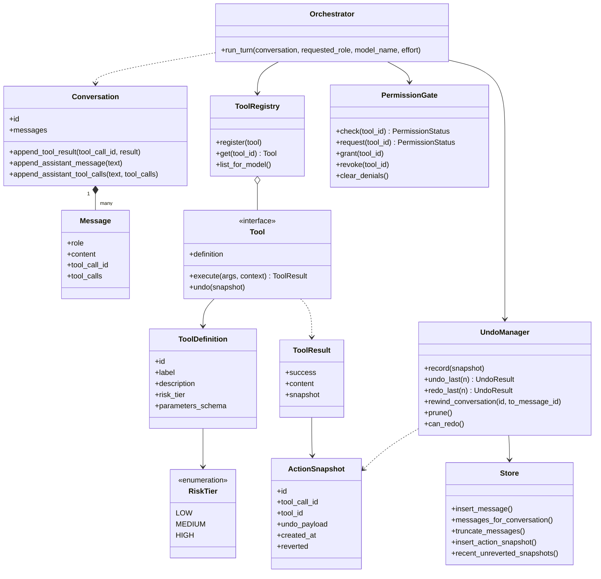
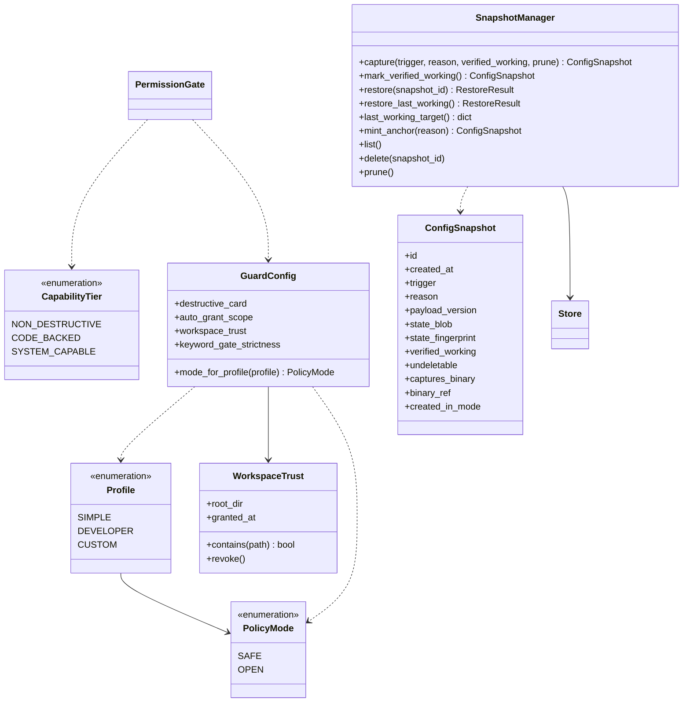
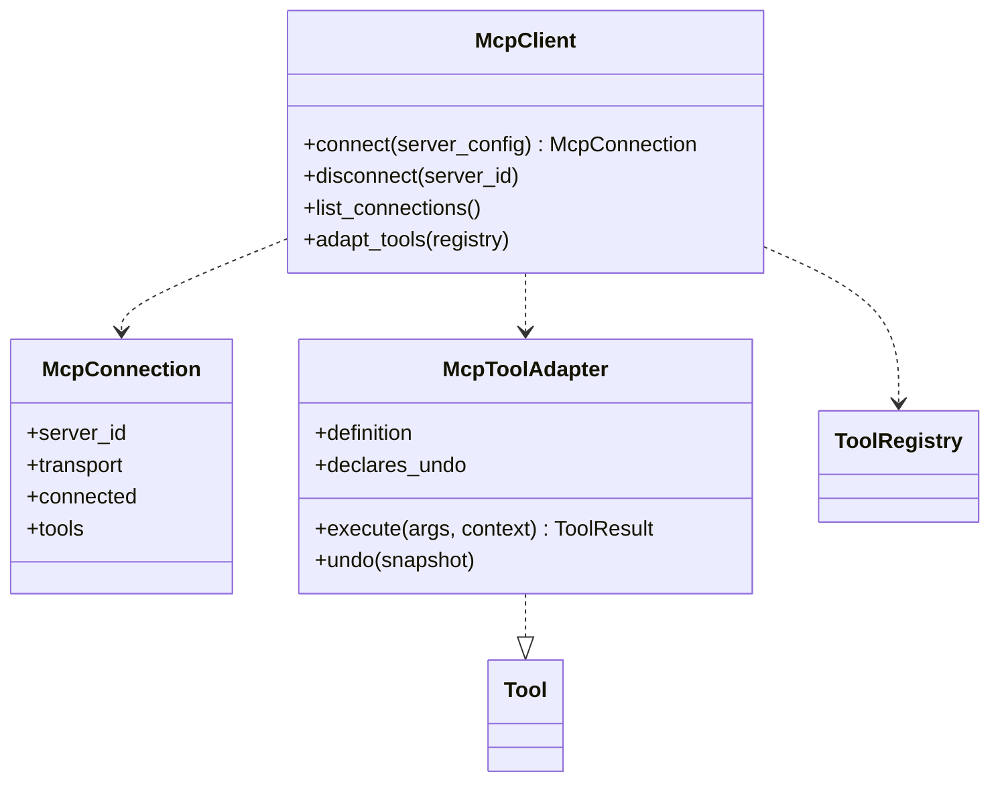
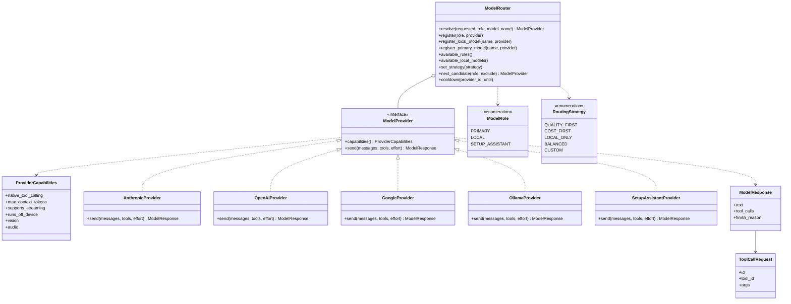
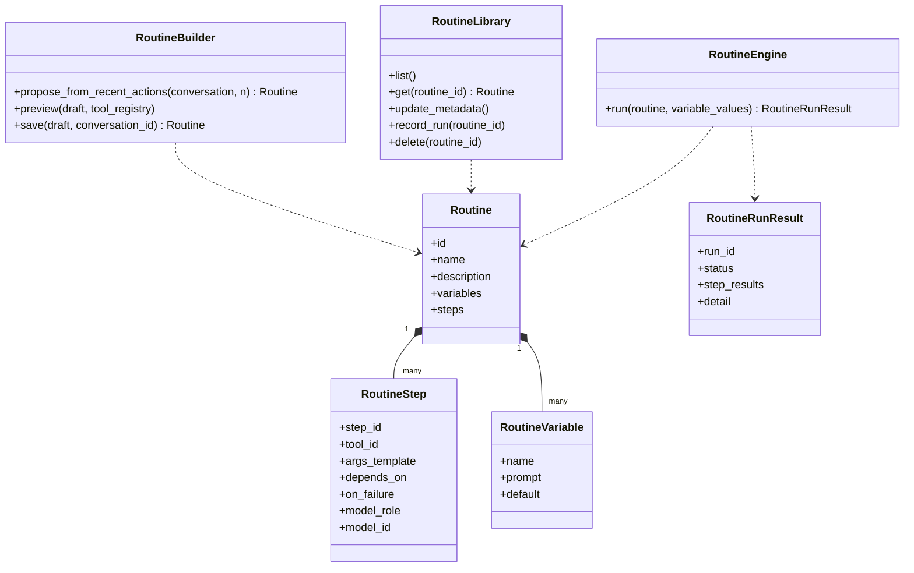

# Class diagrams

> **Amended 2026-07-20** — see [Scope Amendment](addison-scope-amendment-2026-07.md).
> Adds the `SnapshotManager` (global floor **G3**, guaranteed rollback), the
> Simple/Developer/**Custom** mode-and-guard model with capability tiers, a
> `RoutingStrategy` abstraction (four named strategies + custom, with graceful
> fallback), and an `McpClient` external-tool surface over the existing registry +
> gate. Members marked *(Phase-2)* describe shape the amendment implies but that is
> not yet in code.

The core in three views: orchestration, providers, and routines. Attributes and
methods are the real ones from the code, trimmed to the load-bearing members. The
`tools/`, `providers/`, and `routines/` packages do not import one another; the
orchestrator is the only module that knows all three.

Back to the [README](../README.md); see also [architecture.md](architecture.md),
[flows.md](flows.md), and [data-model.md](data-model.md).

## Core orchestration

The turn loop and the safety machinery. `Tool` is a structural protocol; a tool whose
`risk_tier` is not LOW must implement a real `undo()`, and `ToolRegistry.register`
raises otherwise.

## Modes, guards, and snapshots

The scope amendment layers three things onto the safety machinery above: a third
**Custom** profile whose *prompting* guards are user-tunable, **capability tiers** that
gate what a tool or widget may do per mode, and the **SnapshotManager** that makes
global floor **G3** (guaranteed rollback) real. The mode is still derived from the
active profile; Custom is a tuned overlay whose *floors* are fixed. The
`SnapshotManager` captures app-state snapshots (config/DB rows — never keys, so G1
holds), marks a configuration verified-working after a turn completes, and restores to
the last verified-working state. Turning a guard off in Custom mode mints an
**undeletable anchor** that records the app build it was minted on (a reference, not
the binary — owner decision 2026-07-20; see `data-model.md`). `WorkspaceTrust` scopes
the gate's OPEN-mode auto-grant to a user-granted project directory.

**`SnapshotManager` shipped in Phase-2 step 1**, so its members below are real and the
signatures are the ones in `agent_core/snapshots/snapshot_manager.py`. Three names in
the earlier sketch were wrong and are corrected here: `snapshot(reason)` is
**`capture(...)`** (the verb set is capture / restore / mint_anchor / prune, never
record / undo_last, so it can never be confused with `UndoManager`);
`mark_verified_working(config_id)` takes **no argument** (there is no config-identity
concept in the data model — it captures the *current* config as a new verified row,
deduped by fingerprint); and `Snapshot.payload` is **`ConfigSnapshot.state_blob`**,
because dataclasses mirror their table 1:1 and the column is `state_blob`.
`restore(snapshot_id)` and `restore_last_working()` **both** exist: the second is the
G3 floor — the one-action button, which cannot take an argument — and is implemented
as the first, so there is one code path. `mint_anchor()` ships fully implemented with
no caller; step 2's Custom guard toggle supplies it.

`GuardConfig.mode_for_profile` keeps today's 1:1 derivation (Simple→SAFE,
Developer→OPEN); Custom carries the tunable guard fields. `CapabilityTier` is what the
gate and the widget validator consult to decide whether a tool/widget's requested
capability is admissible in the active mode — SAFE admits only `NON_DESTRUCTIVE`.
Neither `ConfigSnapshot.undeletable` anchors nor the four floors (G1, G2, G3, the
anchor rule — **G4** in code and in `CLAUDE.md`; the two names are the same rule) are
reachable from `GuardConfig`. `SnapshotManager` and `ConfigSnapshot` are **shipped**
and their names are fixed; `GuardConfig`, `WorkspaceTrust`, `CapabilityTier` and the
`CUSTOM` profile are still *(Phase-2)* sketches whose module and class names are not.

`SnapshotManager` depends on `Store` and nothing else in this diagram — deliberately.
It reaches no provider, router, profile, policy mode, registry, or gate, because the
restore path has to work when any of those is broken. For the same reason **restore is
never a registry tool and never passes the `PermissionGate`**: a gate that could deny a
restore would make "the restore path is itself unbreakable" false. The only
model-facing snapshot surface is a **LOW, capture-only** `snapshot_now` tool
(`agent_core/tools/snapshot_now.py`, in both v1 profiles) that may add a row and
nothing else — it reaches the `SnapshotManager` through a **late-bound** ref (the
registry is built before the manager exists, so it answers "can't save yet" until the
store is up) and calls only `capture(...)`, never restore/delete/prune.

## External tools via MCP

Addison is an MCP **client** — it consumes external MCP servers — never a server or
gateway. `McpClient` adapts each remote tool into the *existing* `ToolRegistry`, so an
MCP tool is registered, gated, logged, and undo-checked exactly like a native tool
(§ Core orchestration). Because a mutating tool with no `undo()` cannot be LOW-risk,
invariant 2 automatically keeps such an MCP tool out of the SAFE view. Connecting a
server is reversible, snapshotted config, sharing the add-an-endpoint plumbing.

`McpToolAdapter` satisfies the same `Tool` protocol as native tools, which is what lets
it flow through the one shared registry + gate. All members here are *(Phase-2)*.

## Providers and routing

The orchestrator is written against the `ModelProvider` protocol and never branches on
the concrete provider; capability differences are read from `ProviderCapabilities`.
The concrete providers satisfy the protocol structurally (duck-typed, shown here as
realization). `ModelRouter` resolves a provider per turn from a role and an optional
model name, with several models reachable per role.

The amendment adds a bounded **routing strategy** layer *(Phase-2)*. A `RoutingStrategy`
picks, within the resolved role, which of the reachable models to try first and how to
degrade: **quality-first** (default — strongest capable model, degrade down on
unavailability/rate-limit/budget), **cost-first**, **local-only** (never leaves the
machine), **balanced**, plus a Developer-only **custom** builder. The companion surface
exposes only a "prefer quality / prefer free" toggle over these. On failure the router
degrades gracefully — a plain-language note, a light per-provider **cooldown** instead
of hammering a failing endpoint, and an "answered with a free model" disclaimer
whenever a free model responds.

`set_strategy` / `next_candidate` / `cooldown` are the *(Phase-2)* strategy + graceful
fallback surface; the `resolve`/`register*`/`available*` members are today's code.

## Routines

A routine is a declarative plan: an ordered, DAG-shaped list of tool calls with
templated arguments and no code field anywhere. The builder drafts one from a recent
conversation, the library stores and lists them, and the engine replays a plan through
the same permission gate, tool registry, and undo manager as the live loop. Saved
routines are declarative artifacts, so they are part of the app state the
`SnapshotManager` captures (§ Modes, guards, and snapshots) and are restored with a
rollback. Under the amendment, an OPEN-mode `command` step still raises the gate's
per-invocation destructive card unless it runs inside a trusted workspace, and any
routine that arms OS-run automation is subject to the keyword gate.

