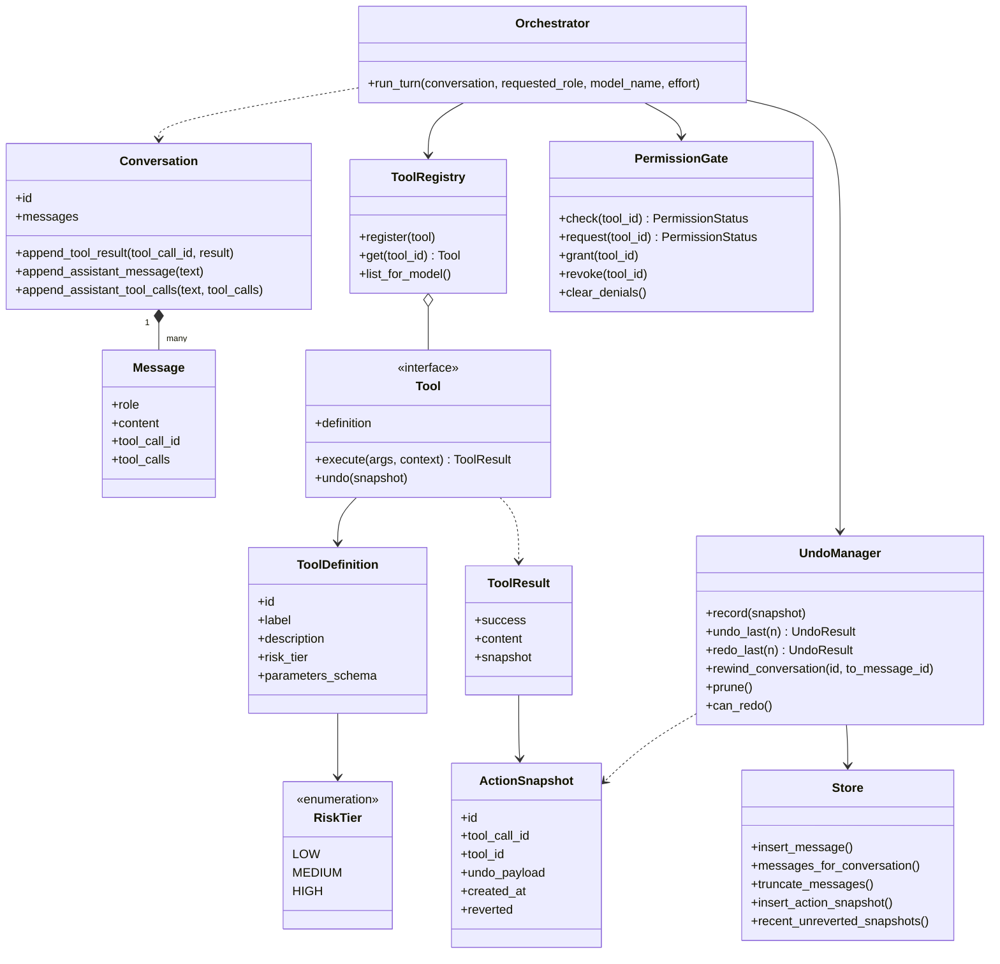
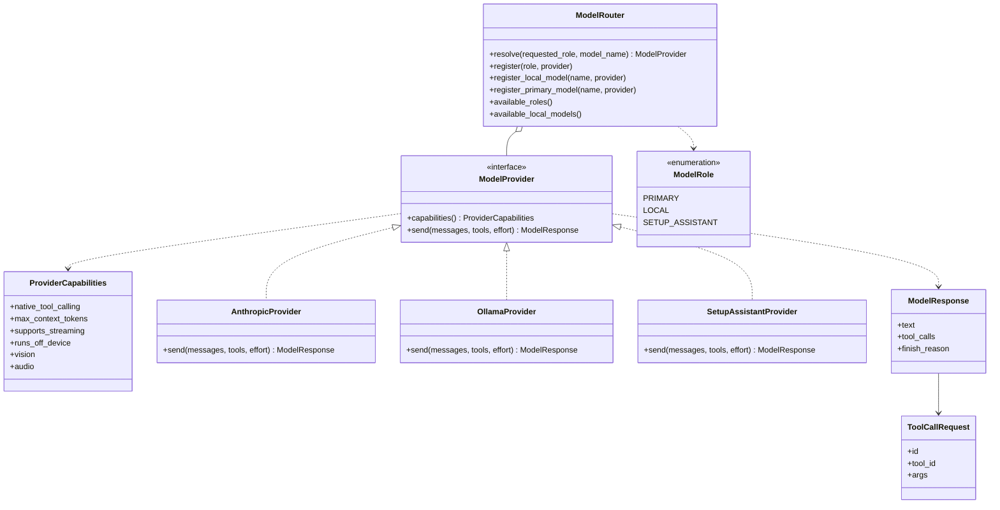
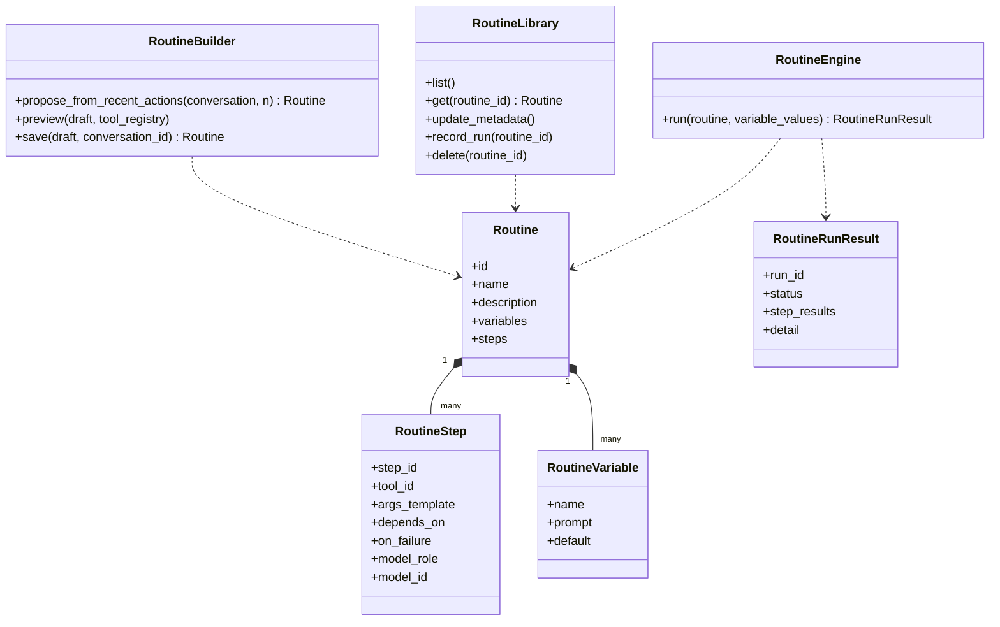

# Class diagrams

The core in three views: orchestration, providers, and routines. Attributes and
methods are the real ones from the code, trimmed to the load-bearing members. The
`tools/`, `providers/`, and `routines/` packages do not import one another; the
orchestrator is the only module that knows all three.

Back to the [README](../README.md); see also [architecture.md](architecture.md),
[flows.md](flows.md), and [data-model.md](data-model.md).

## Core orchestration

The turn loop and the safety machinery. `Tool` is a structural protocol; a tool whose
`risk_tier` is not LOW must implement a real `undo()`, and `ToolRegistry.register`
raises otherwise.

## Providers and routing

The orchestrator is written against the `ModelProvider` protocol and never branches on
the concrete provider; capability differences are read from `ProviderCapabilities`.
The three concrete providers satisfy the protocol structurally (duck-typed, shown here
as realization). `ModelRouter` resolves a provider per turn from a role and an optional
model name, with several models reachable per role.

## Routines

A routine is a declarative plan: an ordered, DAG-shaped list of tool calls with
templated arguments and no code field anywhere. The builder drafts one from a recent
conversation, the library stores and lists them, and the engine replays a plan through
the same permission gate, tool registry, and undo manager as the live loop.

