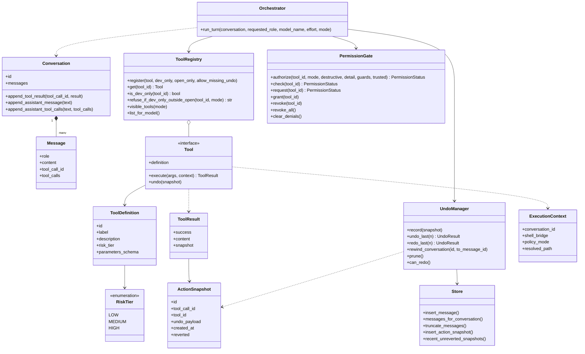
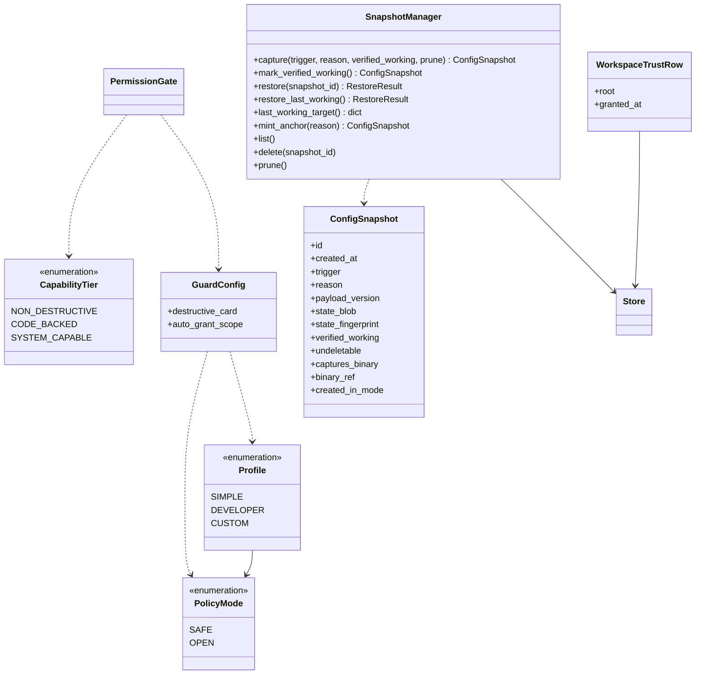
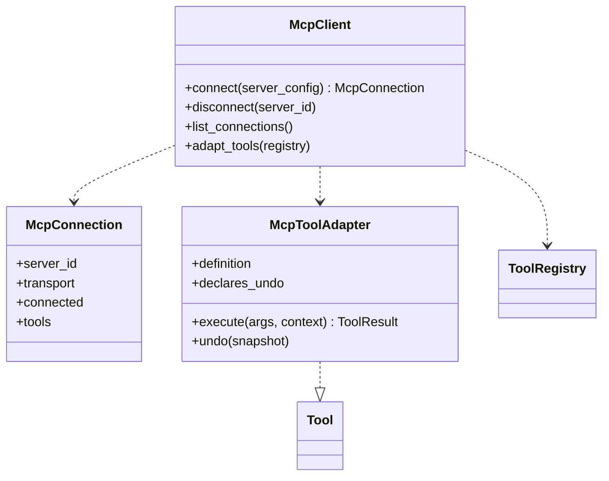
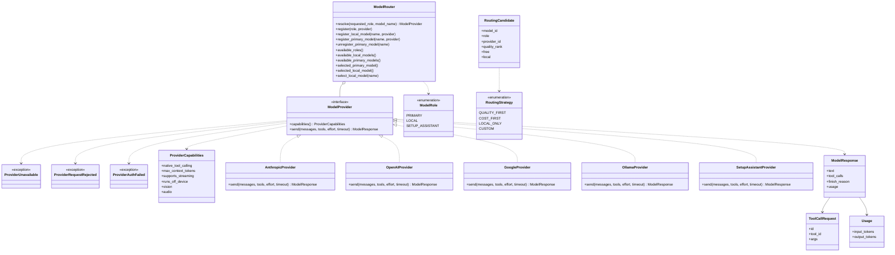
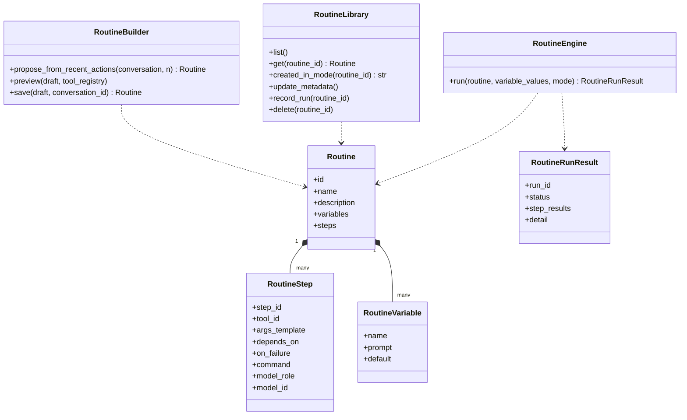

# Class diagrams

> **Amended 2026-07-20** — see [Scope Amendment](addison-scope-amendment-2026-07.md).
> Adds the `SnapshotManager` (global floor **G3**, guaranteed rollback), the
> Simple/Developer/**Custom** mode-and-guard model with capability tiers, a
> `RoutingStrategy` abstraction (four named strategies + custom, with graceful
> fallback), and an `McpClient` external-tool surface over the existing registry +
> gate. Members marked *(Phase-2)* describe shape the amendment implies but that is
> not yet in code.

The core in three views: orchestration, providers, and routines. Attributes and
methods are the real ones from the code, trimmed to the load-bearing members. The
`tools/`, `providers/`, and `routines/` packages do not import one another; the
orchestrator is the only module that knows all three.

Back to the [README](../README.md); see also [architecture.md](architecture.md),
[flows.md](flows.md), and [data-model.md](data-model.md).

## Core orchestration

The turn loop and the safety machinery. `Tool` is a structural protocol; a tool whose
`risk_tier` is not LOW must implement a real `undo()`, and `ToolRegistry.register`
raises otherwise.

```mermaid
classDiagram
    class Orchestrator {
        +run_turn(conversation, requested_role, model_name, effort, mode)
    }
    class Conversation {
        +id
        +messages
        +append_tool_result(tool_call_id, result)
        +append_assistant_message(text)
        +append_assistant_tool_calls(text, tool_calls)
    }
    class Message {
        +role
        +content
        +tool_call_id
        +tool_calls
    }
    class Tool {
        <<interface>>
        +definition
        +execute(args, context) ToolResult
        +undo(snapshot)
    }
    class ToolDefinition {
        +id
        +label
        +description
        +risk_tier
        +parameters_schema
    }
    class RiskTier {
        <<enumeration>>
        LOW
        MEDIUM
        HIGH
    }
    class ToolRegistry {
        +register(tool, dev_only, open_only, allow_missing_undo)
        +get(tool_id) Tool
        +is_dev_only(tool_id) bool
        +refuse_if_dev_only_outside_open(tool_id, mode) str
        +visible_tools(mode)
        +list_for_model()
    }
    class PermissionGate {
        +authorize(tool_id, mode, destructive, detail, guards, trusted) PermissionStatus
        +check(tool_id) PermissionStatus
        +request(tool_id) PermissionStatus
        +grant(tool_id)
        +revoke(tool_id)
        +revoke_all()
        +clear_denials()
    }
    class UndoManager {
        +record(snapshot)
        +undo_last(n) UndoResult
        +redo_last(n) UndoResult
        +rewind_conversation(id, to_message_id)
        +prune()
        +can_redo()
    }
    class ActionSnapshot {
        +id
        +tool_call_id
        +tool_id
        +undo_payload
        +created_at
        +reverted
    }
    class ToolResult {
        +success
        +content
        +snapshot
    }
    class ExecutionContext {
        +conversation_id
        +shell_bridge
        +policy_mode
        +resolved_path
    }
    class Store {
        +insert_message()
        +messages_for_conversation()
        +truncate_messages()
        +insert_action_snapshot()
        +recent_unreverted_snapshots()
    }

    Orchestrator --> ToolRegistry
    Orchestrator --> PermissionGate
    Orchestrator --> UndoManager
    Orchestrator ..> Conversation
    Conversation "1" *-- "many" Message
    ToolRegistry o-- Tool
    Tool --> ToolDefinition
    ToolDefinition --> RiskTier
    Tool ..> ToolResult
    Tool ..> ExecutionContext
    ToolResult --> ActionSnapshot
    UndoManager --> Store
    UndoManager ..> ActionSnapshot
```

Three things about the dispatch order the diagram cannot show, all of them shared
byte for byte by the orchestrator turn path and the routine step path:

1. **The dev-only refusal happens at dispatch, before the gate and before
   `execute`.** `visible_tools` hides an `open_only` tool from the *model*, but hiding
   is not enforcing — a `tool_use` naming a hidden id still reaches `get()`, and the
   gate does not check dev-ness. `refuse_if_dev_only_outside_open` is what closes it.
2. **Confinement is a separate predicate from prompting.** `call_affected_path`
   resolves a path-bounded tool's path **once**; if that path is outside every trusted
   root the call is hard-refused there and then, LOW and MEDIUM alike. The resolved
   value rides to `execute` on `ExecutionContext.resolved_path` and is never re-read
   from `args` — resolving twice would let confinement approve one path while the write
   lands on another.
3. **Destructiveness and the card's text are per call**, from
   `tools/base.call_is_destructive` and `call_permission_detail`. The latter is asked
   once and used twice — for the permission card and for the Activity Panel — so the
   two can never describe different calls.

## Modes, guards, and snapshots

The scope amendment layers three things onto the safety machinery above: a third
**Custom** profile whose *prompting* guards are user-tunable, **capability tiers** that
gate what a tool or widget may do per mode, and the **SnapshotManager** that makes
global floor **G3** (guaranteed rollback) real. The mode is still derived from the
active profile; Custom is a tuned overlay whose *floors* are fixed. The
`SnapshotManager` captures app-state snapshots (config/DB rows — never keys, so G1
holds), marks a configuration verified-working after a turn completes, and restores to
the last verified-working state. Turning a guard off in Custom mode mints an
**undeletable anchor** that records the app build it was minted on (a reference, not
the binary — owner decision 2026-07-20; see `data-model.md`).

**Workspace trust is not a class.** It is a two-column table (`workspace_trust`) plus
two pure predicates and an RPC namespace, and it is drawn above only as the row shape
it actually is. `policy.workspace_trust_allows(path, data_dir)` is the *floor* —
Addison's own data directory and its sidecar can never be, contain, or be contained by
a trusted root, checked realpath-and-casefold in **both** directions so neither a
symlink nor an ancestor gets around it. `rpc/workspace.is_trusted(resolved_path,
roots, data_dir)` is the *confinement* predicate: match a granted root **then** apply
the floor, so a root somehow planted over the data dir still confines nothing. Both
are store-free by construction — the caller supplies the roots — which is what keeps
the gate store-free. `WorkspaceMixin` wires the same resolver into the orchestrator,
the routine engine and the widget rail as `trust_check`, so grant time and authorize
time can never drift.

**`SnapshotManager` shipped in Phase-2 step 1**, so its members below are real and the
signatures are the ones in `agent_core/snapshots/snapshot_manager.py`. Three names in
the earlier sketch were wrong and are corrected here: `snapshot(reason)` is
**`capture(...)`** (the verb set is capture / restore / mint_anchor / prune, never
record / undo_last, so it can never be confused with `UndoManager`);
`mark_verified_working(config_id)` takes **no argument** (there is no config-identity
concept in the data model — it captures the *current* config as a new verified row,
deduped by fingerprint); and `Snapshot.payload` is **`ConfigSnapshot.state_blob`**,
because dataclasses mirror their table 1:1 and the column is `state_blob`.
`restore(snapshot_id)` and `restore_last_working()` **both** exist: the second is the
G3 floor — the one-action button, which cannot take an argument — and is implemented
as the first, so there is one code path. `mint_anchor()` got its caller in Phase-2
step 2: `guards.set` mints the anchor before persisting any weakening, deduped by
fingerprint so repeated toggling cannot grow an unbounded permanent list.

```mermaid
classDiagram
    class Profile {
        <<enumeration>>
        SIMPLE
        DEVELOPER
        CUSTOM
    }
    class PolicyMode {
        <<enumeration>>
        SAFE
        OPEN
    }
    class CapabilityTier {
        <<enumeration>>
        NON_DESTRUCTIVE
        CODE_BACKED
        SYSTEM_CAPABLE
    }
    class GuardConfig {
        +destructive_card
        +auto_grant_scope
    }
    class WorkspaceTrustRow {
        +root
        +granted_at
    }
    class SnapshotManager {
        +capture(trigger, reason, verified_working, prune) ConfigSnapshot
        +mark_verified_working() ConfigSnapshot
        +restore(snapshot_id) RestoreResult
        +restore_last_working() RestoreResult
        +last_working_target() dict
        +mint_anchor(reason) ConfigSnapshot
        +list()
        +delete(snapshot_id)
        +prune()
    }
    class ConfigSnapshot {
        +id
        +created_at
        +trigger
        +reason
        +payload_version
        +state_blob
        +state_fingerprint
        +verified_working
        +undeletable
        +captures_binary
        +binary_ref
        +created_in_mode
    }

    Profile --> PolicyMode
    GuardConfig ..> Profile
    GuardConfig ..> PolicyMode
    PermissionGate ..> GuardConfig
    PermissionGate ..> CapabilityTier
    WorkspaceTrustRow --> Store
    SnapshotManager ..> ConfigSnapshot
    SnapshotManager --> Store
```

`mode_for_profile` is a module function in `policy.py`, not a `GuardConfig` member:
Simple→SAFE, Developer and Custom→OPEN, with `GuardConfig` as the Custom profile's
overlay on the OPEN gate. `GuardConfig` has **exactly two fields**, both
settings-backed and both a closed vocabulary with a total strictness order:
`destructive_card` (`per_invocation` > `session`) and `auto_grant_scope` (`none` >
`non_destructive` > `everything`). The defaults are today's OPEN gate byte for byte, so
`GuardConfig()` is indistinguishable from the unguarded gate — that equivalence is what
lets Simple and Developer keep passing `None`. `weakenings_between(old, new)` is the
module function that decides whether a save *lowered* a guard; only a lowering mints the
G4 anchor, and `guards.set` mints it **first**, refusing the change if it cannot.
Neither the anchor nor the four floors (G1, G2, G3, the anchor rule — **G4** in code and
in `CLAUDE.md`; the two names are the same rule) are reachable from `GuardConfig`.
`SnapshotManager`, `ConfigSnapshot`, the `CUSTOM` profile and `GuardConfig` are
**shipped** and their names are fixed. `CapabilityTier` is the one *(Phase-2)* sketch
left in this diagram — step 6, not built, and its member names are not fixed. When it
lands it is what the gate and the widget validator will consult to decide whether a
tool's or widget's requested capability is admissible in the active mode, with SAFE
admitting only `NON_DESTRUCTIVE`; today the widget validator takes the `PolicyMode`
itself.

`SnapshotManager` depends on `Store` and nothing else in this diagram — deliberately.
It reaches no provider, router, profile, policy mode, registry, or gate, because the
restore path has to work when any of those is broken. For the same reason **restore is
never a registry tool and never passes the `PermissionGate`**: a gate that could deny a
restore would make "the restore path is itself unbreakable" false. The only
model-facing snapshot surface is a **LOW, capture-only** `snapshot_now` tool
(`agent_core/tools/snapshot_now.py`, in both v1 profiles) that may add a row and
nothing else — it reaches the `SnapshotManager` through a **late-bound** ref (the
registry is built before the manager exists, so it answers "can't save yet" until the
store is up) and calls only `capture(...)`, never restore/delete/prune.

## External tools via MCP

Addison is an MCP **client** — it consumes external MCP servers — never a server or
gateway. `McpClient` adapts each remote tool into the *existing* `ToolRegistry`, so an
MCP tool is registered, gated, logged, and undo-checked exactly like a native tool
(§ Core orchestration). Because a mutating tool with no `undo()` cannot be LOW-risk,
invariant 2 automatically keeps such an MCP tool out of the SAFE view. Connecting a
server is reversible, snapshotted config, sharing the add-an-endpoint plumbing.

```mermaid
classDiagram
    class McpClient {
        +connect(server_config) McpConnection
        +disconnect(server_id)
        +list_connections()
        +adapt_tools(registry)
    }
    class McpConnection {
        +server_id
        +transport
        +connected
        +tools
    }
    class McpToolAdapter {
        +definition
        +execute(args, context) ToolResult
        +undo(snapshot)
        +declares_undo
    }

    McpClient ..> McpConnection
    McpClient ..> McpToolAdapter
    McpToolAdapter ..|> Tool
    McpClient ..> ToolRegistry
```

`McpToolAdapter` satisfies the same `Tool` protocol as native tools, which is what lets
it flow through the one shared registry + gate. All members here are *(Phase-2)*.

## Providers and routing

The orchestrator is written against the `ModelProvider` protocol and never branches on
the concrete provider; capability differences are read from `ProviderCapabilities`.
The concrete providers satisfy the protocol structurally (duck-typed, shown here as
realization). `ModelRouter` resolves a provider per turn from a role and an optional
model name, with several models reachable per role.

Phase-2 step 3 **shipped** the bounded routing layer. A routing strategy orders the
fallback chain behind the user's standing default model, which always heads the chain:
**quality-first** (default), **cost-first**, **local-only** (no model call leaves the
machine — the Setup Assistant relay included), plus a Developer-only **custom** ordered
list. **Balanced was cut from v1 by owner decision** (amendment §10.1): the drafted
version was indistinguishable from cost-first at two-model pools. The companion surface
is a single "prefer quality / prefer free" toggle. On failure the turn falls forward
gracefully: only on a provider-unavailable failure (a rejected request or bad key ends
the turn instead), with a plain note ("[X] was busy, so Addison used [Y]."), an
in-memory per-provider cooldown, a per-turn deadline, and an "Answered with a free
model." chip whenever routing — not an explicit pick — chose a free model.

```mermaid
classDiagram
    class ModelProvider {
        <<interface>>
        +capabilities() ProviderCapabilities
        +send(messages, tools, effort, timeout) ModelResponse
    }
    class ProviderUnavailable {
        <<exception>>
    }
    class ProviderRequestRejected {
        <<exception>>
    }
    class ProviderAuthFailed {
        <<exception>>
    }
    class ProviderCapabilities {
        +native_tool_calling
        +max_context_tokens
        +supports_streaming
        +runs_off_device
        +vision
        +audio
    }
    class AnthropicProvider {
        +send(messages, tools, effort, timeout) ModelResponse
    }
    class OpenAIProvider {
        +send(messages, tools, effort, timeout) ModelResponse
    }
    class GoogleProvider {
        +send(messages, tools, effort, timeout) ModelResponse
    }
    class OllamaProvider {
        +send(messages, tools, effort, timeout) ModelResponse
    }
    class SetupAssistantProvider {
        +send(messages, tools, effort, timeout) ModelResponse
    }
    class ModelRole {
        <<enumeration>>
        PRIMARY
        LOCAL
        SETUP_ASSISTANT
    }
    class RoutingStrategy {
        <<enumeration>>
        QUALITY_FIRST
        COST_FIRST
        LOCAL_ONLY
        CUSTOM
    }
    class RoutingCandidate {
        +model_id
        +role
        +provider_id
        +quality_rank
        +free
        +local
    }
    class ModelRouter {
        +resolve(requested_role, model_name) ModelProvider
        +register(role, provider)
        +register_local_model(name, provider)
        +register_primary_model(name, provider)
        +unregister_primary_model(name)
        +available_roles()
        +available_local_models()
        +available_primary_models()
        +selected_primary_model()
        +selected_local_model()
        +select_local_model(name)
    }
    class ModelResponse {
        +text
        +tool_calls
        +finish_reason
        +usage
    }
    class Usage {
        +input_tokens
        +output_tokens
    }
    class ToolCallRequest {
        +id
        +tool_id
        +args
    }

    ModelProvider <|.. AnthropicProvider
    ModelProvider <|.. OpenAIProvider
    ModelProvider <|.. GoogleProvider
    ModelProvider <|.. OllamaProvider
    ModelProvider <|.. SetupAssistantProvider
    ModelProvider ..> ProviderCapabilities
    ModelProvider ..> ModelResponse
    ModelProvider ..> ProviderUnavailable
    ModelProvider ..> ProviderRequestRejected
    ModelProvider ..> ProviderAuthFailed
    ModelResponse --> ToolCallRequest
    ModelResponse --> Usage
    ModelRouter o-- ModelProvider
    ModelRouter ..> ModelRole
    RoutingCandidate ..> RoutingStrategy
```

All members are shipped code. Two shape notes. `RoutingStrategy` is drawn as an
enumeration for readability, but in code it is four module-level string constants in
`providers/router.py` (`QUALITY_FIRST`, `COST_FIRST`, `LOCAL_ONLY`, `CUSTOM`) plus the
`ROUTING_STRATEGIES` tuple and `DEFAULT_ROUTING_STRATEGY` — there is no `Enum`, and
there is no `BALANCED` (cut from v1, amendment §10.1). The three provider exceptions
all subclass `RuntimeError`, so every pre-existing `except RuntimeError` still catches
them and each carries byte-identical user-facing wording to what the provider raised
before the split; the type is the only new thing, and the attempt loop branches on it
for one question — *may I try the next candidate?* Only `ProviderUnavailable` says yes.

The strategy layer lives beside the router, not on it:
`resolve_chain(strategy, candidates, head_model_id, *, custom_order)` is a pure
function — store-free, holding no cooldown state — that orders `RoutingCandidate`s,
while the attempt loop (per-send continuation, cooldown, the per-turn deadline) is
orchestrator machinery. The router itself still answers one question: which provider
instance serves this role and model name. `DirectAPIProvider`
(`providers/direct_api_provider.py`) is not a fifth adapter but a BYOK wrapper
parameterized by a provider name and a key-*getter*: it holds the callable, never key
material, and delegates to a per-instance adapter that fetches the key per `send()`.
It is what a completed Setup Assistant → BYOK handoff registers under `PRIMARY`.

## Routines

A routine is a declarative plan: an ordered, DAG-shaped list of tool calls with
templated arguments and no code field anywhere. The builder drafts one from a recent
conversation, the library stores and lists them, and the engine replays a plan through
the same permission gate, tool registry, and undo manager as the live loop. Saved
routines are declarative artifacts, so they are part of the app state the
`SnapshotManager` captures (§ Modes, guards, and snapshots) and are restored with a
rollback. An OPEN-mode `command` step **always** raises the gate's per-invocation
destructive card: it runs through `run_command`, whose `affected_path` is `None`, and
the engine passes `trusted=False` unconditionally for stored, replayable steps — so a
trusted workspace never makes a saved routine's command card-free. The keyword gate for
OS-run automation is Phase-2 step 8 and not built.

```mermaid
classDiagram
    class Routine {
        +id
        +name
        +description
        +variables
        +steps
    }
    class RoutineStep {
        +step_id
        +tool_id
        +args_template
        +depends_on
        +on_failure
        +command
        +model_role
        +model_id
    }
    class RoutineVariable {
        +name
        +prompt
        +default
    }
    class RoutineRunResult {
        +run_id
        +status
        +step_results
        +detail
    }
    class RoutineBuilder {
        +propose_from_recent_actions(conversation, n) Routine
        +preview(draft, tool_registry)
        +save(draft, conversation_id) Routine
    }
    class RoutineLibrary {
        +list()
        +get(routine_id) Routine
        +created_in_mode(routine_id) str
        +update_metadata()
        +record_run(routine_id)
        +delete(routine_id)
    }
    class RoutineEngine {
        +run(routine, variable_values, mode) RoutineRunResult
    }

    Routine "1" *-- "many" RoutineStep
    Routine "1" *-- "many" RoutineVariable
    RoutineBuilder ..> Routine
    RoutineLibrary ..> Routine
    RoutineEngine ..> Routine
    RoutineEngine ..> RoutineRunResult
```
