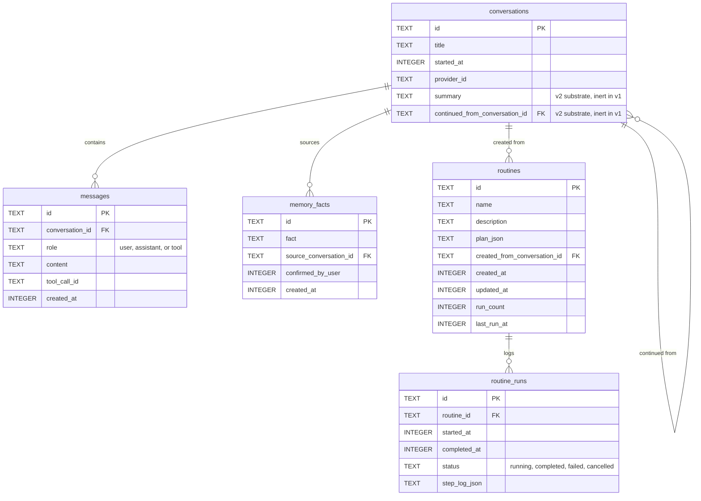
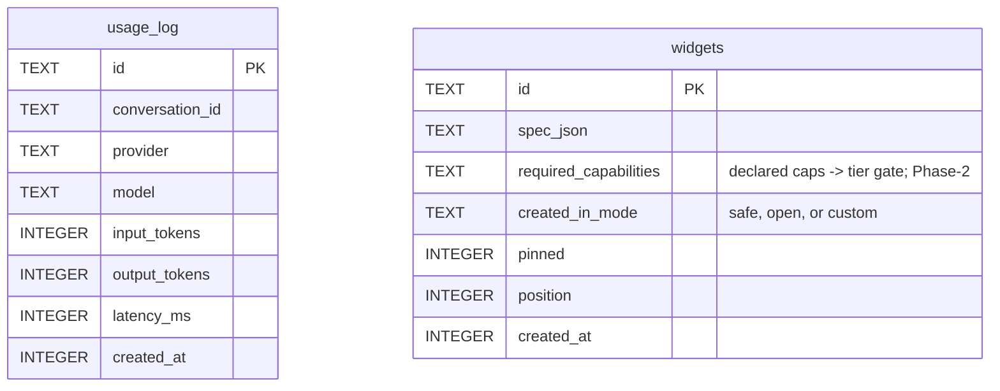

# Data model

> **Scope amendment 2026-07-20** — see
> [`addison-scope-amendment-2026-07.md`](addison-scope-amendment-2026-07.md).
> Adds the guaranteed-rollback floor (G3) and its **snapshot** store (auto + on-command,
> keys excluded, an undeletable Custom-mode anchor), a third **Custom** profile,
> **capability-tiered** widgets, **routing-strategy** config, and **MCP client** server
> config. Column names for the new tables are Phase-2 and marked as tentative below;
> the shapes are authoritative, the exact names are not yet frozen.

Addison's local state is a single SQLite database on the user's device, created from
`agent_core/memory/schema.sql` on first open. All timestamps are unix epoch seconds.
The Python dataclasses mirror these tables closely. No secret ever lives here — API
keys are in the OS keychain, not the database, and (per the amendment) they are
**excluded from every snapshot**, including the undeletable Custom-mode anchor.

The schema splits into two groups: the conversation-and-routine graph, whose tables
reference each other, and a set of standalone config and identity tables.

Back to the [README](../README.md); see also [architecture.md](architecture.md) and
[flows.md](flows.md).

## Conversation and routine graph

- **conversations** — one row per conversation, keyed by a uuid, with its title,
  start time, and the provider role that was active. Two columns are v2 substrate,
  present in the schema but never written by v1 logic: `summary` (a condensed older
  history for the future Context Budget Manager) and `continued_from_conversation_id`
  (lineage for a continued conversation). A conversation row is created lazily on the
  first turn, so an abandoned empty chat leaves nothing behind.
- **messages** — the full transcript in insertion order. `role` is constrained to
  `user`, `assistant`, or `tool`. Note there is **no** `tool_calls` column: an
  assistant turn's requested tool calls are not persisted, only its text. That is why
  reopening a conversation keeps the assistant's prose but not its tool plumbing —
  replaying persisted tool rows would send unpaired tool results and the provider
  would reject the next turn.
- **memory_facts** — the second tier of memory: durable facts written only on explicit
  user confirmation (`confirmed_by_user`), never silently.
- **routines** — saved declarative plans. `plan_json` holds the ordered, DAG-shaped
  step plan; by construction it never contains code. `run_count` and `last_run_at`
  track usage.
- **routine_runs** — the run log behind "show what you just did", one row per run with
  a `status` constrained to `running`, `completed`, `failed`, or `cancelled` and a
  JSON step log.

## Config and identity tables

These tables have no foreign-key relationships; they are keyed independently.

```mermaid
erDiagram
    action_snapshots {
        TEXT id PK
        TEXT tool_call_id
        TEXT tool_id
        TEXT undo_payload
        INTEGER created_at
        INTEGER reverted
    }
    tool_grants {
        TEXT tool_id PK
        INTEGER granted_at
        TEXT scope_details
    }
    device_identity {
        INTEGER id PK "singleton, id = 1"
        TEXT device_id
        INTEGER created_at
    }
    provider_config {
        TEXT role PK "primary, local, setup_assistant"
        TEXT provider_id
        TEXT config_json
        INTEGER updated_at
    }
    app_settings {
        TEXT key PK
        TEXT value
        INTEGER updated_at
    }
    snapshots {
        TEXT id PK
        INTEGER created_at
        TEXT trigger "auto or on_command; Phase-2"
        TEXT reason "what change prompted it; Phase-2"
        TEXT state_blob "captured config/state JSON; Phase-2"
        INTEGER verified_working "last-known-good marker; Phase-2"
        INTEGER undeletable "1 for a Custom-mode anchor; Phase-2"
        INTEGER captures_binary "1 only for anchors; Phase-2"
        TEXT binary_ref "app build reference, anchors only; Phase-2"
    }
    mcp_servers {
        TEXT id PK
        TEXT label
        TEXT transport "stdio or http; Phase-2"
        TEXT config_json "command/base URL, non-secret; Phase-2"
        INTEGER enabled
        INTEGER added_at
    }
```

- **action_snapshots** — the backing store for action undo. Each row records what a
  mutating tool did (`undo_payload`, tool-specific JSON) so `UndoManager` can reverse
  it; `reverted` flags a snapshot that has already been undone. Retention is roughly
  the most recent 20 actions or 7 days, whichever keeps more.
- **tool_grants** — remembered coarse permission grants keyed by tool, with optional
  tool-specific `scope_details`.
- **device_identity** — a single-row table (`id = 1`) holding the public device id.
  The matching ed25519 private key lives only in the OS keychain, never here.
- **provider_config** — non-secret per-role provider configuration (selected model
  name, Ollama base URL, and the like). `role` is constrained to `primary`, `local`,
  or `setup_assistant`. Multiple roles can be populated at once. API keys are never
  stored in this table. *(Phase-2, amendment §10):* this table also carries the
  non-secret routing/availability metadata a strategy needs — the provider's cost/tier
  hints, a `free`/legit-free flag (so the "answered with a free model" disclaimer can
  fire), and light **cooldown** bookkeeping (a `cooldown_until`-style marker) so a
  degrade-down strategy can skip a rate-limited endpoint instead of hammering it.
  Endpoints added by prompting (§6.2) land here exactly like a normal provider; it is
  reversible, snapshotted config.
- **app_settings** — a generic non-secret key/value store. Notably it holds
  `active_profile` — now one of `simple`, `developer`, or **`custom`** (default
  `simple`; the amendment §7 adds Custom, a user-tuned surface reached deep in
  Settings). It also holds the **routing** choice (*Phase-2, amendment §10*): a
  `routing_strategy` key (`quality_first` | `cost_first` | `local_only` | `balanced` |
  `custom`, default `quality_first`) plus the companion's simpler **prefer-quality /
  prefer-free** toggle, and the Custom profile's per-guard **prompting** toggles (the
  floors G1/G2/G3 and the anchor rule are never keys here — they cannot be switched
  off). Never holds secrets.
- **snapshots** *(Phase-2, amendment §3)* — the backing store for the **G3 guaranteed-
  rollback floor**, distinct from `action_snapshots` (which reverses one tool call; this
  captures whole-app *state*). Each row is a point-in-time copy of Addison's **mutable
  config/state** — settings, provider/routing config, skills, widgets, routines — taken
  **automatically** before any risky or sweeping change (guard toggle, provider/endpoint
  change, a "make it cheaper" reconfiguration, a mode switch) and **on command** ("snapshot
  now"). `trigger` records which. A row is marked **verified-working** once a turn completes
  successfully against it; **Restore always targets the last verified-working row**, not
  merely the state before the last edit. Rows are normally **deletable**; a row with
  `undeletable = 1` is a **Custom-mode anchor**, minted the moment a safety guard is turned
  off and saved (§3.3) — neither user nor model can remove it, and it persists after the
  guard is switched back. An anchor additionally sets `captures_binary = 1` and carries a
  `binary_ref` to a **known-good app build** (ordinary snapshots restore state only; the
  anchor is a complete build + config restore point). Column names above are tentative;
  the *shape* — auto/on-command trigger, verified-working marking, undeletable anchor,
  optional binary capture — is authoritative. **Keys never enter a snapshot**: the keychain
  is untouched by capture or restore, so a rollback can never move, expose, or clobber a key
  (G1 holds even for the anchor).
- **mcp_servers** *(Phase-2, amendment §8.5)* — non-secret configuration for external **MCP
  servers Addison consumes as a client** (Addison is never an MCP server/gateway). Shaped
  like a provider row: a label, the transport, and non-secret connection metadata
  (`config_json` — the launch command or base URL). Any credential an MCP server needs is
  stored in the **OS keychain per G1**, never in this table. Connecting a server is
  **reversible config** — addable by prompting, revocable, and **snapshotted** — so it
  shares the add-an-endpoint plumbing. Whether an MCP tool is usable in SAFE is decided at
  the registry/gate (read-only or genuinely undo-able only, per invariant 2), not by a
  column here.

## Widgets and usage tables

These back the widget rail (§3 of the Fern brief). Neither holds secrets.

- **usage_log** — the §4.8 usage substrate. One row per provider call that reported
  token usage, written by orchestrator machinery (`main.py`, `Orchestrator.on_usage`)
  after each model call — never by a registry tool. `latency_ms` is the wall-clock
  duration of that call. Backs two derived stats: `tokens_month` (sum of tokens since
  the first of the month) and `provider_latency` (the newest latency per provider).
  Carries no key material.
- **widgets** — user-owned rail widgets. `spec_json` is a **declarative** widget spec
  (`agent_core/widgets.py`), validated at save *and* at render (an invalid stored spec
  is hidden, never run). The base shapes are the launchers `{kind:"routine", routineId,
  title}`, `{kind:"stat", source, title}`, and — in OPEN — `{kind:"command", command,
  title}`. **Widgets are now buildable in every mode; the mode gates the *capability*,
  not whether one can be built** (*amendment §8.4*). Phase-2 therefore adds:
  - **New SAFE-tier interactive kinds** — a **safe, non-destructive vocabulary** on top
    of the launchers: to-do / checklist, note, counter / timer. These are rendered by
    *trusted Addison components* and backed by Addison's own safe storage — **no shell,
    no arbitrary code or eval**, so SAFE-1 and the webview CSP still hold. "Build me a
    to-do widget" produces a real checklist in Simple.
  - **Capability declaration + tier gate** — `required_capabilities` (tentative name)
    records the capabilities a widget's spec needs; a tier check maps capabilities → the
    minimum mode. SAFE admits only the non-destructive set; higher tiers (Developer /
    Custom) additionally admit **code-backed / system-capable** widgets (monitors,
    scripts) governed by workspace-trust, per-tool `undo()`, the snapshot floor, and the
    keyword gate to run/arm one.
  - **`created_in_mode`** — the mode a widget was built in (`safe` | `open` | `custom`),
    so an OPEN/Custom-only widget is hidden while Simple is active, matching the existing
    routine hiding.

  `pinned` decides whether the widget shows as a card or behind the overflow tray (at
  most six pinned); `position` is the user-visible order. The token meter and connections
  cards are core-provided and implicit — they are *not* stored here.
