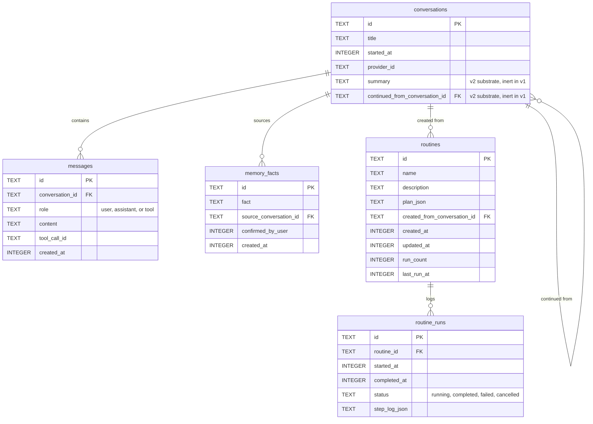
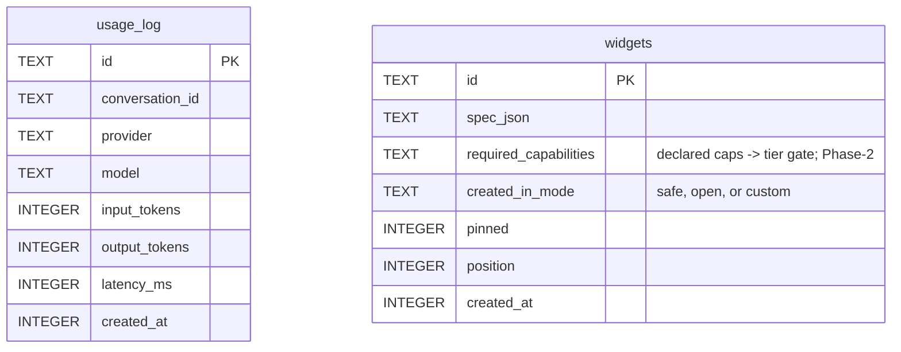

# Data model

> **Scope amendment 2026-07-20** — see
> [`addison-scope-amendment-2026-07.md`](addison-scope-amendment-2026-07.md).
> Adds the guaranteed-rollback floor (G3) and its **snapshot** store (auto + on-command,
> keys excluded, an undeletable Custom-mode anchor), a third **Custom** profile,
> **capability-tiered** widgets, **routing-strategy** config, and **MCP client** server
> config. Column names for the new tables are Phase-2 and marked as tentative below;
> the shapes are authoritative, the exact names are not yet frozen — **except
> `config_snapshots`, which shipped in Phase-2 step 1 and is final.**

Addison's local state is a single SQLite database on the user's device, created from
`agent_core/memory/schema.sql` on first open. All timestamps are unix epoch seconds.
The Python dataclasses mirror these tables closely. No secret ever lives here — API
keys are in the OS keychain, not the database, and (per the amendment) they are
**excluded from every snapshot**, including the undeletable Custom-mode anchor.

The schema splits into two groups: the conversation-and-routine graph, whose tables
reference each other, and a set of standalone config and identity tables.

Back to the [README](../README.md); see also [architecture.md](architecture.md) and
[flows.md](flows.md).

## Conversation and routine graph

- **conversations** — one row per conversation, keyed by a uuid, with its title,
  start time, and the provider role that was active. Two columns are v2 substrate,
  present in the schema but never written by v1 logic: `summary` (a condensed older
  history for the future Context Budget Manager) and `continued_from_conversation_id`
  (lineage for a continued conversation). A conversation row is created lazily on the
  first turn, so an abandoned empty chat leaves nothing behind.
- **messages** — the full transcript in insertion order. `role` is constrained to
  `user`, `assistant`, or `tool`. Note there is **no** `tool_calls` column: an
  assistant turn's requested tool calls are not persisted, only its text. That is why
  reopening a conversation keeps the assistant's prose but not its tool plumbing —
  replaying persisted tool rows would send unpaired tool results and the provider
  would reject the next turn.
- **memory_facts** — the second tier of memory: durable facts written only on explicit
  user confirmation (`confirmed_by_user`), never silently.
- **routines** — saved declarative plans. `plan_json` holds the ordered, DAG-shaped
  step plan; by construction it never contains code. `run_count` and `last_run_at`
  track usage.
- **routine_runs** — the run log behind "show what you just did", one row per run with
  a `status` constrained to `running`, `completed`, `failed`, or `cancelled` and a
  JSON step log.

## Config and identity tables

These tables have no foreign-key relationships; they are keyed independently.

```mermaid
erDiagram
    action_snapshots {
        TEXT id PK
        TEXT tool_call_id
        TEXT tool_id
        TEXT undo_payload
        INTEGER created_at
        INTEGER reverted
    }
    tool_grants {
        TEXT tool_id PK
        INTEGER granted_at
        TEXT scope_details
    }
    device_identity {
        INTEGER id PK "singleton, id = 1"
        TEXT device_id
        INTEGER created_at
    }
    provider_config {
        TEXT role PK "primary, local, setup_assistant"
        TEXT provider_id
        TEXT config_json
        INTEGER updated_at
    }
    app_settings {
        TEXT key PK
        TEXT value
        INTEGER updated_at
    }
    config_snapshots {
        TEXT id PK
        INTEGER created_at
        TEXT trigger "auto or on_command"
        TEXT reason "closed slug set; never free text"
        INTEGER payload_version "state_blob format version"
        TEXT state_blob "captured config row-image JSON"
        TEXT state_fingerprint "sha256 of the canonical blob"
        INTEGER verified_working "a turn completed against this config"
        INTEGER undeletable "1 = permanent: G4 anchor or genesis"
        INTEGER captures_binary "1 only when a build ref was obtained"
        TEXT binary_ref "app build reference, anchors only; NEVER bytes"
        TEXT created_in_mode "safe, open or custom - DISPLAY ONLY"
    }
    mcp_servers {
        TEXT id PK
        TEXT label
        TEXT transport "stdio or http; Phase-2"
        TEXT config_json "command/base URL, non-secret; Phase-2"
        INTEGER enabled
        INTEGER added_at
    }
```

- **action_snapshots** — the backing store for action undo. Each row records what a
  mutating tool did (`undo_payload`, tool-specific JSON) so `UndoManager` can reverse
  it; `reverted` flags a snapshot that has already been undone. Retention is roughly
  the most recent 20 actions or 7 days, whichever keeps more.
- **tool_grants** — remembered coarse permission grants keyed by tool, with optional
  tool-specific `scope_details`. *(Phase-2, step 1):* **explicitly excluded from every
  snapshot.** It is live consent state, not configuration. Restoring it would reinstate
  a grant the user had since revoked — a permission grant delivered by a deliberately
  ungated one-action button, with no permission card anywhere in the path. (Inert today:
  nothing reads or writes this table; `PermissionGate` keeps grants in memory, per
  session. If grants ever persist, restore must **intersect** them, never replace.) A
  restore additionally clears the live in-session grants, so the session is never more
  permissive than the config it just rolled back to.
- **device_identity** — a single-row table (`id = 1`) holding the public device id.
  The matching ed25519 private key lives only in the OS keychain, never here.
- **provider_config** — non-secret per-role provider configuration (selected model
  name, Ollama base URL, and the like). `role` is constrained to `primary`, `local`,
  or `setup_assistant`. Multiple roles can be populated at once. API keys are never
  stored in this table. *(Phase-2, amendment §10):* this table also carries the
  non-secret routing/availability metadata a strategy needs — the provider's cost/tier
  hints, a `free`/legit-free flag (so the "answered with a free model" disclaimer can
  fire), and light **cooldown** bookkeeping (a `cooldown_until`-style marker) so a
  degrade-down strategy can skip a rate-limited endpoint instead of hammering it.
  Endpoints added by prompting (§6.2) land here exactly like a normal provider; it is
  reversible, snapshotted config.
- **app_settings** — a generic non-secret key/value store. Notably it holds
  `active_profile` — now one of `simple`, `developer`, or **`custom`** (default
  `simple`; the amendment §7 adds Custom, a user-tuned surface reached deep in
  Settings). It also holds the **routing** choice (*Phase-2, amendment §10*): a
  `routing_strategy` key (`quality_first` | `cost_first` | `local_only` | `balanced` |
  `custom`, default `quality_first`) plus the companion's simpler **prefer-quality /
  prefer-free** toggle, and the Custom profile's per-guard **prompting** toggles (the
  floors G1/G2/G3 and the anchor rule are never keys here — they cannot be switched
  off). Never holds secrets.
- **config_snapshots** *(Phase-2 step 1 — **built**; amendment §3, spec §4.9)* — the
  backing store for the **G3 guaranteed-rollback floor**, distinct from `action_snapshots`
  (which reverses one tool call; this restores whole-app *configuration*). The column names
  above are now **final** — this is the shipped DDL, and the dataclass `ConfigSnapshot`
  mirrors it 1:1. Each row is a point-in-time **row-image** of Addison's mutable config
  tables — `app_settings`, `provider_config`, `skills`, `widgets`, `routines`; the
  authoritative table *and column* lists live in `agent_core/snapshots/scope.py`, and tests
  fail the build if any schema table, or any column of a captured table, is neither captured
  nor explicitly excluded. (That column half is not pedantry: restore is replace-all with an
  explicit column list, so an uncaptured new column would be silently reset to its default
  **by the recovery path** — a restore would wipe, say, the user's routing strategy.)
  - `trigger` ∈ `auto` | `on_command`. Taken **automatically** before any risky or sweeping
    change (mode switch, provider connect/disconnect, deleting a routine/widget/note,
    changing a note) and **on command** from the Settings "Restore points" card. `reason` is
    a short slug from a **closed vocabulary** (`snapshot_manager.REASONS`) — never free text,
    because it is written by auto-hooks and later by model-orchestrated flows, and free text
    would let model-authored prose into the config store. The vocabulary also carries
    **`pre_upgrade`** — the bottom row written the first time this subsystem opens a
    database that predates it (see the two-bottom-rows note below).
  - A row is **verified-working** once a turn completed against that configuration, and
    **Restore always targets the last verified-working row**, not merely the state before
    the last edit — so it lands somewhere that actually ran. `state_fingerprint` (sha256 of
    the canonical blob, timestamps excluded) dedupes repeat captures and lets restore skip a
    candidate identical to the present state; the effect is that **each click of "Restore to
    the last working state" steps back one distinct proven configuration.**
  - Rows are normally **deletable**. `undeletable = 1` marks a permanent row, and it names
    *the guarantee the delete path enforces*, not the provenance (provenance is `reason`).
    Three kinds carry it: the **G4 anchor** (`reason='guard_weakened'`, minted when a guard is
    turned off in Custom mode and saved — step 2) and the two possible bottom rows,
    **genesis** and **`pre_upgrade`** (below). Enforcement is in the **database** —
    two `RAISE(ABORT)` triggers refuse both the delete and any clearing of the flag — not in
    a `WHERE` clause someone can forget. Retention (50 rows / 30 days, whichever keeps more)
    exempts permanent rows and the newest **two** verified rows **in the SQL**. Two, not one:
    the restore walk skips any verified row whose fingerprint matches the *current* config
    (restoring it would change zero bytes), so a single exempt row could be exactly the row
    the walk skips — leaving the floor with no target at all.
  - **The bottom row differs by install.** `_ensure_genesis` fires whenever the table is
    empty, and that is true for every install that predates this subsystem, not only a new
    one. On a **fresh install** the bottom row is `reason='genesis'`, `verified_working = 1`
    — a new install is a configuration that works. On an **upgraded install** it is
    `reason='pre_upgrade'` and deliberately **not** verified: it is a copy of whatever config
    the user happens to have at that moment, which may be the broken one they are about to
    need rescuing from, and nothing has run against it under this subsystem's observation.
    Marking it verified would let the one-action restore hand that config straight back. The
    accepted consequence is that on an upgraded install `restore_last_working()` has **no
    target until the first turn completes**, and says so in plain language.
  - Which install it is is **measured, not inferred**. `main.py` checks whether the database
    file existed in the instant before it opened it, and passes the answer to
    `SnapshotManager(created_the_database=...)`. The snapshot module cannot find this out for
    itself — it is forbidden from importing anything or reading a setting, and that import ban
    is the unbreakability argument — so the fact is handed in from the one place that knows.
    Three outcomes, not two: `True`, `False`, and `None` for "couldn't find out", with `None`
    and `False` sharing the safe branch. **Only `True` writes a verified `genesis`**, so an
    unknown can never mint a permanent row claiming to be a fresh install.
  - *An earlier draft inferred this from the config row-image and was deleted.* It read only
    providers, skills, routines and a non-default profile — widgets and settings were invisible
    to it, and chats are not in the payload at all. So a companion with tuned settings, widgets
    and months of use, but no provider row (the ordinary state of anyone who never opens
    Settings → Services, since a keyless install runs on the Setup Assistant relay), was
    classified **fresh**: a permanent, undeletable, verified row that handed their broken
    config back under copy promising it had been cleared. Mislabelling an established install
    as fresh is the severe direction, which is why the replacement fails toward `pre_upgrade`.
  - `captures_binary` / `binary_ref` hold a short **build reference** — `{"version",
    "identifier"}`, obtained via `shell.appBuildRef` — **never bytes and never a path**.
    *(Owner decision 2026-07-20:* the anchor **records** the build it was minted on; it is
    not a build restore point. A restore whose build differs says so in plain language and
    changes settings only. Restoring a previous binary is a **Phase-3 updater** item.*)*
  - `created_in_mode` is **recorded for display only and never filters a query** — see the
    note below.
  - **The payload shape**, written byte-identically into `state_blob` and into the JSON
    sidecar: `{"version", "captured_at", "captured_at_ns", "meta", "tables"}`. A *restore*
    reads only `version` and `tables`; `meta` is the row's **only backup** — it carries every
    column not derivable from `tables` (identity, provenance, the fingerprint, and the three
    flags plus `binary_ref`), because a rebuild from sidecars alone would otherwise quietly
    convert every G4 anchor into an ordinary deletable row.
    - **`meta.restored_to`** *(additive, step 1)* — the snapshot id a restore landed on,
      written **only** on a `pre_restore` row. It is what makes the rollback walk survive a
      relaunch: the walk's position is held in memory during a session, but a restart between
      two clicks would otherwise rewind it and put the user straight back into the config they
      had just escaped. `_recorded_restore_target` reads the newest `pre_restore` row's
      payload to recover it. Additive by construction — an ordinary payload keeps the exact
      bytes it has always had, and every existing reader ignores the key.
  - **Keys never enter a snapshot** (G1): the captured tables cannot hold key material, and
    the keychain is untouched by capture *and* restore, so a rollback can never move, expose,
    or clobber a key. A restored provider config re-binds to whatever key is in the keychain
    by provider id; if that key is gone, the restore says so by name. Also never captured:
    the transcript, `usage_log`, `action_snapshots`, `routine_runs`, `device_identity`,
    `tool_grants`, and this table itself — a restore must never rewrite the way back.

  **`created_in_mode` never hides a snapshot** *(a deliberate override, step 1)*. The
  engineering spec's provisional DDL commented that this column "mirrors existing artifact
  hiding" (routines and widgets made in OPEN are hidden in SAFE). That was **overridden, not
  followed.** Taken literally it hides the way back from exactly the user who most needs it:
  weakened a guard in Custom, broke something, switched to Simple, opens Restore points and
  finds an empty list. Snapshots are recovery machinery, not artifacts. Two tests hold the
  line — a behavioural one and a **source-level** one that reads the SQL in `store.py` and
  `snapshot_manager.py` and fails if the column ever appears in a filter position.
- **mcp_servers** *(Phase-2, amendment §8.5)* — non-secret configuration for external **MCP
  servers Addison consumes as a client** (Addison is never an MCP server/gateway). Shaped
  like a provider row: a label, the transport, and non-secret connection metadata
  (`config_json` — the launch command or base URL). Any credential an MCP server needs is
  stored in the **OS keychain per G1**, never in this table. Connecting a server is
  **reversible config** — addable by prompting, revocable, and **snapshotted** — so it
  shares the add-an-endpoint plumbing. Whether an MCP tool is usable in SAFE is decided at
  the registry/gate (read-only or genuinely undo-able only, per invariant 2), not by a
  column here.

## Widgets and usage tables

These back the widget rail (§3 of the Fern brief). Neither holds secrets.

- **usage_log** — the §4.8 usage substrate. One row per provider call that reported
  token usage, written by orchestrator machinery (`main.py`, `Orchestrator.on_usage`)
  after each model call — never by a registry tool. `latency_ms` is the wall-clock
  duration of that call. Backs two derived stats: `tokens_month` (sum of tokens since
  the first of the month) and `provider_latency` (the newest latency per provider).
  Carries no key material.
- **widgets** — user-owned rail widgets. `spec_json` is a **declarative** widget spec
  (`agent_core/widgets.py`), validated at save *and* at render (an invalid stored spec
  is hidden, never run). The base shapes are the launchers `{kind:"routine", routineId,
  title}`, `{kind:"stat", source, title}`, and — in OPEN — `{kind:"command", command,
  title}`. **Widgets are now buildable in every mode; the mode gates the *capability*,
  not whether one can be built** (*amendment §8.4*). Phase-2 therefore adds:
  - **New SAFE-tier interactive kinds** — a **safe, non-destructive vocabulary** on top
    of the launchers: to-do / checklist, note, counter / timer. These are rendered by
    *trusted Addison components* and backed by Addison's own safe storage — **no shell,
    no arbitrary code or eval**, so SAFE-1 and the webview CSP still hold. "Build me a
    to-do widget" produces a real checklist in Simple.
  - **Capability declaration + tier gate** — `required_capabilities` (tentative name)
    records the capabilities a widget's spec needs; a tier check maps capabilities → the
    minimum mode. SAFE admits only the non-destructive set; higher tiers (Developer /
    Custom) additionally admit **code-backed / system-capable** widgets (monitors,
    scripts) governed by workspace-trust, per-tool `undo()`, the snapshot floor, and the
    keyword gate to run/arm one.
  - **`created_in_mode`** — the mode a widget was built in (`safe` | `open` | `custom`),
    so an OPEN/Custom-only widget is hidden while Simple is active, matching the existing
    routine hiding.

  `pinned` decides whether the widget shows as a card or behind the overflow tray (at
  most six pinned); `position` is the user-visible order. The token meter and connections
  cards are core-provided and implicit — they are *not* stored here.
