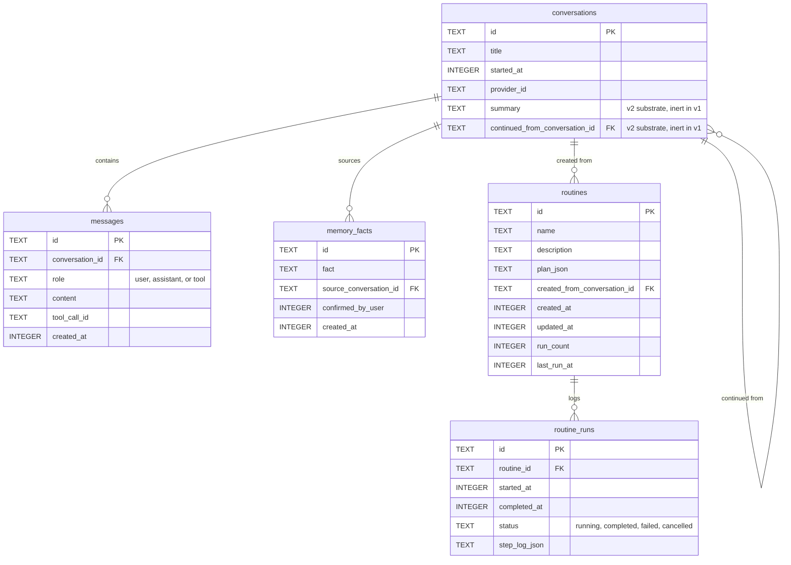
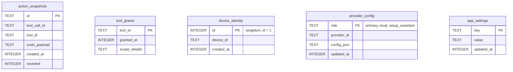

# Data model

Addison's local state is a single SQLite database on the user's device, created from
`agent_core/memory/schema.sql` on first open. All timestamps are unix epoch seconds.
The Python dataclasses mirror these tables closely. No secret ever lives here — API
keys are in the OS keychain, not the database.

The schema splits into two groups: the conversation-and-routine graph, whose tables
reference each other, and a set of standalone config and identity tables.

Back to the [README](../README.md); see also [architecture.md](architecture.md) and
[flows.md](flows.md).

## Conversation and routine graph

- **conversations** — one row per conversation, keyed by a uuid, with its title,
  start time, and the provider role that was active. Two columns are v2 substrate,
  present in the schema but never written by v1 logic: `summary` (a condensed older
  history for the future Context Budget Manager) and `continued_from_conversation_id`
  (lineage for a continued conversation). A conversation row is created lazily on the
  first turn, so an abandoned empty chat leaves nothing behind.
- **messages** — the full transcript in insertion order. `role` is constrained to
  `user`, `assistant`, or `tool`. Note there is **no** `tool_calls` column: an
  assistant turn's requested tool calls are not persisted, only its text. That is why
  reopening a conversation keeps the assistant's prose but not its tool plumbing —
  replaying persisted tool rows would send unpaired tool results and the provider
  would reject the next turn.
- **memory_facts** — the second tier of memory: durable facts written only on explicit
  user confirmation (`confirmed_by_user`), never silently.
- **routines** — saved declarative plans. `plan_json` holds the ordered, DAG-shaped
  step plan; by construction it never contains code. `run_count` and `last_run_at`
  track usage.
- **routine_runs** — the run log behind "show what you just did", one row per run with
  a `status` constrained to `running`, `completed`, `failed`, or `cancelled` and a
  JSON step log.

## Config and identity tables

These tables have no foreign-key relationships; they are keyed independently.

- **action_snapshots** — the backing store for action undo. Each row records what a
  mutating tool did (`undo_payload`, tool-specific JSON) so `UndoManager` can reverse
  it; `reverted` flags a snapshot that has already been undone. Retention is roughly
  the most recent 20 actions or 7 days, whichever keeps more.
- **tool_grants** — remembered coarse permission grants keyed by tool, with optional
  tool-specific `scope_details`.
- **device_identity** — a single-row table (`id = 1`) holding the public device id.
  The matching ed25519 private key lives only in the OS keychain, never here.
- **provider_config** — non-secret per-role provider configuration (selected model
  name, Ollama base URL, and the like). `role` is constrained to `primary`, `local`,
  or `setup_assistant`. Multiple roles can be populated at once. API keys are never
  stored in this table.
- **app_settings** — a generic non-secret key/value store. Notably it holds
  `active_profile` (`simple` or `developer`, default `simple`). Never holds secrets.
