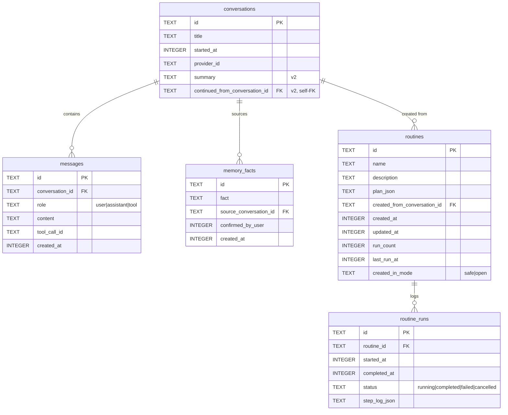
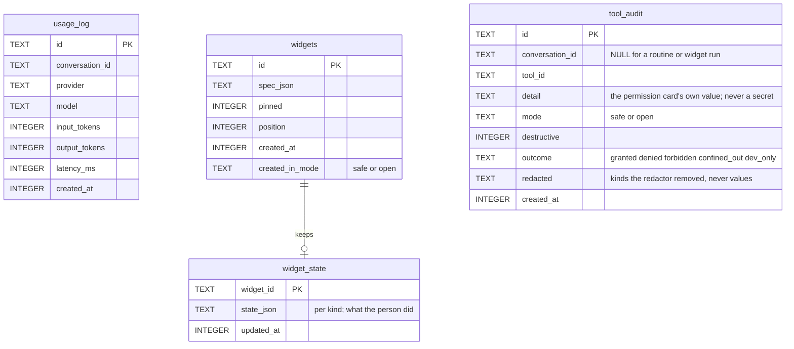

# Data model

> **Amended 2026-07-20** by the scope amendment, which was folded into the
> authoritative docs and **retired 2026-07-27**. Floors, modes and guards are
> owned by [`SAFETY.md`](SAFETY.md); status by [`../ROADMAP.md`](../ROADMAP.md).
> Do not consult the amendment to settle a question — it is a historical record.
> Adds the guaranteed-rollback floor (G3) and its **snapshot** store (auto + on-command,
> keys excluded, an undeletable Custom-mode anchor), a third **Custom** profile,
> **capability-tiered** widgets, **routing-strategy** config, and **MCP client** server
> config. **`config_snapshots` (step 1), `workspace_trust` (step 5) and `widget_state`
> (step 6) have shipped and their DDL is final.** `mcp_servers` has not been built; it is
> a sketch, called out as such where it appears, and is deliberately absent from the ER
> diagrams, which show only what `agent_core/memory/schema.sql` actually creates. The
> amendment's **`required_capabilities` widget column was CUT** (owner decision
> 2026-08-06): the widget vocabulary is a closed set of kinds instead — see the `widgets`
> notes below.

Addison's local state is a single SQLite database on the user's device, created from
`agent_core/memory/schema.sql` on first open. All timestamps are unix epoch seconds.
The Python dataclasses mirror these tables closely. No secret ever lives here — API
keys are in the OS keychain, not the database, and (per the amendment) they are
**excluded from every snapshot**, including the undeletable Custom-mode anchor.

The schema splits into two groups: the conversation-and-routine graph, whose tables
reference each other, and a set of standalone config and identity tables.

Back to the [README](../README.md); see also [architecture.md](architecture.md) and
[flows.md](flows.md).

## Conversation and routine graph

```mermaid
erDiagram
    conversations ||--o{ messages : contains
    conversations ||--o{ memory_facts : sources
    conversations ||--o{ routines : "created from"
    routines ||--o{ routine_runs : logs

    conversations {
        TEXT id PK
        TEXT title
        INTEGER started_at
        TEXT provider_id
        TEXT summary "v2"
        TEXT continued_from_conversation_id FK "v2, self-FK"
    }
    messages {
        TEXT id PK
        TEXT conversation_id FK
        TEXT role "user|assistant|tool"
        TEXT content
        TEXT tool_call_id
        INTEGER created_at
    }
    memory_facts {
        TEXT id PK
        TEXT fact
        TEXT source_conversation_id FK
        INTEGER confirmed_by_user
        INTEGER created_at
    }
    routines {
        TEXT id PK
        TEXT name
        TEXT description
        TEXT plan_json
        TEXT created_from_conversation_id FK
        INTEGER created_at
        INTEGER updated_at
        INTEGER run_count
        INTEGER last_run_at
        TEXT created_in_mode "safe|open"
    }
    routine_runs {
        TEXT id PK
        TEXT routine_id FK
        INTEGER started_at
        INTEGER completed_at
        TEXT status "running|completed|failed|cancelled"
        TEXT step_log_json
    }
```

- **conversations** — one row per conversation, keyed by a uuid, with its title,
  start time, and the provider role that was active. Two columns are v2 substrate,
  present in the schema but never written by v1 logic: `summary` (a condensed older
  history for the future Context Budget Manager) and `continued_from_conversation_id`
  (lineage for a continued conversation). A conversation row is created lazily on the
  first turn, so an abandoned empty chat leaves nothing behind.
- **messages** — the full transcript in insertion order. `role` is constrained to
  `user`, `assistant`, or `tool`. Note there is **no** `tool_calls` column: an
  assistant turn's requested tool calls are not persisted, only its text. That is why
  reopening a conversation keeps the assistant's prose but not its tool plumbing —
  replaying persisted tool rows would send unpaired tool results and the provider
  would reject the next turn.
- **memory_facts** — the second tier of memory: durable facts to be written only on
  explicit user confirmation (`confirmed_by_user`), never silently. **Inert today** —
  the table is created, but `Store` has no method that reads or writes it, so nothing
  in the running app touches it yet.
- **routines** — saved declarative plans. `plan_json` holds the ordered, DAG-shaped
  step plan; by construction it never contains code. `run_count` and `last_run_at`
  track usage. `created_in_mode` (`safe` | `open`) records the policy mode the routine
  was saved under: a routine created in OPEN is **listed but disabled** in
  `routine.list` (the row carries a display-only `unavailable` reason) and refused
  by `routine.run` while the Simple profile is active, and returns untouched in
  Developer. It was hidden outright until 2026-08-06 — see
  [SAFETY.md](SAFETY.md), which owns the rule.
- **routine_runs** — the run log behind "show what you just did", one row per run with
  a `status` constrained to `running`, `completed`, `failed`, or `cancelled` and a
  JSON step log.

## Config and identity tables

These tables have no foreign-key relationships; they are keyed independently.

```mermaid
erDiagram
    action_snapshots {
        TEXT id PK
        TEXT tool_call_id
        TEXT tool_id
        TEXT undo_payload
        INTEGER created_at
        INTEGER reverted
    }
    tool_grants {
        TEXT tool_id PK
        INTEGER granted_at
        TEXT scope_details
    }
    workspace_trust {
        TEXT root PK "canonical abs path"
        INTEGER granted_at
    }
    device_identity {
        INTEGER id PK "singleton, id = 1"
        TEXT device_id
        INTEGER created_at
    }
    provider_config {
        TEXT provider_id PK "4 known ids"
        INTEGER connected
        INTEGER added_at
        TEXT base_url "custom server only"
        TEXT catalog_json "cached catalog"
        INTEGER last_check_ok
        TEXT secret_presence "present|absent|unknown"
        INTEGER key_rejected_at "NULL = not rejected"
        INTEGER updated_at
    }
    skills {
        TEXT id PK
        TEXT name
        TEXT instructions
        INTEGER enabled
        INTEGER created_at
    }
    app_settings {
        TEXT key PK
        TEXT value
        INTEGER updated_at
    }
    config_snapshots {
        TEXT id PK
        INTEGER created_at
        TEXT trigger "auto or on_command"
        TEXT reason "closed slug set"
        INTEGER payload_version
        TEXT state_blob "row-image JSON"
        TEXT state_fingerprint "sha256"
        INTEGER verified_working "a turn ran on it"
        INTEGER undeletable "permanent"
        INTEGER captures_binary
        TEXT binary_ref "build ref, never bytes"
        TEXT created_in_mode "DISPLAY ONLY"
    }
```

`config_snapshots` also carries two `RAISE(ABORT)` triggers
(`trg_config_snapshots_permanent_no_delete`,
`trg_config_snapshots_permanent_stays_permanent`) — see the permanence note below.

- **action_snapshots** — the backing store for action undo. Each row records what a
  mutating tool did (`undo_payload`, tool-specific JSON) so `UndoManager` can reverse
  it; `reverted` flags a snapshot that has already been undone. Retention is roughly
  the most recent 20 actions or 7 days, whichever keeps more.
- **tool_grants** — remembered coarse permission grants keyed by tool, with optional
  tool-specific `scope_details`. *(Phase-2, step 1):* **explicitly excluded from every
  snapshot.** It is live consent state, not configuration. Restoring it would reinstate
  a grant the user had since revoked — a permission grant delivered by a deliberately
  ungated one-action button, with no permission card anywhere in the path. (Inert today:
  nothing reads or writes this table; `PermissionGate` keeps grants in memory, per
  session. If grants ever persist, restore must **intersect** them, never replace.) A
  restore additionally clears the live in-session grants, so the session is never more
  permissive than the config it just rolled back to.
- **workspace_trust** *(step 5 — **built**)* — the directories the user has trusted for
  the OPEN-mode coding harness, one row per root. `root` is canonicalized (`realpath`)
  at grant time, so the confinement check (`rpc/workspace.is_trusted`) compares
  realpath against realpath. Inside a trusted root a typed, path-bounded, undoable file
  edit skips the per-change card; the edit is still logged and reversible, and
  `run_command` still cards every time (its `affected_path` is `None`, so confinement
  never governs it). Addison's own data directory can never be a trusted root — the
  floor is `policy.workspace_trust_allows`, applied both at grant time and at
  authorize time. **Excluded from every snapshot** on the `tool_grants` precedent:
  trust is standing consent, and a restore that reinstated a revoked trust would be a
  privilege grant delivered by the ungated one-action restore button.
- **device_identity** — a single-row table (`id = 1`) intended to hold the public
  device id, with the matching ed25519 private key only in the OS keychain, never here.
  **Inert today**: `Store` has no method that reads or writes it — the relay's device
  identity is served straight from the keychain via `keychain.getDeviceKey`.
- **provider_config** — non-secret per-**provider** connection metadata. The primary
  key is `provider_id`, constrained to `anthropic`, `openai`, `google`, or `custom`
  (owner decision 2026-07-18 — several providers connected at once, one picker union);
  `connected` and `last_check_ok` record how `provider.connect`'s validation request
  went, `added_at` when the key was first connected, `base_url` is the custom
  OpenAI-compatible server's address (the one permitted `http://` case), and
  `catalog_json` an optional cached model catalog. API keys are never stored here.
  `secret_presence` (2026-08-06, secrets-and-keychain plan §4.1) answers a DIFFERENT
  question from `connected`: whether a key is **saved** for this provider, not whether
  the validating request passed — a key that saved fine and was then rejected is
  `present` and not `connected`. It is the authority for every presence question with
  no person behind it, which is what retired the 60-second keychain poll: `stats.get`,
  `provider.list` and the live-catalog gate read this column and never the OS. Three
  values, never two: `present` | `absent` | `unknown`, and **`unknown` must never read
  as "no key"** — that collapse is the 2026-07-25 relay-routing bug, and the rule lives
  in exactly one function (`agent_core/secret_presence.py::may_reach_setup_relay`). It
  is written by the two paths that genuinely learn the answer — `provider.connect`, and
  the per-turn read in `_primary_key_status`, which stays a fresh keychain read because
  it is the one caller with a person behind it. It is one of **two columns excluded
  from snapshot capture** (`snapshots/scope.py`): it is a timestamped observation about
  a store the person has been editing since, so a restore resets it to `unknown` rather
  than asserting a snapshot-era answer.
  `key_rejected_at` (2026-08-06, plan §5.2) is the other, and it is a **THIRD** signal
  beside those two rather than a re-use of either: epoch seconds of the first
  DEFINITIVE rejection (a 401/403 from the provider itself — never a 429, never a
  network error) since the last successful connect, or NULL. It is not `connected`,
  because an auth failure mid-conversation must not silently disconnect a provider and
  drop it out of the reconnect path; it is emphatically not `secret_presence`, because
  a rejected key is `present` and rejected, and writing `absent` would make
  `may_reach_setup_relay` true and hand the person's next message to the external
  relay while their key sits in the keychain. It is also not `last_check_ok`, the
  obvious candidate: that answers "did the last CONNECT PING pass", every write of `0`
  to it is paired with `connected = 0`, and a reader therefore cannot tell "never
  connected" from "connected, then revoked" — the only state that earns the sentence.
  A timestamp rather than a flag because non-NULL IS the "the person has been told"
  latch, which is what keeps repeated 401s from re-notifying. Written by the
  orchestrator's attempt loop through one callback, cleared when `provider.connect`
  passes (and by that branch only — a connect that FAILED is no evidence the revoked
  key was replaced). Excluded from capture for the same reason as `secret_presence`
  plus one more: a restore that resurrected it would either assert a fortnight-old
  rejection about a key replaced since, or silence the notice for one that really is
  revoked.
  Endpoints added by prompting (amendment §6.2) land here exactly like a normal
  provider, through `endpoint.confirmAdd` → `provider.connect` — reversible,
  snapshotted config. It carries **no** routing metadata: a model's `quality_rank` and
  its `free` flag come from the code catalog (`agent_core/models_catalog.py`), and the
  per-provider **cooldown** is in-memory in the orchestrator (a module constant, not a
  column), so nothing persisted can shrink or extend it.
- **app_settings** — a generic non-secret key/value store. The keys actually written
  today are `active_profile` — one of `simple`, `developer`, or **`custom`** (default
  `simple`; amendment §7 adds Custom, a user-tuned surface reached deep in Settings) —
  the routing pair `routing_strategy` / `routing_custom_chain` (`rpc/routing.py`), the
  Custom profile's two prompting guards `guard_destructive_card` /
  `guard_auto_grant_scope` (`rpc/guards.py`), and the `widgets_seeded` latch. The
  routing vocabulary is `quality_first` | `cost_first` | `local_only` | `custom`,
  default `quality_first` — **`balanced` was cut from v1** (owner decision 2026-07-24,
  amendment §10.1: at two-model pools it was indistinguishable from cost-first). The
  companion's **prefer-quality / prefer-free** toggle is a *surface* over the same key,
  not a key of its own — `routing.get` returns a `surface` field (`"toggle"` under
  Simple, `"full"` under Developer/Custom). The floors G1–G4 are never keys here; they
  cannot be switched off. Never holds secrets.
- **skills** — guidance skills (owner-directed 2026-07-20): a named plain-text note the
  person writes to steer *how* Addison approaches tasks. When `enabled`, the text is
  appended to the **transient** per-turn system prompt, never persisted into the
  transcript. A skill is not executable — no tool, no routine, no code field — so it
  respects SAFE-mode invariant 1, and it can never widen what Addison may *do*: the
  registry and gate stay the sole authority. It therefore applies in both modes and has
  no `created_in_mode` column. `idx_skills_enabled` backs the hot read path, since every
  non-setup turn composes the enabled skills into its prompt.
- **config_snapshots** *(Phase-2 step 1 — **built**; amendment §3, spec §4.9)* — the
  backing store for the **G3 guaranteed-rollback floor**, distinct from `action_snapshots`
  (which reverses one tool call; this restores whole-app *configuration*). The column names
  above are now **final** — this is the shipped DDL, and the dataclass `ConfigSnapshot`
  mirrors it 1:1. Each row is a point-in-time **row-image** of Addison's mutable config
  tables — `app_settings`, `provider_config`, `skills`, `widgets`, `routines`; the
  authoritative table *and column* lists live in `agent_core/snapshots/scope.py`, and tests
  fail the build if any schema table, or any column of a captured table, is neither captured
  nor explicitly excluded. (That column half is not pedantry: restore is replace-all with an
  explicit column list, so an uncaptured new column would be silently reset to its default
  **by the recovery path** — a restore would wipe, say, the user's routing strategy.)
  - `trigger` ∈ `auto` | `on_command`. Taken **automatically** before any risky or sweeping
    change (mode switch, provider connect/disconnect, deleting a routine/widget/note,
    changing a note) and **on command** from the Settings "Restore points" card. `reason` is
    a short slug from a **closed vocabulary** (`snapshot_manager.REASONS`) — never free text,
    because it is written by auto-hooks and later by model-orchestrated flows, and free text
    would let model-authored prose into the config store. The vocabulary also carries
    **`pre_upgrade`** — the bottom row written the first time this subsystem opens a
    database that predates it (see the two-bottom-rows note below).
  - A row is **verified-working** once a turn completed against that configuration, and
    **Restore always targets the last verified-working row**, not merely the state before
    the last edit — so it lands somewhere that actually ran. `state_fingerprint` (sha256 of
    the canonical blob, timestamps excluded) dedupes repeat captures and lets restore skip a
    candidate identical to the present state; the effect is that **each click of "Restore to
    the last working state" steps back one distinct proven configuration.**
  - Rows are normally **deletable**. `undeletable = 1` marks a permanent row, and it names
    *the guarantee the delete path enforces*, not the provenance (provenance is `reason`).
    Three kinds carry it: the **G4 anchor** (`reason='guard_weakened'`, minted when a guard is
    turned off in Custom mode and saved — step 2) and the two possible bottom rows,
    **genesis** and **`pre_upgrade`** (below). Enforcement is in the **database** —
    two `RAISE(ABORT)` triggers refuse both the delete and any clearing of the flag — not in
    a `WHERE` clause someone can forget. Retention (50 rows / 30 days, whichever keeps more)
    exempts permanent rows and the newest **two** verified rows **in the SQL**. Two, not one:
    the restore walk skips any verified row whose fingerprint matches the *current* config
    (restoring it would change zero bytes), so a single exempt row could be exactly the row
    the walk skips — leaving the floor with no target at all.
  - **The bottom row differs by install.** `_ensure_genesis` fires whenever the table is
    empty, and that is true for every install that predates this subsystem, not only a new
    one. On a **fresh install** the bottom row is `reason='genesis'`, `verified_working = 1`
    — a new install is a configuration that works. On an **upgraded install** it is
    `reason='pre_upgrade'` and **captured unverified**: it is a copy of whatever config the
    user happens to have at that moment, which may be the broken one they are about to need
    rescuing from, and nothing has run against it under this subsystem's observation. So on an
    upgraded install `restore_last_working()` has **no target until the first turn completes**,
    and says so in plain language.
  - **When a permanent row becomes verified** *(amended 2026-07-20, `4c7ae78` — this
    supersedes an earlier claim here that nothing ever flips the flag on an existing row)*.
    `verified_working` records one fact: *a turn demonstrably answered against these exact
    bytes.* `mark_verified_working()` ordinarily writes a **new** `turn_verified` row, and
    flips the flag on an existing row in exactly one narrowed case — an **`undeletable`** row
    whose `state_fingerprint` matches the current config byte for byte
    (`_permanent_row_matching`). Fingerprint equality is evidence rather than a guess, so a
    proven `pre_upgrade` (or `genesis`, or a G4 anchor) **is** a legitimate one-action target
    from that point on. Ordinary pre-change rows are never flagged after the fact — they hold
    a config no turn ran against, and flagging one would make "restore lands somewhere that
    actually ran" false.
    - *Why this is not a weakening.* The rule it replaces left the one row retention can never
      prune permanently unprovable, while the same call wrote a `turn_verified` **clone with
      identical bytes** that the button restored instead — the user received the same
      configuration either way. What the flag buys is that the guaranteed row is the one the
      button names. The two real protections are unchanged: the flag still requires a
      **completed turn**, and the walk **skips any row fingerprint-matching the current
      config**, so a proven permanent row can never hand back what the user is sitting on.
      Restore copy stays reason-specific (`_RESTORED_DETAIL`), so a `pre_upgrade` restore is
      never dressed in the generic "last working setup" sentence.
    - *Two writes, with one exception that is closed.* Because this is the only path that
      mutates a flag **after** the payload is written twice, the row-only `UPDATE` would leave
      the sidecar saying `0` — and the sidecar is the copy that survives the database, so a
      cold-start rebuild would silently drop the proof. `_mirror_verified_into_sidecar()`
      writes the flag through to `meta`. It is best-effort like every sidecar write: the row is
      the primary copy, and an unwritable snapshots directory must never fail a turn.
  - Which install it is is **measured, not inferred**. `main.py` checks whether the database
    file existed in the instant before it opened it, and passes the answer to
    `SnapshotManager(created_the_database=...)`. The snapshot module cannot find this out for
    itself — it is forbidden from importing anything or reading a setting, and that import ban
    is the unbreakability argument — so the fact is handed in from the one place that knows.
    Three outcomes, not two: `True`, `False`, and `None` for "couldn't find out", with `None`
    and `False` sharing the safe branch. **Only `True` writes a verified `genesis`**, so an
    unknown can never mint a permanent row claiming to be a fresh install.
  - *An earlier draft inferred this from the config row-image and was deleted.* It read only
    providers, skills, routines and a non-default profile — widgets and settings were invisible
    to it, and chats are not in the payload at all. So a companion with tuned settings, widgets
    and months of use, but no provider row (the ordinary state of anyone who never opens
    Settings → Services, since a keyless install runs on the Setup Assistant relay), was
    classified **fresh**: a permanent, undeletable, verified row that handed their broken
    config back under copy promising it had been cleared. Mislabelling an established install
    as fresh is the severe direction, which is why the replacement fails toward `pre_upgrade`.
  - `captures_binary` / `binary_ref` hold a short **build reference** — `{"version",
    "identifier"}`, obtained via `shell.appBuildRef` — **never bytes and never a path**.
    *(Owner decision 2026-07-20:* the anchor **records** the build it was minted on; it is
    not a build restore point. A restore whose build differs says so in plain language and
    changes settings only. Restoring a previous binary is a **Phase-3 updater** item.*)*
  - `created_in_mode` is **recorded for display only and never filters a query** — see the
    note below.
  - **The payload shape**, written byte-identically into `state_blob` and into the JSON
    sidecar: `{"version", "captured_at", "captured_at_ns", "meta", "tables"}`. A *restore*
    reads only `version` and `tables`; `meta` is the row's **only backup** — it carries every
    column not derivable from `tables` (identity, provenance, the fingerprint, and the three
    flags plus `binary_ref`), because a rebuild from sidecars alone would otherwise quietly
    convert every G4 anchor into an ordinary deletable row.
    - **`meta.restored_to`** *(additive, step 1)* — the snapshot id a restore landed on,
      written **only** on a `pre_restore` row. It is the **second** on-disk copy of the walk's
      position. What makes the rollback walk survive a relaunch — the walk's position is held
      in memory during a session, but a restart between two clicks would otherwise rewind it
      and put the user straight back into the config they had just escaped — is written twice:
      the primary copy is a plain note file beside the sidecars (`_WALK_NOTE_FILE =
      "walk-position"`, written by `_note_restored` after **every** restore that landed,
      including the sidecar arm), and `_recorded_restore_target` reads that note **first**,
      falling back to the newest `pre_restore` row's `meta.restored_to`. The note is
      deliberately not a `.json` name: `recover_payloads_from_disk` and `_sweep_sidecars` both
      key off that suffix, so a `.json` note would be read as a payload by one and deleted as
      an orphan by the other. Additive by construction — an ordinary payload keeps the exact
      bytes it has always had, and every existing reader ignores the key.
    - **Which restores write a `pre_restore` row, and which cannot** *(stated with its
      exceptions — the earlier text claimed the guarantee flat)*. "Clicking Restore is itself
      reversible" holds wherever a database can take an `INSERT`, and the exceptions are
      exactly the paths where one cannot:

      | Path | Writes `pre_restore`? |
      |---|---|
      | `restore(snapshot_id)` — the Settings list row, the anchor path, and the walk arm of `restore_last_working()` (which delegates straight to it) | **Yes**, always attempted |
      | The sidecar arm, walk outcome `'none'` or `'identical'` | **Yes** — the refs query answered, which proves the database is healthy enough to take the row |
      | The sidecar arm, walk outcome `'unreadable'` | **No** — that is the damaged-table case; the `INSERT` cannot land, and attempting it is noise on the flagship recovery path |
      | The cold-start rebuild in `main.py` (`_rebuild_into`) | **No** — there is no openable database to capture the current config *from* or write the row *into*. The way back on this path is a different mechanism: the damaged file is **renamed aside**, never deleted (`<db>.damaged-<epoch>`) |

      Two further properties of the row itself. It is taken **inside** the sidecar arm, after a
      payload is chosen and before the apply, rather than at the call site — that arm answers
      "nothing to do" far more often than it applies anything, and a "Before restoring" entry
      appearing right after *there's nothing to go back to* would be a puzzle, not a rescue.
      And the capture is **wrapped and `prune=False`** on every path that takes it: a failure to
      record the way back must not abort the recovery (recovery outranks the reversibility of
      the recovery), and pruning here could delete the very payload about to be applied.
    - **A `pre_restore` payload is never the unverified fallback** (`select_payload_to_restore`).
      It holds the configuration the user pressed Restore to get *away* from, and it is written
      moments before the escape — so it is the newest thing on disk and would win the fallback
      every time, handing back exactly what they escaped under the sentence "the most recent
      settings I had". It is barred in the one chooser every restore path shares, so the
      property holds for the sidecar arm, the cold-start rebuild, and the listing that names
      the target alike. A **verified** payload is still returned whatever its reason: the bar
      is on the guess, never on the evidence. Deliberate trade: when a `pre_restore` payload is
      the only thing on disk, the rebuild reports failure rather than applying it.
  - **Keys never enter a snapshot** (G1): the captured tables cannot hold key material, and
    the keychain is untouched by capture *and* restore, so a rollback can never move, expose,
    or clobber a key. A restored provider config re-binds to whatever key is in the keychain
    by provider id; if that key is gone, the restore says so by name. Also never captured
    (`scope.py`'s `_EXCLUDED_TABLES`, each with its stated reason): the transcript
    (`conversations`, `messages`), `memory_facts`, `usage_log`, `action_snapshots`,
    `routine_runs`, `device_identity`, `tool_grants`, **`workspace_trust`**, and this
    table itself — a restore must never rewrite the way back. A handful of `app_settings`
    keys are one-way latches rather than reversible config and survive the replace-all
    restore (`_PRESERVED_SETTING_KEYS`, `widgets_seeded` today).

  **`created_in_mode` never hides a snapshot** *(a deliberate override, step 1)*. The
  engineering spec's provisional DDL commented that this column "mirrors existing artifact
  hiding" (as routines and widgets made in OPEN were then hidden in SAFE — they are
  listed-but-disabled since 2026-08-06). That was **overridden, not
  followed.** Taken literally it hides the way back from exactly the user who most needs it:
  weakened a guard in Custom, broke something, switched to Simple, opens Restore points and
  finds an empty list. Snapshots are recovery machinery, not artifacts. Two tests hold the
  line — a behavioural one and a **source-level** one that reads the SQL in `store.py` and
  `snapshot_manager.py` and fails if the column ever appears in a filter position.
- **mcp_servers** *(Phase-2 step 7 — **not in `schema.sql` yet**; amendment §8.5)* — the
  planned home for non-secret configuration of external **MCP servers Addison consumes as
  a client** (Addison is never an MCP server/gateway). Column names are a sketch. Shaped
  like a provider row: a label, the transport, and non-secret connection metadata
  (`config_json` — the launch command or base URL). Any credential an MCP server needs is
  stored in the **OS keychain per G1**, never in this table. Connecting a server is
  **reversible config** — addable by prompting, revocable, and **snapshotted** — so it
  shares the add-an-endpoint plumbing. Whether an MCP tool is usable in SAFE is decided at
  the registry/gate (read-only or genuinely undo-able only, per invariant 2), not by a
  column here.

## Widgets and usage tables

These back the widget rail (`docs/design-brief-dark/IMPLEMENTATION.md`, "Layout
& chrome → Right rail"). Neither holds secrets.

```mermaid
erDiagram
    usage_log {
        TEXT id PK
        TEXT conversation_id
        TEXT provider
        TEXT model
        INTEGER input_tokens
        INTEGER output_tokens
        INTEGER latency_ms
        INTEGER created_at
    }
    widgets {
        TEXT id PK
        TEXT spec_json
        INTEGER pinned
        INTEGER position
        INTEGER created_at
        TEXT created_in_mode "safe or open"
    }
    widget_state {
        TEXT widget_id PK
        TEXT state_json "per kind; what the person did"
        INTEGER updated_at
    }
    widgets ||--o| widget_state : keeps
    tool_audit {
        TEXT id PK
        TEXT conversation_id "NULL for a routine or widget run"
        TEXT tool_id
        TEXT detail "the permission card's own value; never a secret"
        TEXT mode "safe or open"
        INTEGER destructive
        TEXT outcome "granted denied forbidden confined_out dev_only"
        TEXT redacted "kinds the redactor removed, never values"
        INTEGER created_at
    }
```

- **usage_log** — the §4.8 usage substrate. One row per provider call that reported
  token usage, written by orchestrator machinery (`main.py`, `Orchestrator.on_usage`)
  after each model call — never by a registry tool. `latency_ms` is the wall-clock
  duration of that call. Backs two derived stats: `tokens_month` (sum of tokens since
  the first of the month) and `provider_latency` (the newest latency per provider).
  Carries no key material.
- **tool_audit** — the tool-call audit trail (step 5.5, item 4). One row per tool
  DECISION, on every branch, **including the ones that never ran** — written by
  orchestrator/engine/rail machinery only, never by a registry tool. It exists
  because the shipped record had a hole exactly where it mattered: `read_web_page`
  is LOW risk so it writes no `action_snapshots` row, leaving the tool most exposed
  to prompt injection with no persistent trace of which hosts it fetched; and a
  refusal left none at all, so "what did Addison decline?" was unanswerable after
  the fact. `detail` is the same narrow value the permission card and Activity Panel
  already show (`tools/base.call_permission_detail`) — a HOST for `read_web_page`,
  never a full URL, never tool output, never arguments. `redacted` lists the KINDS
  the redactor (`agent_core/redaction.py`) stripped on the way to the model, never
  the values. **Excluded from snapshots** on the `tool_grants` precedent: a restore
  that rewrote the record of what happened would be worse than no record.
- **widgets** — user-owned rail widgets. `spec_json` is a **declarative** widget spec
  (`agent_core/widgets.py`), validated at save *and* at render (an invalid stored spec
  is hidden, never run). The launchers are `{kind:"routine", routineId, title}` and
  `{kind:"stat", source, title}`; the three interactive SAFE kinds (Phase-2 step 6, half
  A) are `{kind:"checklist", items, title}`, `{kind:"note", text, title}` and
  `{kind:"timer", seconds, title}`; and OPEN adds `{kind:"command", command, title}`.
  `WIDGET_KINDS` and `STAT_SOURCES` (`tokens_month`, `provider_latency`,
  `connections`) are the closed vocabularies; an unknown kind or source is rejected at
  save and hidden at render. `created_in_mode` is `safe` | `open` — a command widget is
  saved as `open` and never surfaces while Simple is active.

  **There is no capability column, and there will not be one** (owner decision
  2026-08-06). The amendment (§8.4) sketched a `required_capabilities` field plus a
  capability→minimum-mode lattice; the closed set of kinds above **is** that gate, and it
  is a better one, because every kind's whole behaviour is written in `widgets.py` where
  it can be read and tested rather than declared by the saved row about itself. The three
  interactive kinds are rendered by *trusted Addison components* and backed by Addison's
  own storage — no shell, no arbitrary code or eval — so SAFE-1 and the webview CSP hold.
  Higher tiers still add **code-backed / system-capable** widgets (today's OPEN
  `{kind:"command",…}`; monitors and scripts remain future work governed by
  workspace-trust, per-tool `undo()`, the snapshot floor, and the keyword gate).

  `pinned` decides whether the widget shows as a card or behind the overflow tray (at
  most six pinned); `position` is the user-visible order. The token meter and connections
  cards are core-provided and implicit — they are *not* stored here.
- **widget_state** — what the PERSON has since done with an interactive widget: which
  boxes are ticked, what the note says now, whether the timer is running and how much is
  left. One row per widget at most, and a **separate table on purpose**. The spec is the
  DECLARATION (re-validated at every render, against the mode the widget would run in);
  the state is the doing, so folding it into `spec_json` would make every tick a
  re-declaration. `state_json` is validated per kind by `widgets.validate_widget_state`
  on the way in *and* on the way out — a checklist state whose length no longer matches
  its spec is dropped rather than applied to the wrong line. **Excluded from snapshots**
  on the `memory_facts` precedent: restoring a *configuration* must never un-tick
  somebody's list. Rows whose widget does not survive a restore are deleted explicitly in
  `Store.apply_config_state` (the `routine_runs` shape) — the FK would otherwise abort the
  restore at COMMIT, and `ON DELETE CASCADE` would have wiped the state of every widget
  that *did* survive.
