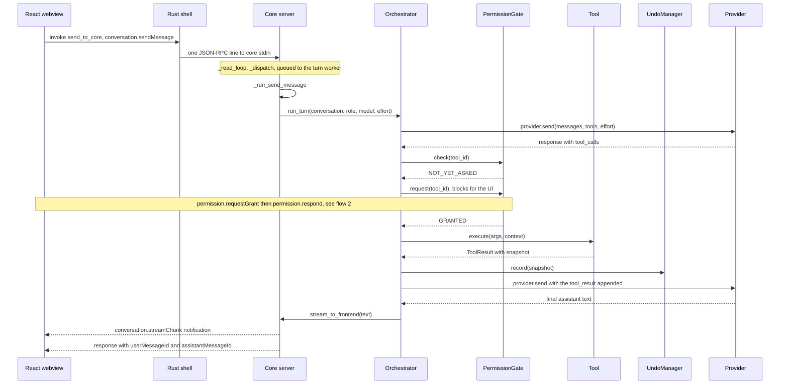
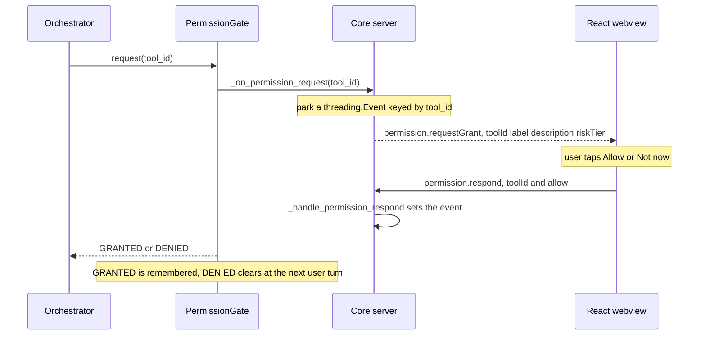
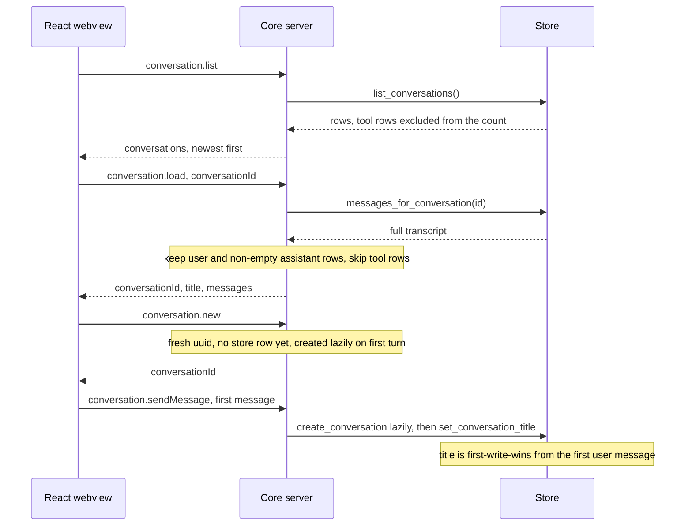
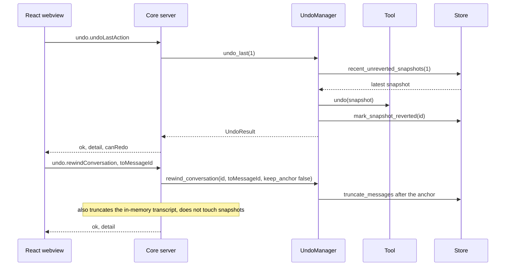
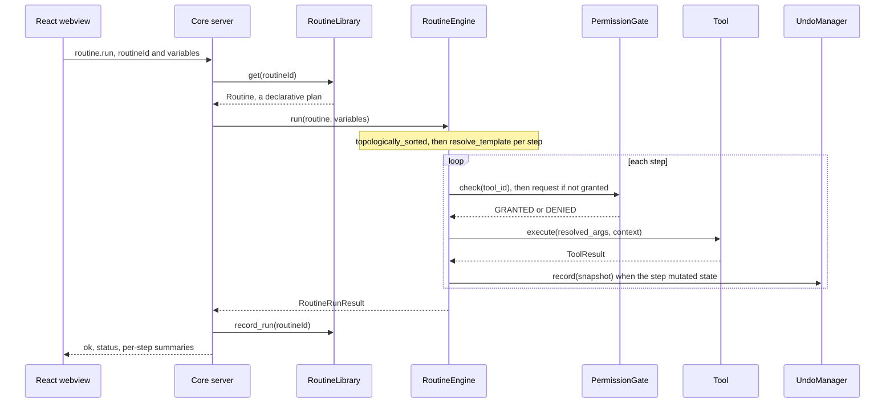
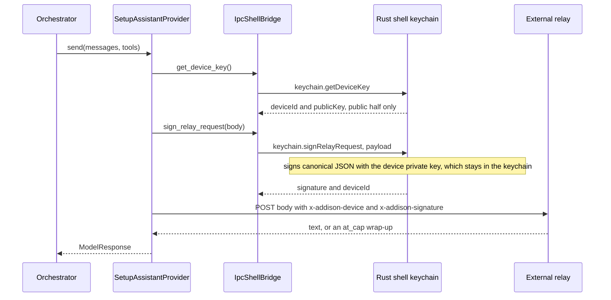
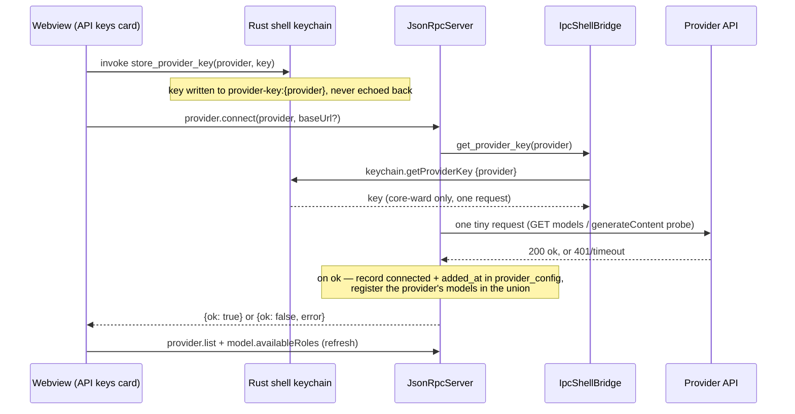

# Runtime flows

Sequence diagrams for the main flows across the three processes. Method and function
names match the code. Every Core-to-webview frame in these diagrams actually reaches
the webview as a `core-message` (or `core-status`) event relayed by the Rust shell;
the diagrams draw it as a direct arrow to keep the relay hop from repeating on every
line.

See also: [architecture.md](architecture.md), [data-model.md](data-model.md),
[classes.md](classes.md), and the [README](../README.md).

## 1. Send-message turn

A user message runs on the core's single turn worker: the read loop parses the frame
and queues it, the worker calls `_run_send_message`, and the orchestrator drives the
provider-and-tools loop until the model returns plain text.



## 2. Permission grant round-trip

The gate's consent prompt is an IPC round-trip. The worker thread parks an event
keyed by the tool id, emits the card, and blocks; the answering frame arrives on the
read loop and wakes the worker. A grant is remembered; a "Not now" only lasts the
rest of the current turn.



## 3. Conversation history

History landed recently. Listing counts only user and assistant rows; loading rebuilds
the in-memory transcript from user and non-empty assistant rows and skips persisted
tool rows on purpose — the store never persists an assistant turn's `tool_calls`, so
replaying tool rows would send unpaired tool results and the provider would reject the
next turn. A new conversation gets a fresh uuid but no store row until its first real
turn, and the title is written first-write-wins from the first user message.



## 4. Undo and conversational rewind

Two independent mechanisms. Action undo reverses the most recent mutating tool actions
through their snapshots; conversational rewind truncates the transcript. They never
touch each other's state.



## 5. Routine run

A routine is a shortcut for re-issuing a sequence of tool calls. The engine runs on
the same `ToolRegistry`, `PermissionGate`, and `UndoManager` instances as the live
loop, so it can never gain permissions the user has not already granted live.



## 6. Setup Assistant relay signing

When no primary key is configured, a turn runs on the onboarding relay. The relay's
own keys live server-side, outside this repository. The device only signs each request
with an ed25519 keypair whose private half never leaves the OS keychain; the core hands
bytes to sign and gets back a signature.



## 7. Connecting a provider key (multi-provider)

Adding a provider key (owner decision 2026-07-18) is a three-hop dance: the webview
hands the key straight to the highest-trust Rust process (never the core), then asks
the core to validate and record the connection. The core pulls the just-stored key
from the keychain, makes ONE tiny request to prove it works, and folds that provider's
models into the picker union. On failure the provider is left disconnected and the
card offers Remove to clear the stored key. Keys never cross to the core in a frame —
only the provider id does, and the core reads the value from the keychain at the moment
of use.



## 8. Widget propose and confirm

Addison proposes widgets the same way it proposes routines: a draft is held in the
core and nothing is saved until an explicit confirm. A widget is a **declarative**
spec (`agent_core/widgets.py`) — a saved-routine Run pill or a whitelisted stat
display — never code, validated at save and at render. Saving is display-only
(LOW-risk), so there is no permission card; a routine widget's routine keeps its own
gates when it is actually run.

```mermaid
sequenceDiagram
    participant WV as React webview
    participant SRV as Core server
    participant W as widgets.validate_widget_spec
    participant DB as Store (widgets)

    Note over WV: user sends "Build me a widget that …" (composer seed)
    WV->>SRV: widget.proposeFromConversation
    Note over SRV: draft from recent chat — a routine just run/named,<br/>or a token/latency/connections stat; else a plain refusal
    SRV-->>WV: {title, kind, summary, spec}  (held in memory, nothing saved)
    Note over WV: WidgetProposalCard — "Add widget" / "Not now"
    WV->>SRV: widget.confirmSave {accept: true}
    SRV->>W: validate_widget_spec(draft)
    W-->>SRV: None (valid) — reject otherwise
    SRV->>DB: insert_widget (pinned if under the 6-pin cap)
    SRV-->>WV: {ok: true, widgetId}
    WV->>SRV: widget.list (refresh the rail)
```
