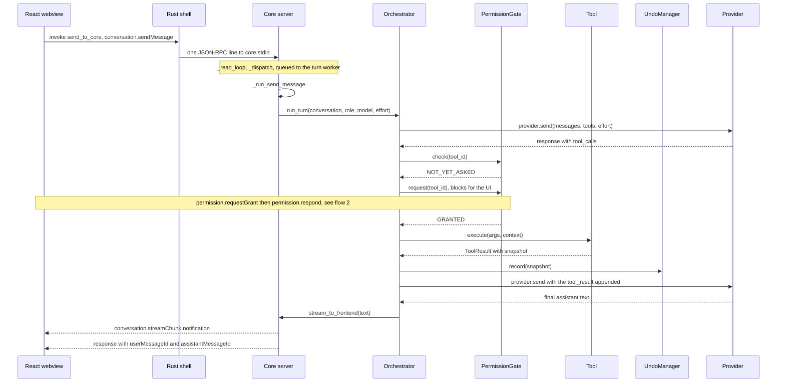
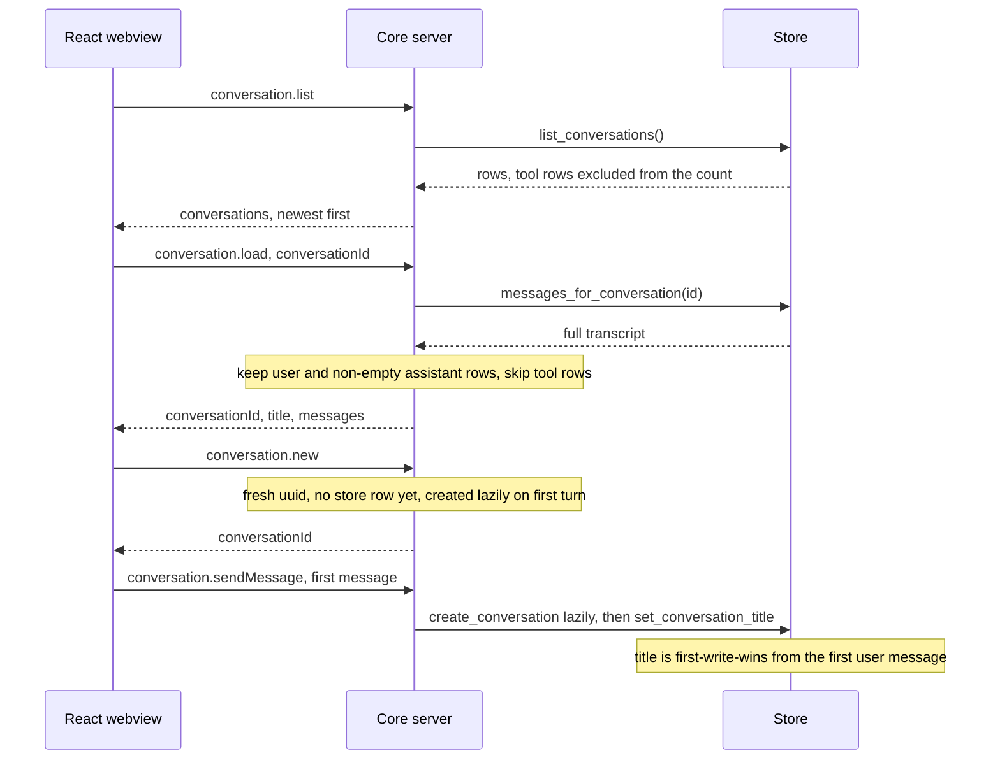
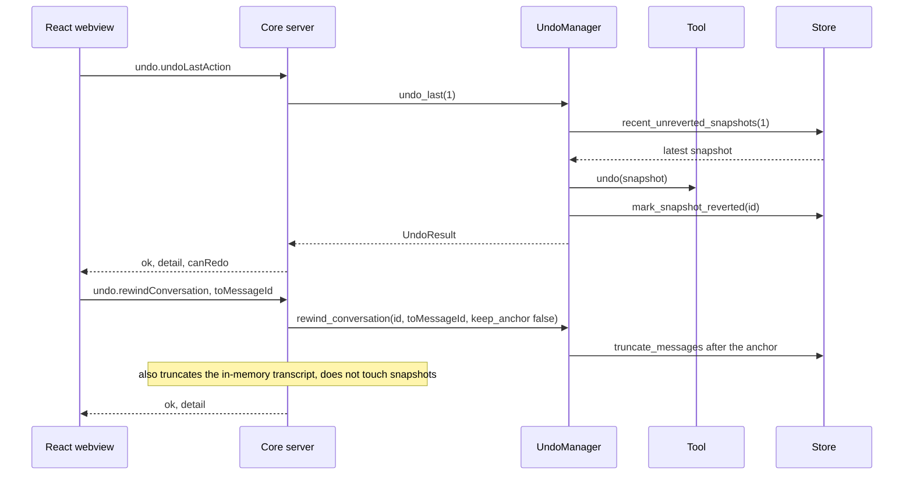
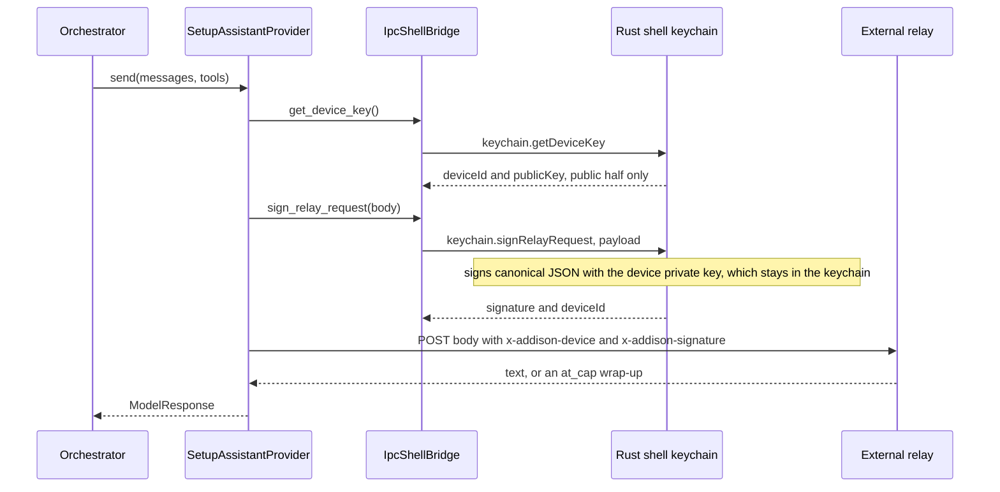
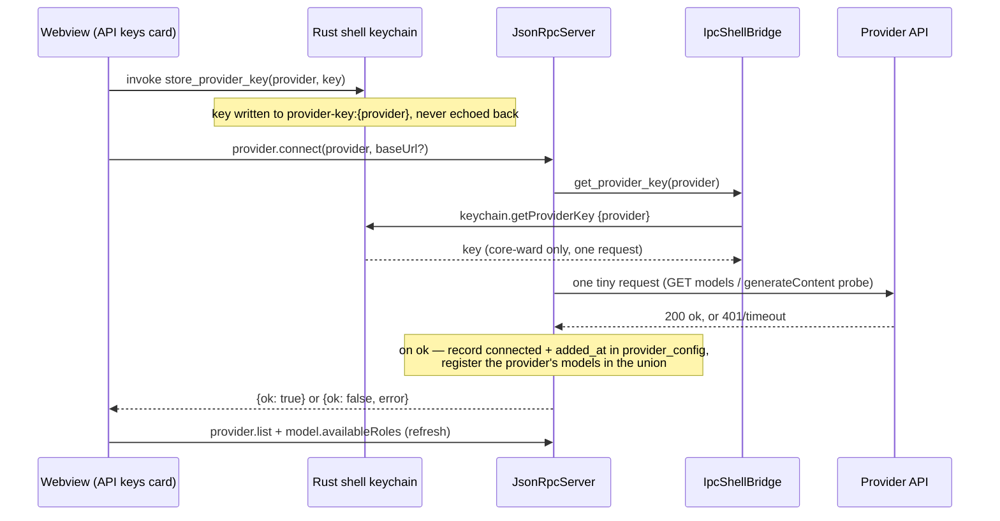
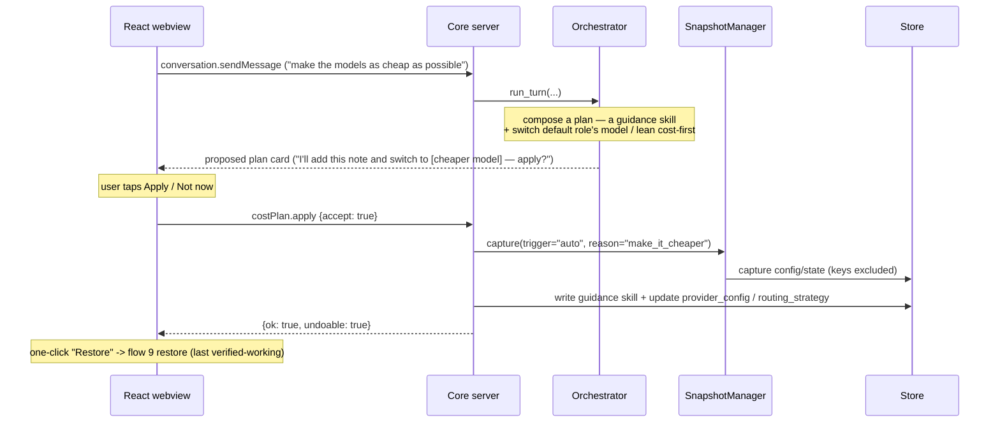
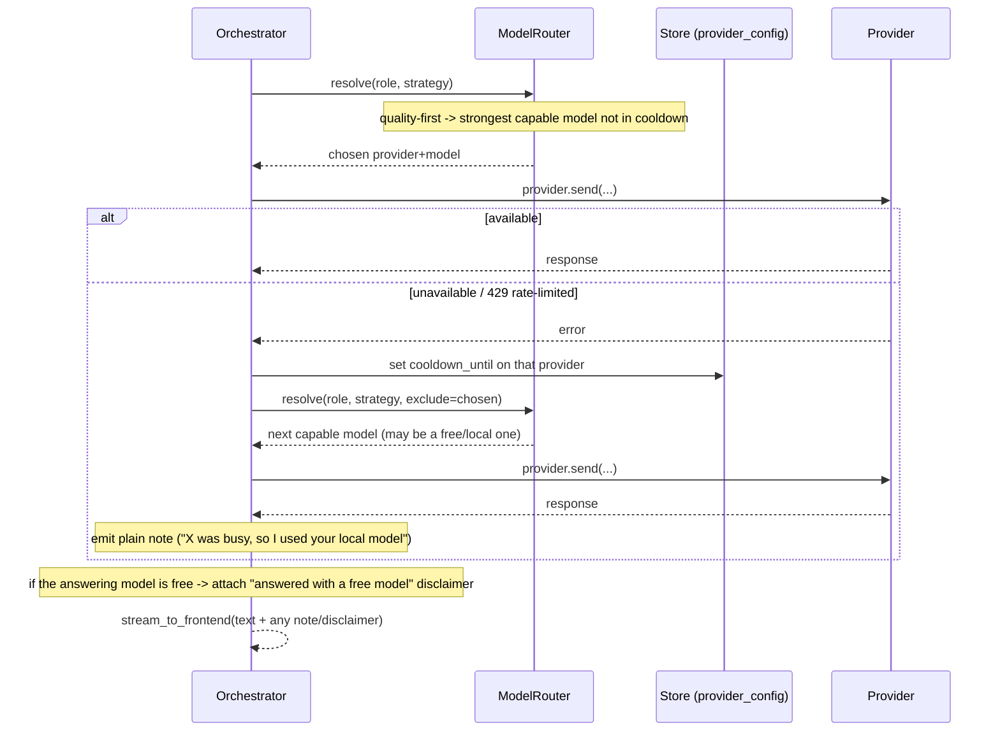

# Runtime flows

> **Scope amendment 2026-07-20** — see
> [`addison-scope-amendment-2026-07.md`](addison-scope-amendment-2026-07.md).
> Flows 1–8 are unchanged. Flows 9–15 are **new** and cover the amendment:
> snapshot + restore (G3), the "make it cheaper" orchestration, adding an endpoint by
> prompt, workspace-trust + the keyword-gated powerful action, building a widget
> (SAFE safe-vocabulary vs. higher-tier code-backed), routing degrade-with-disclaimer,
> and an MCP tool call through the existing gate. Names in the new flows are illustrative
> where the amendment leaves them open (marked Phase-2); the shapes are authoritative.
> **Flow 9 is the exception — snapshot/restore shipped in Phase-2 step 1, so its names
> are real.** The `reason` slugs quoted in flows 10, 11 and 12 are the reserved entries
> of that vocabulary (`snapshot_manager.REASONS`), so they are real too, even though the
> flows around them are not built yet.

Sequence diagrams for the main flows across the three processes. Method and function
names match the code. Every Core-to-webview frame in these diagrams actually reaches
the webview as a `core-message` (or `core-status`) event relayed by the Rust shell;
the diagrams draw it as a direct arrow to keep the relay hop from repeating on every
line.

See also: [architecture.md](architecture.md), [data-model.md](data-model.md),
[classes.md](classes.md), and the [README](../README.md).

## 1. Send-message turn

A user message runs on the core's single turn worker: the read loop parses the frame
and queues it, the worker calls `_run_send_message`, and the orchestrator drives the
provider-and-tools loop until the model returns plain text.



## 2. Permission grant round-trip

The orchestrator (and routine engine) call the mode-aware `authorize(tool_id, mode,
destructive, detail)` before every call (`policy.py`). In SAFE mode this prompts for
every not-yet-granted tool; in OPEN mode it auto-allows a non-destructive call
(recorded in the activity log) and prompts **per invocation** for a destructive one —
no prior grant carries over, and the card's description names the exact command being
approved this time (`detail`) — "open" is fewer prompts, not no gate. When a prompt is
needed, the consent prompt is an IPC round-trip: the worker thread parks an event
keyed by the tool id, emits the card, and blocks; the answering frame arrives on the
read loop and wakes the worker. A SAFE grant is remembered (destructive-OPEN approvals
are not); a "Not now" only lasts the rest of the current turn.

```mermaid
sequenceDiagram
    participant ORC as Orchestrator
    participant PG as PermissionGate
    participant SRV as Core server
    participant WV as React webview

    ORC->>PG: authorize(tool_id, mode, destructive, detail)
    alt OPEN mode and not destructive
        Note over PG: auto-grant, record in activity log
        PG-->>ORC: GRANTED (no card)
    else SAFE mode, or a destructive OPEN call
        PG->>SRV: _on_permission_request(tool_id, detail)
        Note over SRV: park a threading.Event keyed by tool_id;<br/>destructive-OPEN: description = the exact command text
        SRV-->>WV: permission.requestGrant, toolId label description riskTier
        Note over WV: user taps Allow or Not now
        WV->>SRV: permission.respond, toolId and allow
        SRV->>SRV: _handle_permission_respond sets the event
        PG-->>ORC: GRANTED or DENIED
        Note over PG: a SAFE grant is remembered; a destructive-OPEN approval is<br/>per-invocation (never remembered); DENIED clears at the next user turn
    end
```

## 3. Conversation history

History landed recently. Listing counts only user and assistant rows; loading rebuilds
the in-memory transcript from user and non-empty assistant rows and skips persisted
tool rows on purpose — the store never persists an assistant turn's `tool_calls`, so
replaying tool rows would send unpaired tool results and the provider would reject the
next turn. A new conversation gets a fresh uuid but no store row until its first real
turn, and the title is written first-write-wins from the first user message.



## 4. Undo and conversational rewind

Two independent mechanisms. Action undo reverses the most recent mutating tool actions
through their snapshots; conversational rewind truncates the transcript. They never
touch each other's state.



## 5. Routine run

A routine is a shortcut for re-issuing a sequence of tool calls. The engine runs on
the same `ToolRegistry`, `PermissionGate`, and `UndoManager` instances as the live
loop, so it can never gain permissions the user has not already granted live. The run
carries the current policy mode (`policy.py`): a dev-created routine is refused before
this flow starts when in SAFE mode; an OPEN-mode `command` step runs through the
`run_command` dev-only tool on those same instances, so a destructive command still
stops to ask.

```mermaid
sequenceDiagram
    participant WV as React webview
    participant SRV as Core server
    participant RL as RoutineLibrary
    participant RE as RoutineEngine
    participant PG as PermissionGate
    participant TL as Tool
    participant UM as UndoManager

    WV->>SRV: routine.run, routineId and variables
    SRV->>RL: get(routineId)
    RL-->>SRV: Routine, a declarative plan
    SRV->>RE: run(routine, variables)
    Note over RE: topologically_sorted, then resolve_template per step
    loop each step
        RE->>PG: authorize(tool_id, mode, destructive)
        Note over PG: SAFE prompts; OPEN auto-allows non-destructive, prompts destructive
        PG-->>RE: GRANTED or DENIED
        RE->>TL: execute(resolved_args, context)
        TL-->>RE: ToolResult
        RE->>UM: record(snapshot) when the step mutated state
    end
    RE-->>SRV: RoutineRunResult
    SRV->>RL: record_run(routineId)
    SRV-->>WV: ok, status, per-step summaries
```

## 6. Setup Assistant relay signing

When no primary key is configured, a turn runs on the onboarding relay. The relay's
own keys live server-side, outside this repository. The device only signs each request
with an ed25519 keypair whose private half never leaves the OS keychain; the core hands
bytes to sign and gets back a signature.



## 7. Connecting a provider key (multi-provider)

Adding a provider key (owner decision 2026-07-18) is a three-hop dance: the webview
hands the key straight to the highest-trust Rust process (never the core), then asks
the core to validate and record the connection. The core pulls the just-stored key
from the keychain, makes ONE tiny request to prove it works, and folds that provider's
models into the picker union. On failure the provider is left disconnected and the
card offers Remove to clear the stored key. Keys never cross to the core in a frame —
only the provider id does, and the core reads the value from the keychain at the moment
of use.



## 8. Widget propose and confirm

Addison proposes widgets the same way it proposes routines: a draft is held in the
core and nothing is saved until an explicit confirm. A widget is a **declarative**
spec (`agent_core/widgets.py`) — a saved-routine Run pill or a whitelisted stat
display — never code, validated at save and at render **against the current policy
mode**. In OPEN mode a third `command` kind is valid (it runs `run_command` on click,
so the destructive-prompt rule still applies when clicked); it is rejected in SAFE
mode, and OPEN-created widgets are hidden from `widget.list` while the Simple profile
is active (`created_in_mode`). Saving is display-only (LOW-risk), so there is no
permission card; a routine/command widget keeps its own gates when it is actually run.

```mermaid
sequenceDiagram
    participant WV as React webview
    participant SRV as Core server
    participant W as widgets.validate_widget_spec
    participant DB as Store (widgets)

    Note over WV: user sends "Build me a widget that …" (composer seed)
    WV->>SRV: widget.proposeFromConversation
    Note over SRV: draft from recent chat — a routine just run/named,<br/>or a token/latency/connections stat; else a plain refusal
    SRV-->>WV: {title, kind, summary, spec}  (held in memory, nothing saved)
    Note over WV: WidgetProposalCard — "Add widget" / "Not now"
    WV->>SRV: widget.confirmSave {accept: true}
    SRV->>W: validate_widget_spec(draft)
    W-->>SRV: None (valid) — reject otherwise
    SRV->>DB: insert_widget (pinned if under the 6-pin cap)
    SRV-->>WV: {ok: true, widgetId}
    WV->>SRV: widget.list (refresh the rail)
```

## 9. Snapshot and restore (G3 guaranteed rollback)

The load-bearing new floor (amendment §3). A snapshot is a point-in-time copy of Addison's
mutable **config/state** — settings, provider/routing config, skills, widgets, routines —
**never the keychain** (G1 holds) and never the transcript. One is taken **automatically**
before any risky or sweeping change and can also be taken **on command**. A config is marked
**verified-working** once a turn completes successfully against it, and **Restore always
targets the last verified-working snapshot**, so it lands somewhere that actually ran — the
difference between recovery and the friend's dead end. **Shipped in Phase-2 step 1** —
the names below are the real ones.

```mermaid
sequenceDiagram
    participant WV as React webview
    participant SRV as Core server
    participant SM as SnapshotManager
    participant ST as Store (config_snapshots)

    Note over SRV,SM: auto-snapshot — before a risky/sweeping change
    SRV->>SM: capture(trigger="auto", reason="mode_switch")
    SM->>ST: insert row image of the config tables (keychain excluded)
    SM->>SM: also write the payload to a 0600 JSON sidecar
    ST-->>SM: snapshotId
    Note over SM: when the next turn completes cleanly,<br/>mark_verified_working() captures the CURRENT<br/>config as a new verified row (deduped by fingerprint)

    Note over WV,SRV: on-command — Settings "Restore points" card
    WV->>SRV: snapshot.create
    SRV->>SM: capture(trigger="on_command", reason="user_request")
    SM->>ST: capture (deletable, unless minted as a Custom anchor)
    SRV-->>WV: {ok: true, snapshotId}

    Note over WV,SRV: the one-action button — no argument, by design
    WV->>SRV: snapshot.restoreLastWorking
    SRV->>SM: restore_last_working()
    SM->>ST: newest verified row that DIFFERS from the current config
    ST-->>SM: state_blob
    Note over SM: reapply in one transaction; keychain untouched, so a<br/>restored provider re-binds to its key by provider id
    SM-->>SRV: RestoreResult
    SRV-->>WV: {ok, snapshotId, detail, binaryMismatch?}

    Note over WV,SRV: the targeted path — a specific row, or an anchor
    WV->>SRV: snapshot.restore {id}
    SRV->>SM: restore(snapshot_id)
```

Three things the diagram cannot show:

- **`restore_last_working()` skips a candidate identical to the present config.** A
  restore that changes zero bytes is a no-op dressed as a recovery — the friend's dead
  end again. So **each click steps back one distinct proven configuration**; two bad
  changes deep, the user clicks twice. The Settings list is the way to jump straight to
  a specific point (`snapshot.restore {id}`).
- **A restore is an RPC path, never a registry tool, and never passes the permission
  gate** — a gate that could deny a restore would make "the restore path is itself
  unbreakable" false.
- **The database itself may be the broken thing.** `snapshot.list` and
  `snapshot.restoreLastWorking` are the only two methods exempt from the server's
  build-failure short-circuit: with no usable Store they are answered from the sidecar
  files, and the restore renames the damaged database **aside** (never deletes it) and
  rebuilds, in the same session, with no restart.

## 10. "Make it cheaper" orchestration

The exact request that bricked the friend becomes the *safest* thing to ask (amendment §11).
Addison **previews** two reversible changes — a guidance **skill** and a cheaper **model /
routing** choice — **auto-snapshots** before applying, and offers **one-click Restore**. The
bricking scenario is structurally impossible: previewed, reversible, floored by G3.



## 11. Add an endpoint by prompting

Adding a model endpoint in plain language (amendment §5, §6.2) is **reversible config**, not
altering Addison. Addison registers a provider row; the key goes straight to the keychain per
G1 (as in flow 7); an auto-snapshot makes it one-click reversible. The same plumbing connects
an MCP server (flow 15).

```mermaid
sequenceDiagram
    participant WV as React webview
    participant SRV as Core server
    participant ORC as Orchestrator
    participant SM as SnapshotManager
    participant SH as Rust shell keychain
    participant ST as Store (provider_config)

    WV->>SRV: conversation.sendMessage ("add this OpenAI-compatible server at <base>")
    SRV->>ORC: run_turn(...)
    Note over ORC: recognize an add-endpoint intent; confirm base URL + which key
    ORC-->>WV: confirm card (base URL, "paste the key into the secure field")
    Note over WV: key entered in the shell's field, never a chat frame
    WV->>SH: invoke store_provider_key(provider, key)
    WV->>SRV: provider.connect(provider, baseUrl)
    Note over SRV: validate with one tiny request (flow 7), record non-secret metadata
    SRV->>SM: capture(trigger="auto", reason="add_endpoint")
    SM->>ST: (config captured for one-click undo)
    SRV-->>WV: {ok: true} — endpoint now in the picker union
```

## 12. Workspace-trust grant and a keyword-gated powerful action

The harness (Developer/OPEN) reconciles the agentic loop with the per-invocation card
(amendment §8.2, §9). The user grants a **project directory** (a snapshotted act); **inside**
it, non-destructive and routine edits/runs flow without a card (the gate still *runs and
logs*). **Outside** it — and to **run or arm a powerful/elevated action** — a **user-typed
keyword prefix** (e.g. `!run …`; exact syntax Phase-2, §13) is required. Because the prefix is
a keystroke from the human, observed content can never forge it — it doubles as an injection
barrier.

```mermaid
sequenceDiagram
    participant WV as React webview
    participant SRV as Core server
    participant SM as SnapshotManager
    participant ORC as Orchestrator
    participant PG as PermissionGate
    participant TL as Tool

    WV->>SRV: workspace.grantTrust {directory}
    SRV->>SM: capture(trigger="auto", reason="workspace_trust")
    SRV-->>WV: ok (trust scoped, revocable)

    Note over WV,ORC: ordinary edit/run inside the trusted directory
    WV->>SRV: conversation.sendMessage ("fix the failing test")
    ORC->>PG: authorize(tool_id, OPEN, destructive, path)
    Note over PG: path in trusted workspace -> auto-grant + log (no card)
    PG-->>ORC: GRANTED
    ORC->>TL: execute(...)

    Note over WV,ORC: a powerful/armed action needs the typed keyword
    WV->>SRV: conversation.sendMessage ("!run deploy.sh")
    Note over ORC: keyword prefix present (user-typed; injected content can't supply it)
    ORC->>PG: authorize(run_command, OPEN, destructive=true, detail)
    Note over PG: outside trust / powerful -> per-invocation card (flow 2), exact command shown
    PG-->>ORC: GRANTED or DENIED
```

## 13. Build a widget — SAFE safe-vocabulary vs. higher-tier code-backed

Widgets are buildable in **every** mode; the mode gates the **capability**, not whether one
can be built (amendment §8.4). A SAFE request for a to-do widget produces a real checklist
from the **safe interactive vocabulary** (trusted renderers + safe storage, no code). A
Developer/Custom request may build a **code-backed / system-capable** widget (a monitor,
the friend's connection watcher), which is capability-tier-gated and, to *run or arm*, goes
through workspace-trust + the keyword gate + snapshot floor.

```mermaid
sequenceDiagram
    participant WV as React webview
    participant SRV as Core server
    participant W as widgets.validate_widget_spec
    participant DB as Store (widgets)

    WV->>SRV: widget.proposeFromConversation ("build me a to-do widget")
    Note over SRV: draft a spec; stamp required_capabilities + created_in_mode
    SRV-->>WV: {title, kind, summary, spec}  (held in memory)
    WV->>SRV: widget.confirmSave {accept: true}
    SRV->>W: validate_widget_spec(draft, mode)
    alt SAFE-tier capabilities only (to-do/checklist, note, timer, launchers)
        Note over W: non-destructive vocabulary — no code/eval; SAFE-1 + CSP hold
        W-->>SRV: None (valid)
        SRV->>DB: insert_widget (created_in_mode="safe")
    else code-backed / system-capable (Developer / Custom)
        Note over W: capability tier > SAFE -> requires OPEN/Custom;<br/>refused if built under Simple
        W-->>SRV: None (valid in-tier) — else reject + plain reason
        SRV->>DB: insert_widget (created_in_mode="open"/"custom", hidden in Simple)
    end
    SRV-->>WV: {ok: true, widgetId}
    Note over WV: running/arming a system-capable widget -> workspace-trust + keyword gate (flow 12)
```

## 14. Routing: degrade-down with a free-model disclaimer

Routing is **strong-first, degrade-down** by default (amendment §10) — the inverse of a
cheap-first gateway, so the companion never silently gets a worse answer. When the picked
model is unavailable or rate-limited, routing falls forward/down to the next capable model
with a plain-language note and a light provider **cooldown**; when a **free** model answers,
a visible **"answered with a free model"** disclaimer is shown.



## 15. MCP tool call through the existing gate

Addison is an MCP **client**, not a server/gateway (amendment §8.5). External MCP tools are
surfaced through the **existing registry and permission gate** — never a side channel — so
they are gated, logged, and undo-aware like any tool. In OPEN they run under workspace-trust;
in SAFE only read-only or genuinely undo-able MCP tools are admitted (invariant 2 keeps a
mutating, un-undoable MCP tool out of the SAFE view automatically). Connecting the server is
reversible config (flow 11 plumbing).

```mermaid
sequenceDiagram
    participant ORC as Orchestrator
    participant REG as ToolRegistry
    participant PG as PermissionGate
    participant MC as McpClient
    participant SRV as External MCP server
    participant UM as UndoManager

    Note over REG: MCP tools registered as ordinary registry entries;<br/>visible_tools(SAFE) admits only read-only / undo-able ones
    ORC->>REG: resolve(tool_id) for an MCP-backed tool
    REG-->>ORC: Tool wrapper (mode-filtered)
    ORC->>PG: authorize(tool_id, mode, destructive, detail)
    Note over PG: SAFE prompts; OPEN auto-allows non-destructive,<br/>per-invocation card for destructive / powerful (keyword gate)
    PG-->>ORC: GRANTED
    ORC->>MC: call(tool_id, args)
    MC->>SRV: MCP tools/call
    SRV-->>MC: result
    MC-->>ORC: ToolResult (with snapshot when it mutated state)
    ORC->>UM: record(snapshot) when applicable
```
