# Runtime flows

> **Amended 2026-07-20** by the scope amendment, which was folded into the
> authoritative docs and **retired 2026-07-27**. Floors, modes and guards are
> owned by [`SAFETY.md`](SAFETY.md); status by [`../ROADMAP.md`](../ROADMAP.md).
> Do not consult the amendment to settle a question — it is a historical record.
> Flows 1–8 are unchanged. Flows 9–15 are **new** and cover the amendment:
> snapshot + restore (G3), the "make it cheaper" orchestration, adding an endpoint by
> prompt, workspace-trust + the keyword-gated powerful action, building a widget
> (SAFE safe-vocabulary vs. higher-tier code-backed), routing degrade-with-disclaimer,
> and an MCP tool call through the existing gate. Phase-2 steps 1–5 have since landed,
> so most of those flows are now real code and the names in them are the ones in the
> modules: **flow 9** (snapshots, step 1), **flow 10** ("make it cheaper", step 4),
> **flow 11** (add an endpoint, step 4), **flow 14** (routing, step 3), and the
> workspace-trust half of **flow 12** (step 5). Two are still unbuilt and are marked
> where they appear: the **keyword gate** in flow 12 (step 8), and — inside the now
> mostly-shipped **flow 13** — the code-backed widget branch. **Flow 15** (MCP, step 7)
> is unbuilt in its entirety. The `reason` slugs quoted throughout are entries of the
> closed vocabulary in `snapshot_manager.REASONS`, so they are real even where the flow
> around them is not.

Sequence diagrams for the main flows across the three processes. Method and function
names match the code. Every Core-to-webview frame in these diagrams actually reaches
the webview as a `core-message` (or `core-status`) event relayed by the Rust shell;
the diagrams draw it as a direct arrow to keep the relay hop from repeating on every
line.

See also: [architecture.md](architecture.md), [data-model.md](data-model.md),
[classes.md](classes.md), and the [README](../README.md).

## 1. Send-message turn

A user message runs on the core's single turn worker: the read loop parses the frame
and queues it, the worker calls `_run_send_message`, and the orchestrator drives the
provider-and-tools loop until the model returns plain text.

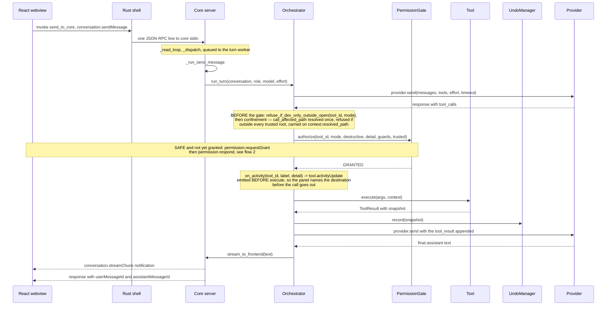
```mermaid
sequenceDiagram
    participant WV as React webview
    participant SH as Rust shell
    participant SRV as Core server
    participant ORC as Orchestrator
    participant PG as PermissionGate
    participant TL as Tool
    participant UM as UndoManager
    participant PR as Provider

    WV->>SH: invoke send_to_core, conversation.sendMessage
    SH->>SRV: one JSON-RPC line to core stdin
    Note over SRV: _read_loop, _dispatch, queued to the turn worker
    SRV->>SRV: _run_send_message
    SRV->>ORC: run_turn(conversation, role, model, effort)
    ORC->>PR: provider.send(messages, tools, effort, timeout)
    PR-->>ORC: response with tool_calls
    Note over ORC: BEFORE the gate: refuse_if_dev_only_outside_open(tool_id, mode),<br/>then confinement — call_affected_path resolved once, refused if<br/>outside every trusted root, carried on context.resolved_path
    ORC->>PG: authorize(tool_id, mode, destructive, detail, guards, trusted)
    Note over PG,WV: SAFE and not yet granted: permission.requestGrant<br/>then permission.respond, see flow 2
    PG-->>ORC: GRANTED
    Note over ORC: on_activity(tool_id, label, detail) -> tool.activityUpdate<br/>emitted BEFORE execute, so the panel names the destination<br/>before the call goes out
    ORC->>TL: execute(args, context)
    TL-->>ORC: ToolResult with snapshot
    ORC->>UM: record(snapshot)
    ORC->>PR: provider.send with the tool_result appended
    PR-->>ORC: final assistant text
    ORC->>SRV: stream_to_frontend(text)
    SRV-->>WV: conversation.streamChunk notification
    SRV-->>WV: response with userMessageId and assistantMessageId
```

## 2. Permission grant round-trip

The orchestrator (and routine engine) call the mode-aware `authorize(tool_id, mode,
destructive, detail)` before every call (`permissions/gate.py`; `policy.py` supplies
`PolicyMode`, `GuardConfig` and `mode_for_profile`). In SAFE mode this prompts for
every not-yet-granted tool; in OPEN mode it auto-allows a non-destructive call
(recorded in the activity log) and prompts **per invocation** for a destructive one —
no prior grant carries over, and the card's description names the exact command being
approved this time (`detail`) — "open" is fewer prompts, not no gate. When a prompt is
needed, the consent prompt is an IPC round-trip: the worker thread parks an event
keyed by the tool id, emits the card, and blocks; the answering frame arrives on the
read loop and wakes the worker. A SAFE grant is remembered (destructive-OPEN approvals
are not); a "Not now" only lasts the rest of the current turn.

Two OPEN-path modulations the diagram folds into one branch. Under the **Custom**
profile a `GuardConfig` shifts how often the gate asks: `auto_grant_scope='none'` sends
*non-destructive* calls through the SAFE-style coarse flow, `'everything'` auto-grants
everything (still recorded, still logged), and `destructive_card='session'` remembers a
destructive approval — in a dedicated set the SAFE `check()` path structurally never
reads, so it can never leak into Simple. A destructive call never falls into the coarse
flow, under any scope: a coarse grant carries no per-call text, so one approved `ls`
would silently authorize every later `rm -rf`. And `trusted=True` — set only for a
confined, undoable file edit inside a trusted root — makes a destructive call
card-free, except that it does *not* override a turn-scoped "Not now" or Custom's
strictest `auto_grant_scope='none'`.

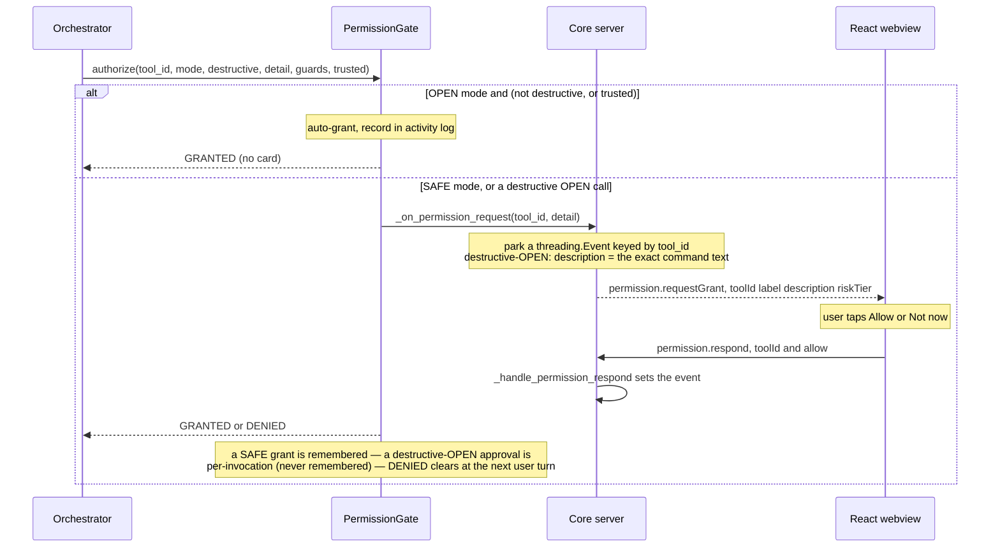
```mermaid
sequenceDiagram
    participant ORC as Orchestrator
    participant PG as PermissionGate
    participant SRV as Core server
    participant WV as React webview

    ORC->>PG: authorize(tool_id, mode, destructive, detail, guards, trusted)
    alt OPEN mode and (not destructive, or trusted)
        Note over PG: auto-grant, record in activity log
        PG-->>ORC: GRANTED (no card)
    else SAFE mode, or a destructive OPEN call
        PG->>SRV: _on_permission_request(tool_id, detail)
        Note over SRV: park a threading.Event keyed by tool_id<br/>destructive-OPEN: description = the exact command text
        SRV-->>WV: permission.requestGrant, toolId label description riskTier
        Note over WV: user taps Allow or Not now
        WV->>SRV: permission.respond, toolId and allow
        SRV->>SRV: _handle_permission_respond sets the event
        PG-->>ORC: GRANTED or DENIED
        Note over PG: a SAFE grant is remembered — a destructive-OPEN approval is<br/>per-invocation (never remembered) — DENIED clears at the next user turn
    end
```

## 3. Conversation history

History landed recently. Listing counts only user and assistant rows; loading rebuilds
the in-memory transcript from user and non-empty assistant rows and skips persisted
tool rows on purpose — the store never persists an assistant turn's `tool_calls`, so
replaying tool rows would send unpaired tool results and the provider would reject the
next turn. A new conversation gets a fresh uuid but no store row until its first real
turn, and the title is written first-write-wins from the first user message.

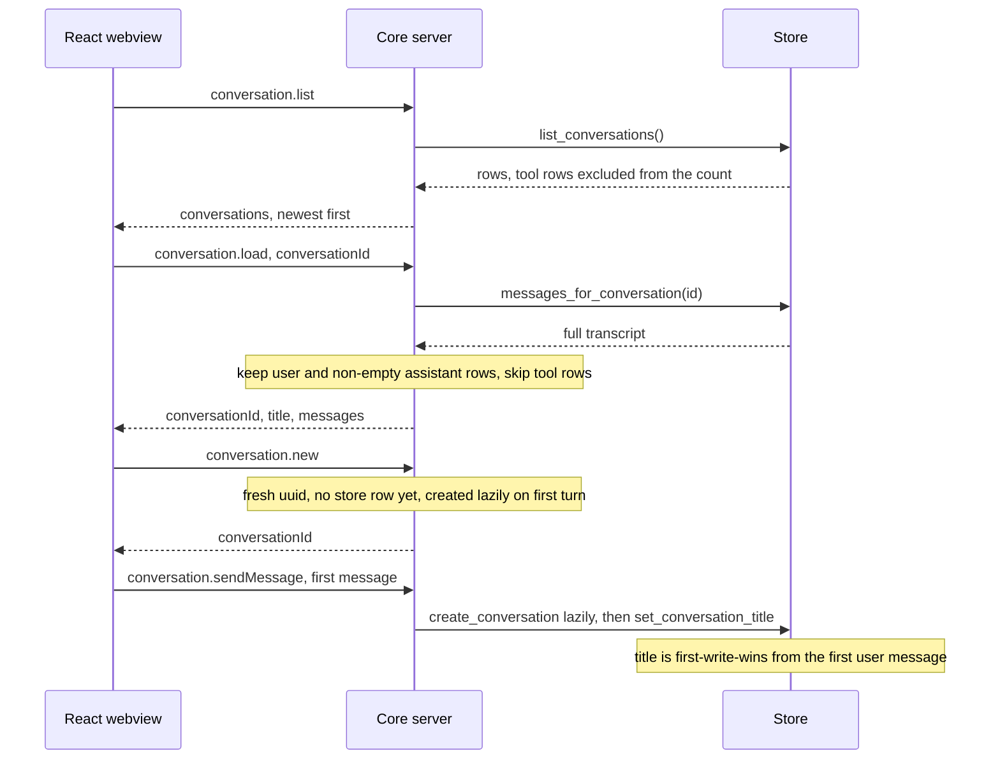
```mermaid
sequenceDiagram
    participant WV as React webview
    participant SRV as Core server
    participant ST as Store

    WV->>SRV: conversation.list
    SRV->>ST: list_conversations()
    ST-->>SRV: rows, tool rows excluded from the count
    SRV-->>WV: conversations, newest first

    WV->>SRV: conversation.load, conversationId
    SRV->>ST: messages_for_conversation(id)
    ST-->>SRV: full transcript
    Note over SRV: keep user and non-empty assistant rows, skip tool rows
    SRV-->>WV: conversationId, title, messages

    WV->>SRV: conversation.new
    Note over SRV: fresh uuid, no store row yet, created lazily on first turn
    SRV-->>WV: conversationId

    WV->>SRV: conversation.sendMessage, first message
    SRV->>ST: create_conversation lazily, then set_conversation_title
    Note over ST: title is first-write-wins from the first user message
```

## 4. Undo and conversational rewind

Two independent mechanisms. Action undo reverses the most recent mutating tool actions
through their snapshots; conversational rewind truncates the transcript. They never
touch each other's state.

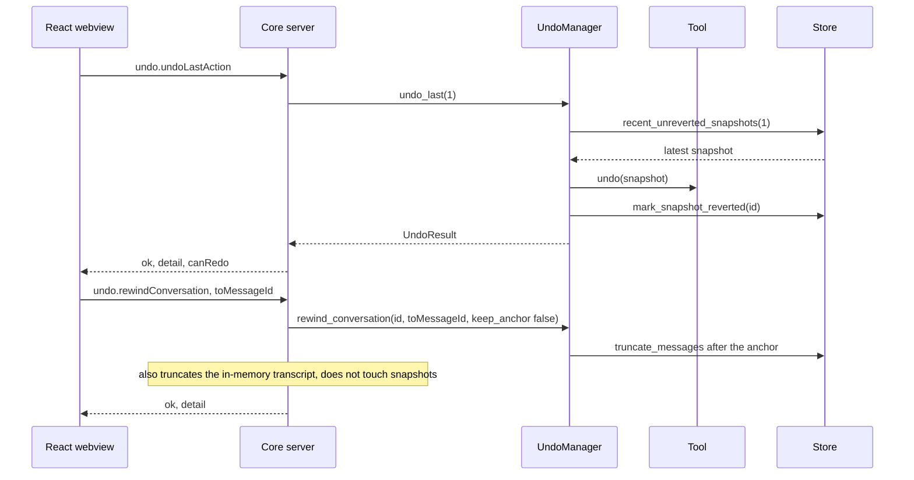
```mermaid
sequenceDiagram
    participant WV as React webview
    participant SRV as Core server
    participant UM as UndoManager
    participant TL as Tool
    participant ST as Store

    WV->>SRV: undo.undoLastAction
    SRV->>UM: undo_last(1)
    UM->>ST: recent_unreverted_snapshots(1)
    ST-->>UM: latest snapshot
    UM->>TL: undo(snapshot)
    UM->>ST: mark_snapshot_reverted(id)
    UM-->>SRV: UndoResult
    SRV-->>WV: ok, detail, canRedo

    WV->>SRV: undo.rewindConversation, toMessageId
    SRV->>UM: rewind_conversation(id, toMessageId, keep_anchor false)
    UM->>ST: truncate_messages after the anchor
    Note over SRV: also truncates the in-memory transcript, does not touch snapshots
    SRV-->>WV: ok, detail
```

## 5. Routine run

A routine is a shortcut for re-issuing a sequence of tool calls. The engine runs on
the same `ToolRegistry`, `PermissionGate`, and `UndoManager` instances as the live
loop, so it can never gain permissions the user has not already granted live. The run
carries the current policy mode (`policy.py`): a dev-created routine is refused before
this flow starts when in SAFE mode; an OPEN-mode `command` step runs through the
`run_command` dev-only tool on those same instances, so it stops to ask **every time**.
Two properties the engine shares with the live turn rather than reimplementing: the
dev-only refusal and the confinement check both run at dispatch, *before* the gate and
before `execute`; and a routine step passes `trusted=False` unconditionally, so a
trusted workspace can never make a stored, replayable step card-free.

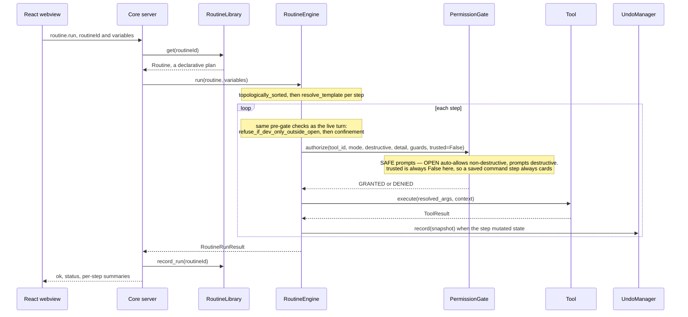
```mermaid
sequenceDiagram
    participant WV as React webview
    participant SRV as Core server
    participant RL as RoutineLibrary
    participant RE as RoutineEngine
    participant PG as PermissionGate
    participant TL as Tool
    participant UM as UndoManager

    WV->>SRV: routine.run, routineId and variables
    SRV->>RL: get(routineId)
    RL-->>SRV: Routine, a declarative plan
    SRV->>RE: run(routine, variables)
    Note over RE: topologically_sorted, then resolve_template per step
    loop each step
        Note over RE: same pre-gate checks as the live turn:<br/>refuse_if_dev_only_outside_open, then confinement
        RE->>PG: authorize(tool_id, mode, destructive, detail, guards, trusted=False)
        Note over PG: SAFE prompts — OPEN auto-allows non-destructive, prompts destructive.<br/>trusted is always False here, so a saved command step always cards
        PG-->>RE: GRANTED or DENIED
        RE->>TL: execute(resolved_args, context)
        TL-->>RE: ToolResult
        RE->>UM: record(snapshot) when the step mutated state
    end
    RE-->>SRV: RoutineRunResult
    SRV->>RL: record_run(routineId)
    SRV-->>WV: ok, status, per-step summaries
```

## 6. Setup Assistant relay signing

When no primary key is configured, a turn runs on the onboarding relay. The relay's
own keys live server-side, outside this repository. The device only signs each request
with an ed25519 keypair whose private half never leaves the OS keychain; the core hands
bytes to sign and gets back a signature.

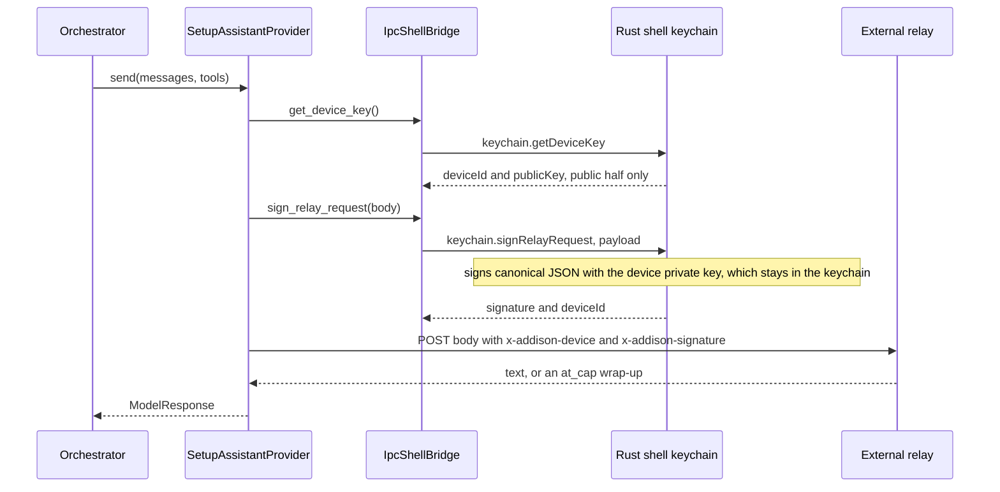
```mermaid
sequenceDiagram
    participant ORC as Orchestrator
    participant SAP as SetupAssistantProvider
    participant BR as IpcShellBridge
    participant SH as Rust shell keychain
    participant RLY as External relay

    ORC->>SAP: send(messages, tools)
    SAP->>BR: get_device_key()
    BR->>SH: keychain.getDeviceKey
    SH-->>BR: deviceId and publicKey, public half only
    SAP->>BR: sign_relay_request(body)
    BR->>SH: keychain.signRelayRequest, payload
    Note over SH: signs canonical JSON with the device private key, which stays in the keychain
    SH-->>BR: signature and deviceId
    SAP->>RLY: POST body with x-addison-device and x-addison-signature
    RLY-->>SAP: text, or an at_cap wrap-up
    SAP-->>ORC: ModelResponse
```

## 7. Connecting a provider key (multi-provider)

Adding a provider key (owner decision 2026-07-18) is a three-hop dance: the webview
hands the key straight to the highest-trust Rust process (never the core), then asks
the core to validate and record the connection. The core pulls the just-stored key
from the keychain, makes ONE tiny request to prove it works, and folds that provider's
models into the picker union. On failure the provider is left disconnected and the
card offers Remove to clear the stored key. Keys never cross to the core in a frame —
only the provider id does, and the core reads the value from the keychain at the moment
of use.

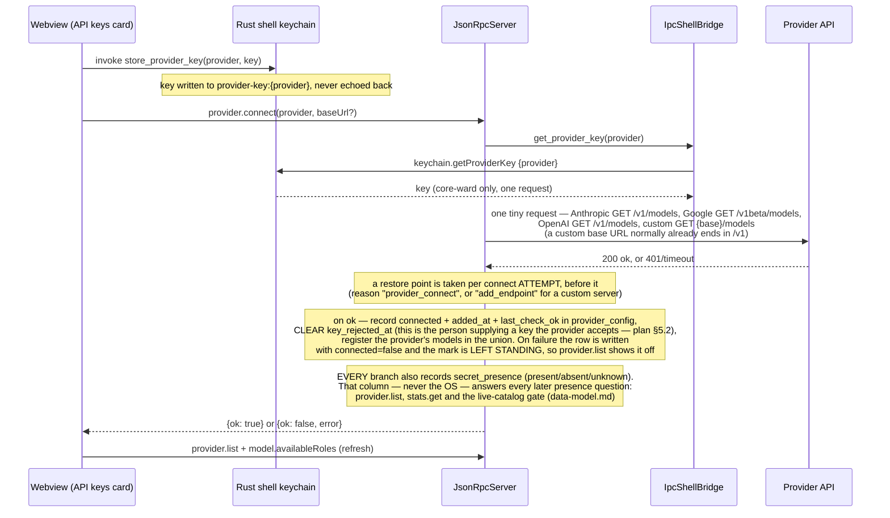
```mermaid
sequenceDiagram
    participant UI as Webview (API keys card)
    participant SH as Rust shell keychain
    participant SRV as JsonRpcServer
    participant BR as IpcShellBridge
    participant P as Provider API

    UI->>SH: invoke store_provider_key(provider, key)
    Note over SH: key written to provider-key:{provider}, never echoed back
    UI->>SRV: provider.connect(provider, baseUrl?)
    SRV->>BR: get_provider_key(provider)
    BR->>SH: keychain.getProviderKey {provider}
    SH-->>BR: key (core-ward only, one request)
    SRV->>P: one tiny request — Anthropic GET /v1/models, Google GET /v1beta/models,<br/>OpenAI GET /v1/models, custom GET {base}/models<br/>(a custom base URL normally already ends in /v1)
    P-->>SRV: 200 ok, or 401/timeout
    Note over SRV: a restore point is taken per connect ATTEMPT, before it<br/>(reason "provider_connect", or "add_endpoint" for a custom server)
    Note over SRV: on ok — record connected + added_at + last_check_ok in provider_config,<br/>CLEAR key_rejected_at (this is the person supplying a key the provider accepts — plan §5.2),<br/>register the provider's models in the union. On failure the row is written<br/>with connected=false and the mark is LEFT STANDING, so provider.list shows it off
    Note over SRV: EVERY branch also records secret_presence (present/absent/unknown).<br/>That column — never the OS — answers every later presence question:<br/>provider.list, stats.get and the live-catalog gate (data-model.md)
    SRV-->>UI: {ok: true} or {ok: false, error}
    UI->>SRV: provider.list + model.availableRoles (refresh)
```

## 8. Widget propose and confirm

Addison proposes widgets the same way it proposes routines: a draft is held in the
core and nothing is saved until an explicit confirm. A widget is a **declarative**
spec (`agent_core/widgets.py`) — a saved-routine Run pill or a whitelisted stat
display — never code, validated at save and at render **against the current policy
mode**. In OPEN mode a third `command` kind is valid (it runs `run_command` on click,
so the destructive-prompt rule still applies when clicked); it is rejected at save in
SAFE mode, and OPEN-created widgets are listed by `widget.list` while the Simple
profile is active (`created_in_mode`) as disabled rows carrying a display-only
reason — they were hidden until 2026-08-06; [SAFETY.md](SAFETY.md) owns the rule. Saving is display-only (LOW-risk), so there is no
permission card; a routine/command widget keeps its own gates when it is actually run.

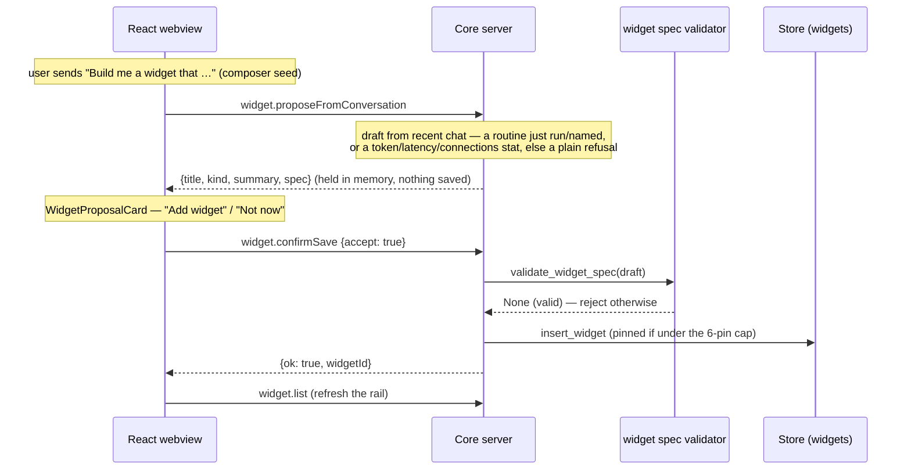
```mermaid
sequenceDiagram
    participant WV as React webview
    participant SRV as Core server
    participant W as widget spec validator
    participant DB as Store (widgets)

    Note over WV: user sends "Build me a widget that …" (composer seed)
    WV->>SRV: widget.proposeFromConversation
    Note over SRV: draft from recent chat — a routine just run/named,<br/>or a token/latency/connections stat, else a plain refusal
    SRV-->>WV: {title, kind, summary, spec}  (held in memory, nothing saved)
    Note over WV: WidgetProposalCard — "Add widget" / "Not now"
    WV->>SRV: widget.confirmSave {accept: true}
    SRV->>W: validate_widget_spec(draft)
    W-->>SRV: None (valid) — reject otherwise
    SRV->>DB: insert_widget (pinned if under the 6-pin cap)
    SRV-->>WV: {ok: true, widgetId}
    WV->>SRV: widget.list (refresh the rail)
```

## 9. Snapshot and restore (G3 guaranteed rollback)

The load-bearing new floor (amendment §3). A snapshot is a point-in-time copy of Addison's
mutable **config/state** — settings, provider/routing config, skills, widgets, routines —
**never the keychain** (G1 holds) and never the transcript. One is taken **automatically**
before any risky or sweeping change and can also be taken **on command**. A config is marked
**verified-working** once a turn completes successfully against it, and **Restore always
targets the last verified-working snapshot**, so it lands somewhere that actually ran — the
difference between recovery and the dead end suffered by the amendment's *friend*: the
non-technical user whose single "make it cheaper" request permanently broke his setup, with
the built-in rewind giving him no way back. **Shipped in Phase-2 step 1** — the names below
are the real ones.

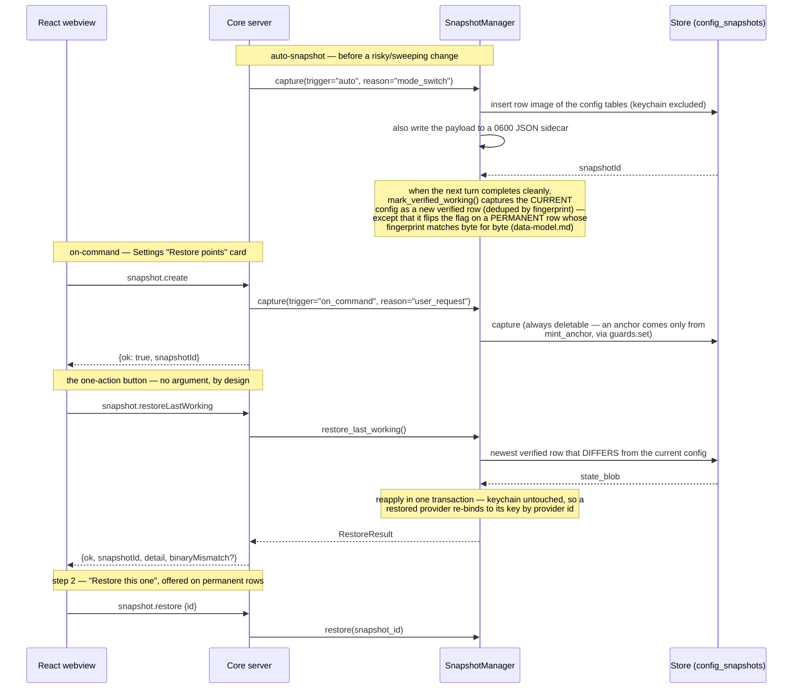
```mermaid
sequenceDiagram
    participant WV as React webview
    participant SRV as Core server
    participant SM as SnapshotManager
    participant ST as Store (config_snapshots)

    Note over SRV,SM: auto-snapshot — before a risky/sweeping change
    SRV->>SM: capture(trigger="auto", reason="mode_switch")
    SM->>ST: insert row image of the config tables (keychain excluded)
    SM->>SM: also write the payload to a 0600 JSON sidecar
    ST-->>SM: snapshotId
    Note over SM: when the next turn completes cleanly,<br/>mark_verified_working() captures the CURRENT<br/>config as a new verified row (deduped by fingerprint) —<br/>except that it flips the flag on a PERMANENT row whose<br/>fingerprint matches byte for byte (data-model.md)

    Note over WV,SRV: on-command — Settings "Restore points" card
    WV->>SRV: snapshot.create
    SRV->>SM: capture(trigger="on_command", reason="user_request")
    SM->>ST: capture (always deletable — an anchor comes only from<br/>mint_anchor, via guards.set)
    SRV-->>WV: {ok: true, snapshotId}

    Note over WV,SRV: the one-action button — no argument, by design
    WV->>SRV: snapshot.restoreLastWorking
    SRV->>SM: restore_last_working()
    SM->>ST: newest verified row that DIFFERS from the current config
    ST-->>SM: state_blob
    Note over SM: reapply in one transaction — keychain untouched, so a<br/>restored provider re-binds to its key by provider id
    SM-->>SRV: RestoreResult
    SRV-->>WV: {ok, snapshotId, detail, binaryMismatch?}

    Note over WV,SRV: step 2 — "Restore this one", offered on permanent rows
    WV->>SRV: snapshot.restore {id}
    SRV->>SM: restore(snapshot_id)
```

Four things the diagram cannot show:

- **`restore_last_working()` skips a candidate identical to the present config.** A
  restore that changes zero bytes is a no-op dressed as a recovery — the friend's dead
  end again. So **each click steps back one distinct proven configuration**; two bad
  changes deep, the user clicks twice.
- **Per-row restore shipped in step 2, on permanent rows only.** `SnapshotsCard`
  offers "Restore this one" beside a permanent row — the row a user cannot delete and
  might most need to reach — which calls `useSnapshots.handleRestoreSnapshot` →
  `ipc.restoreSnapshot` → `snapshot.restore {id}`, and handles the outcome exactly as
  the one-action button does — behind a two-step inline confirm that names the row
  first, never a blind recovery. An ordinary row's only action is **Remove**; saving a
  restore point and restore-to-last-working are card-level controls, not per-row ones.
- **A restore is an RPC path, never a registry tool, and never passes the permission
  gate** — a gate that could deny a restore would make "the restore path is itself
  unbreakable" false.
- **The database itself may be the broken thing.** `snapshot.list` and
  `snapshot.restoreLastWorking` are the only two methods exempt from the server's
  build-failure short-circuit: with no usable Store they are answered from the sidecar
  files, and the restore renames the damaged database **aside** (never deletes it) and
  rebuilds, in the same session, with no restart.

## 10. "Make it cheaper" orchestration

The exact request that bricked the friend becomes the *safest* thing to ask (amendment §11).
Addison **previews** two reversible changes — a guidance **skill** and a cheaper **routing**
choice — **auto-snapshots** before applying, and offers **one-click Restore**. The
bricking scenario is structurally impossible: previewed, reversible, floored by G3.
Shipped in Phase-2 step 4, and the shape matters: **the model authors none of it.** The
turn's reply never carries an actionable payload. After the turn, the frontend tests the
*user's own words* against a deliberately narrow keyword pattern (`useOffers.ts`) and, if
it matches, asks the core for the plan; the core's plan is **canned in code** — a fixed
note and the fixed `cost_first` strategy — so a card can never be armed by the model's
answer. The core needs no message read at all here: `costPlan.propose` returns constants,
so there is nothing for the model to influence (the `role=="user"`-only read belongs to
flow 11, where a base URL has to be extracted from somewhere).

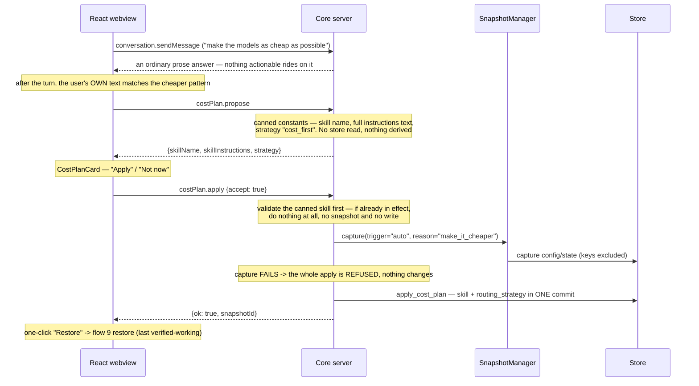
```mermaid
sequenceDiagram
    participant WV as React webview
    participant SRV as Core server
    participant SM as SnapshotManager
    participant ST as Store

    WV->>SRV: conversation.sendMessage ("make the models as cheap as possible")
    SRV-->>WV: an ordinary prose answer — nothing actionable rides on it
    Note over WV: after the turn, the user's OWN text matches the cheaper pattern
    WV->>SRV: costPlan.propose
    Note over SRV: canned constants — skill name, full instructions text,<br/>strategy "cost_first". No store read, nothing derived
    SRV-->>WV: {skillName, skillInstructions, strategy}
    Note over WV: CostPlanCard — "Apply" / "Not now"
    WV->>SRV: costPlan.apply {accept: true}
    Note over SRV: validate the canned skill first — if already in effect,<br/>do nothing at all, no snapshot and no write
    SRV->>SM: capture(trigger="auto", reason="make_it_cheaper")
    SM->>ST: capture config/state (keys excluded)
    Note over SRV: capture FAILS -> the whole apply is REFUSED, nothing changes
    SRV->>ST: apply_cost_plan — skill + routing_strategy in ONE commit
    SRV-->>WV: {ok: true, snapshotId}
    Note over WV: one-click "Restore" -> flow 9 restore (last verified-working)
```

Why apply refuses on a failed capture while `routing.set` merely warns: this is a
compound, conversationally-initiated degradation for the at-risk persona — terser
answers *and* changed model selection, in one click — whose only recovery is the restore
point. A bare strategy toggle can just be flipped back. The asymmetry is deliberate.

## 11. Add an endpoint by prompting

Adding a model endpoint in plain language (amendment §5, §6.2) is **reversible config**, not
altering Addison. Addison registers a provider row; the key goes straight to the keychain per
G1 (as in flow 7); an auto-snapshot makes it one-click reversible. The same plumbing will
connect an MCP server (flow 15). Shipped in Phase-2 step 4, with the same
model-authors-nothing shape as flow 10: the **core** extracts a base URL from the current
turn's *user* messages — never assistant content, never a pasted wall of text — validates
it, and returns it for an explicit confirm. It **holds nothing**: the frontend renders the
card from that reply and sends the base URL back on `endpoint.confirmAdd`, which
re-validates it through the same `_base_url_problem` gate. That differs from the widget
draft precedent (flow 8), where the core does hold the draft between propose and confirm.

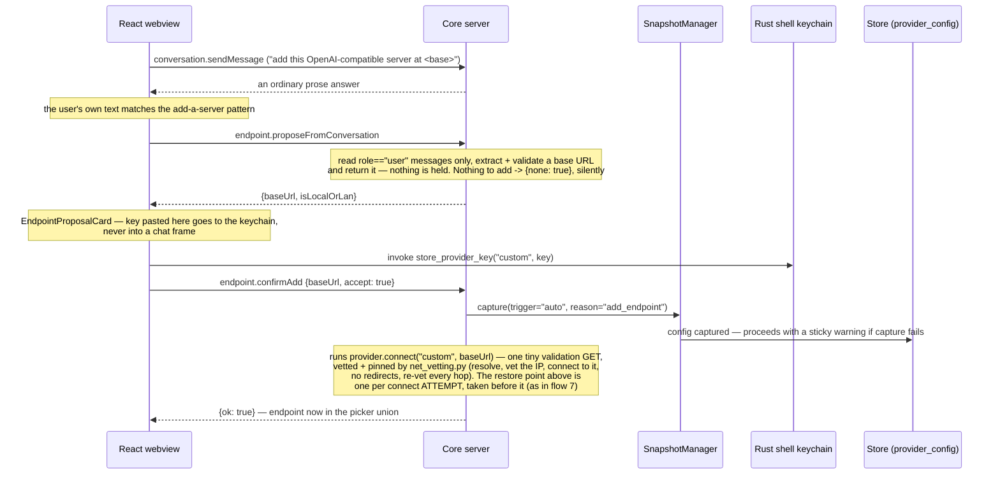
```mermaid
sequenceDiagram
    participant WV as React webview
    participant SRV as Core server
    participant SM as SnapshotManager
    participant SH as Rust shell keychain
    participant ST as Store (provider_config)

    WV->>SRV: conversation.sendMessage ("add this OpenAI-compatible server at <base>")
    SRV-->>WV: an ordinary prose answer
    Note over WV: the user's own text matches the add-a-server pattern
    WV->>SRV: endpoint.proposeFromConversation
    Note over SRV: read role=="user" messages only, extract + validate a base URL<br/>and return it — nothing is held. Nothing to add -> {none: true}, silently
    SRV-->>WV: {baseUrl, isLocalOrLan}
    Note over WV: EndpointProposalCard — key pasted here goes to the keychain,<br/>never into a chat frame
    WV->>SH: invoke store_provider_key("custom", key)
    WV->>SRV: endpoint.confirmAdd {baseUrl, accept: true}
    SRV->>SM: capture(trigger="auto", reason="add_endpoint")
    SM->>ST: config captured — proceeds with a sticky warning if capture fails
    Note over SRV: runs provider.connect("custom", baseUrl) — one tiny validation GET,<br/>vetted + pinned by net_vetting.py (resolve, vet the IP, connect to it,<br/>no redirects, re-vet every hop). The restore point above is<br/>one per connect ATTEMPT, taken before it (as in flow 7)
    SRV-->>WV: {ok: true} — endpoint now in the picker union
```

## 12. Workspace-trust grant and a keyword-gated powerful action

The harness (Developer/OPEN) reconciles the agentic loop with the per-invocation card
(amendment §8.2, §9). Workspace trust shipped in Phase-2 step 5; the keyword gate is step
8 and is **not built**. The essential correction to the amendment's framing: trust is
**two** predicates, not one.

- **Confinement — permission to *touch*.** A path-bounded tool (`read_project_file`,
  `write_project_file`) may only ever act on a path inside a currently-trusted root.
  Outside, it is hard-refused at dispatch, before the gate and before `execute`, at LOW
  and MEDIUM alike. This is not a card the user can approve past.
- **The `trusted` flag — permission to skip the *card*.** Only that: it is set only for
  those same typed, path-bounded, undoable tools. **`run_command` always cards**, in
  every trusted folder, because its `affected_path` is `None` — so confinement never
  governs it and the caller can never mark it trusted (owner decision 2026-07-24).

Addison's own data directory can never be trusted, at grant time or at authorize time.
And the path is resolved **once** and handed to `execute` on
`ExecutionContext.resolved_path`, so the path confinement approved is the exact path
that gets written.

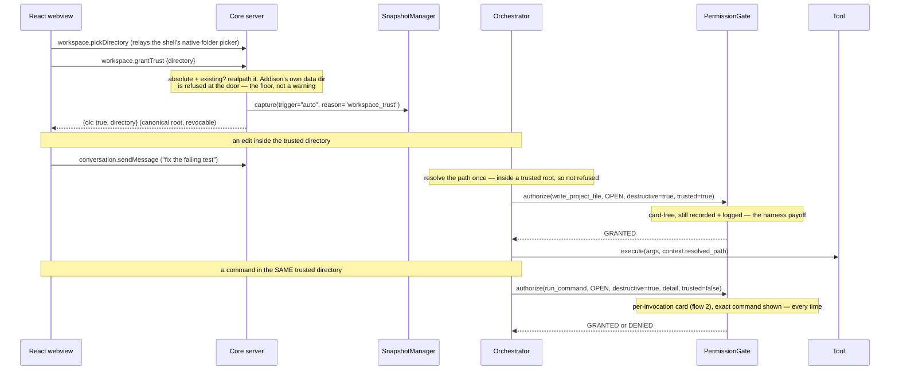
```mermaid
sequenceDiagram
    participant WV as React webview
    participant SRV as Core server
    participant SM as SnapshotManager
    participant ORC as Orchestrator
    participant PG as PermissionGate
    participant TL as Tool

    WV->>SRV: workspace.pickDirectory (relays the shell's native folder picker)
    WV->>SRV: workspace.grantTrust {directory}
    Note over SRV: absolute + existing? realpath it. Addison's own data dir<br/>is refused at the door — the floor, not a warning
    SRV->>SM: capture(trigger="auto", reason="workspace_trust")
    SRV-->>WV: {ok: true, directory} (canonical root, revocable)

    Note over WV,ORC: an edit inside the trusted directory
    WV->>SRV: conversation.sendMessage ("fix the failing test")
    Note over ORC: resolve the path once — inside a trusted root, so not refused
    ORC->>PG: authorize(write_project_file, OPEN, destructive=true, trusted=true)
    Note over PG: card-free, still recorded + logged — the harness payoff
    PG-->>ORC: GRANTED
    ORC->>TL: execute(args, context.resolved_path)

    Note over WV,ORC: a command in the SAME trusted directory
    ORC->>PG: authorize(run_command, OPEN, destructive=true, detail, trusted=false)
    Note over PG: per-invocation card (flow 2), exact command shown — every time
    PG-->>ORC: GRANTED or DENIED
```

*Not built (step 8):* the **keyword gate** — a user-typed prefix (e.g. `!run …`; exact
syntax open, §13) required to run or arm a powerful action. Because a prefix is a
keystroke from the human, observed content can never forge it, so it doubles as an
injection barrier. Nothing in `agent_core/` implements it today.

## 13. Build a widget — SAFE safe-vocabulary vs. higher-tier code-backed

**Phase-2 step 6 — the SAFE half is built (2026-08-06); the code-backed branch is not.**
Today's vocabulary is six kinds: `routine`, `stat`, `checklist`, `note` and `timer` in
SAFE, plus `command` in OPEN only. There is **no `required_capabilities` and no capability
tier, by decision rather than by omission** — the closed list of kinds is the gate
([SAFETY.md](SAFETY.md), invariant 4). The `else` branch below is therefore still the
target shape, not the tree: a code-backed widget is `command` and nothing else today.

Widgets are buildable in **every** mode; the mode gates the **capability**, not whether one
can be built (amendment §8.4). A SAFE request for a to-do widget produces a real checklist
from the **safe interactive vocabulary** (trusted renderers + safe storage, no code) whose
ticks are stored apart from the spec, in `widget_state`. A Developer/Custom request may
build a **code-backed / system-capable** widget (a monitor, the friend's connection
watcher), which is tier-gated and, to *run or arm*, goes through workspace-trust + the
keyword gate + snapshot floor.

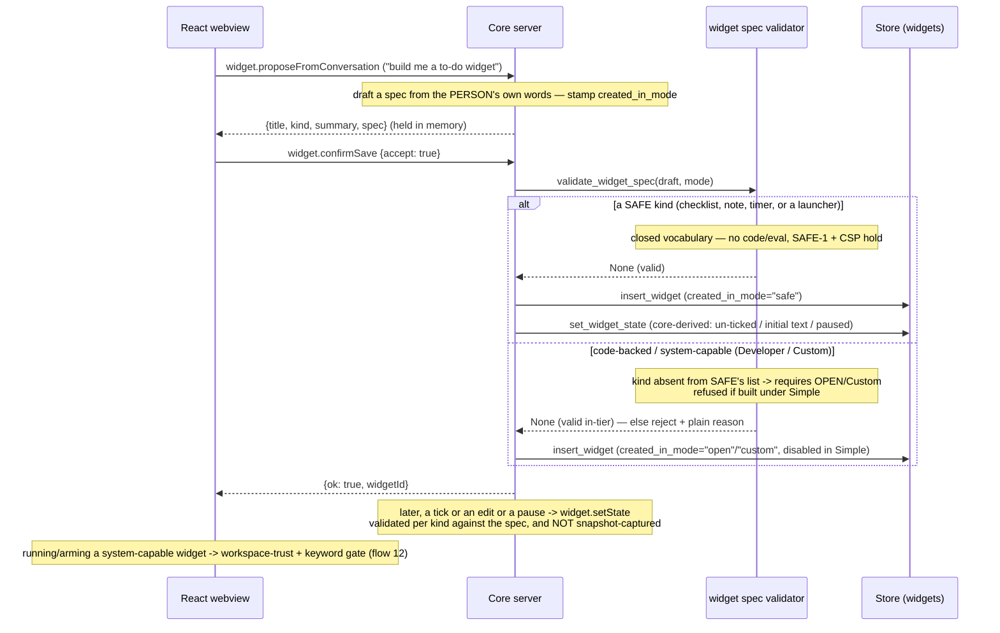
```mermaid
sequenceDiagram
    participant WV as React webview
    participant SRV as Core server
    participant W as widget spec validator
    participant DB as Store (widgets)

    WV->>SRV: widget.proposeFromConversation ("build me a to-do widget")
    Note over SRV: draft a spec from the PERSON's own words — stamp created_in_mode
    SRV-->>WV: {title, kind, summary, spec}  (held in memory)
    WV->>SRV: widget.confirmSave {accept: true}
    SRV->>W: validate_widget_spec(draft, mode)
    alt a SAFE kind (checklist, note, timer, or a launcher)
        Note over W: closed vocabulary — no code/eval, SAFE-1 + CSP hold
        W-->>SRV: None (valid)
        SRV->>DB: insert_widget (created_in_mode="safe")
        SRV->>DB: set_widget_state (core-derived: un-ticked / initial text / paused)
    else code-backed / system-capable (Developer / Custom)
        Note over W: kind absent from SAFE's list -> requires OPEN/Custom<br/>refused if built under Simple
        W-->>SRV: None (valid in-tier) — else reject + plain reason
        SRV->>DB: insert_widget (created_in_mode="open"/"custom", disabled in Simple)
    end
    SRV-->>WV: {ok: true, widgetId}
    Note over SRV: later, a tick or an edit or a pause -> widget.setState<br/>validated per kind against the spec, and NOT snapshot-captured
    Note over WV: running/arming a system-capable widget -> workspace-trust + keyword gate (flow 12)
```

## 14. Routing: degrade-down with a free-model disclaimer

Shipped in Phase-2 step 3, so the names below are real. Routing is
**strong-first, degrade-down** (amendment §10), and the chain's head is always the
user's standing default model — a strategy orders only the fallback tail, so routing
never overrides a deliberate choice. The turn falls forward on a
**provider-unavailable** failure (429, 5xx, network) **and on a rejected key** (a
401/403 from the provider itself — plan §5.2, built 2026-08-06: the next provider has
a different key, so this one is worth walking past, and the provider is marked
needs-attention as it goes). A rejected REQUEST, or a missing/malformed key, still
ends the turn at once — the next provider would just get the same bad request, or the
same nothing. The cooldown is in-memory, and the per-attempt deadline is threaded into
each attempt so one hanging candidate cannot stall the turn.

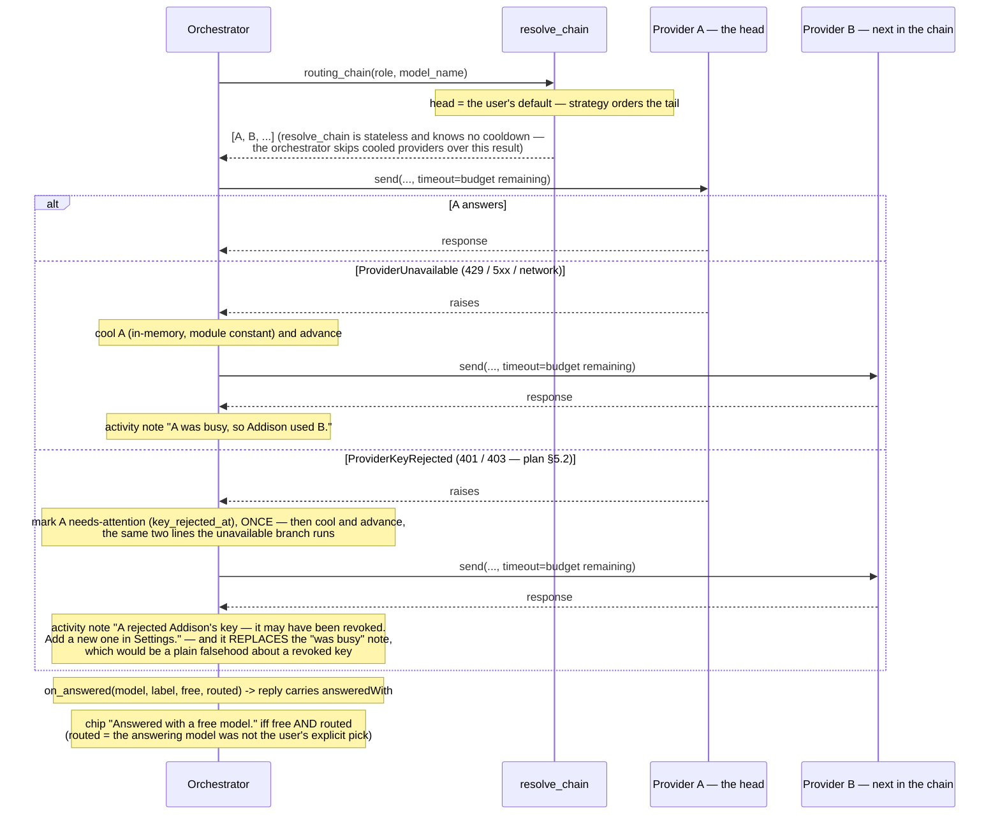
```mermaid
sequenceDiagram
    participant ORC as Orchestrator
    participant RC as resolve_chain
    participant A as Provider A — the head
    participant B as Provider B — next in the chain

    ORC->>RC: routing_chain(role, model_name)
    Note over RC: head = the user's default — strategy orders the tail
    RC-->>ORC: [A, B, ...] (resolve_chain is stateless and knows no cooldown —<br/>the orchestrator skips cooled providers over this result)
    ORC->>A: send(..., timeout=budget remaining)
    alt A answers
        A-->>ORC: response
    else ProviderUnavailable (429 / 5xx / network)
        A-->>ORC: raises
        Note over ORC: cool A (in-memory, module constant) and advance
        ORC->>B: send(..., timeout=budget remaining)
        B-->>ORC: response
        Note over ORC: activity note "A was busy, so Addison used B."
    else ProviderKeyRejected (401 / 403 — plan §5.2)
        A-->>ORC: raises
        Note over ORC: mark A needs-attention (key_rejected_at), ONCE — then cool and advance,<br/>the same two lines the unavailable branch runs
        ORC->>B: send(..., timeout=budget remaining)
        B-->>ORC: response
        Note over ORC: activity note "A rejected Addison's key — it may have been revoked.<br/>Add a new one in Settings." — and it REPLACES the "was busy" note,<br/>which would be a plain falsehood about a revoked key
    end
    Note over ORC: on_answered(model, label, free, routed) -> reply carries answeredWith
    Note over ORC: chip "Answered with a free model." iff free AND routed<br/>(routed = the answering model was not the user's explicit pick)
```

## 15. MCP tool call through the existing gate

**Phase-2 step 7 — not built.** No module in `agent_core/` implements an MCP client
today; the names below are the target shape, not code.

Addison is an MCP **client**, not a server/gateway (amendment §8.5). External MCP tools are
surfaced through the **existing registry and permission gate** — never a side channel — so
they are gated, logged, and undo-aware like any tool. In OPEN they run under workspace-trust;
in SAFE only read-only or genuinely undo-able MCP tools are admitted (invariant 2 keeps a
mutating, un-undoable MCP tool out of the SAFE view automatically). Connecting the server is
reversible config (flow 11 plumbing).

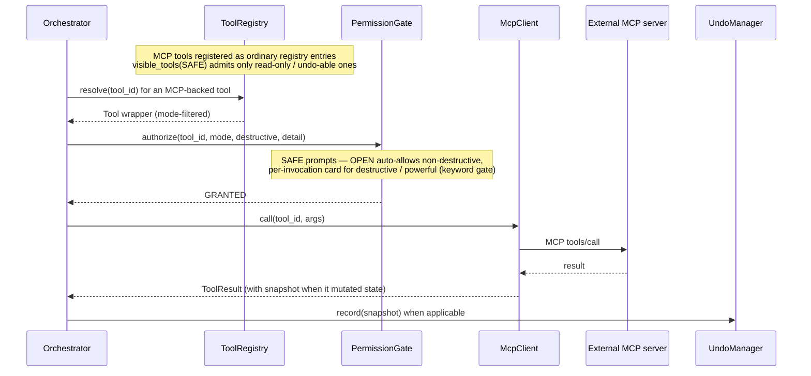
```mermaid
sequenceDiagram
    participant ORC as Orchestrator
    participant REG as ToolRegistry
    participant PG as PermissionGate
    participant MC as McpClient
    participant SRV as External MCP server
    participant UM as UndoManager

    Note over REG: MCP tools registered as ordinary registry entries<br/>visible_tools(SAFE) admits only read-only / undo-able ones
    ORC->>REG: resolve(tool_id) for an MCP-backed tool
    REG-->>ORC: Tool wrapper (mode-filtered)
    ORC->>PG: authorize(tool_id, mode, destructive, detail)
    Note over PG: SAFE prompts — OPEN auto-allows non-destructive,<br/>per-invocation card for destructive / powerful (keyword gate)
    PG-->>ORC: GRANTED
    ORC->>MC: call(tool_id, args)
    MC->>SRV: MCP tools/call
    SRV-->>MC: result
    MC-->>ORC: ToolResult (with snapshot when it mutated state)
    ORC->>UM: record(snapshot) when applicable
```
